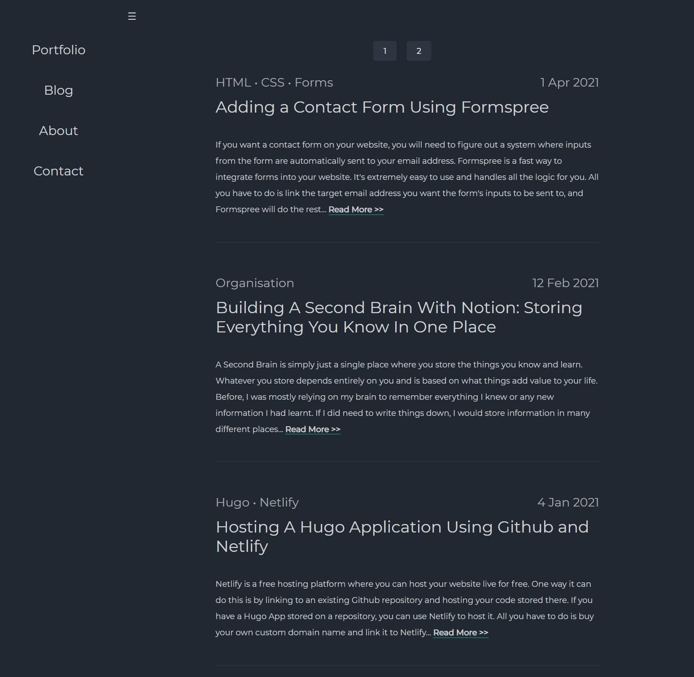

# Vondreii

## About 

This is the code for my personal website, https://vondreii.com.

The website lists some of the major projects I have worked on. It also contains a blog of technologies I have been learning and writing about.

 

 

## Running the Code Locally

Run `ng build` to build the project. The build artifacts will be stored in the `dist/` directory. Use the `--prod` flag for a production build.

Run `ng serve` for a dev server. Navigate to `http://localhost:4200/`. The app will automatically reload if you change any of the source files.

## Contact Me

You can fill the form on the contact page at https://vondreii.com/contact.

