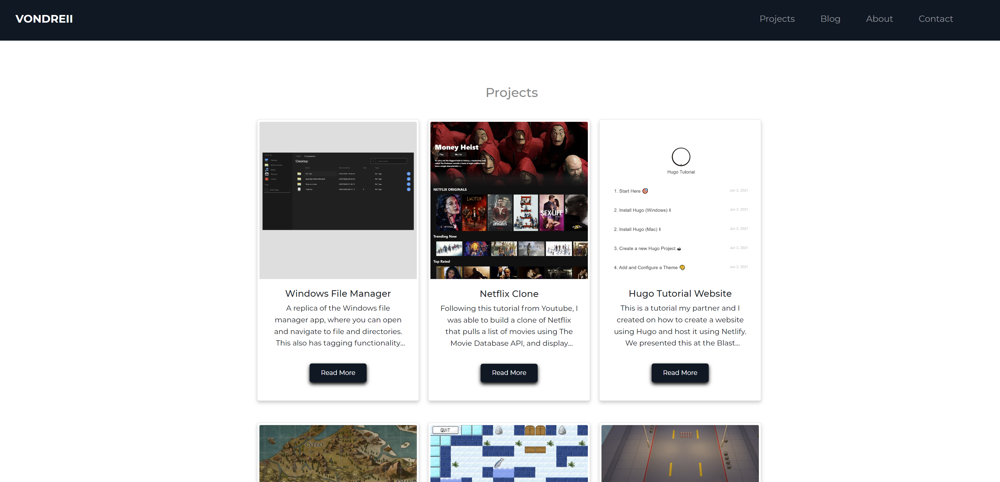

# Vondreii

## About 

This is the code for my personal website, https://vondreii.netlify.app/

The website lists some of the major projects I have worked on. It also contains a blog of technologies I have been learning and writing about.

## To Run

* Run `npm install` in the root directory to add the necessary npm packages to the project.
* Once completed, run `ng serve`.
* Navigate to `localhost:4200` in a browser.

## To Build

* Run `ng build` to build the project. The build artifacts will be stored in the dist/ directory. 
* Use `ng build --prod` for a production build.

## Contact

You can fill the form on the contact page at https://vondreii.netlify.app/contact.

 

