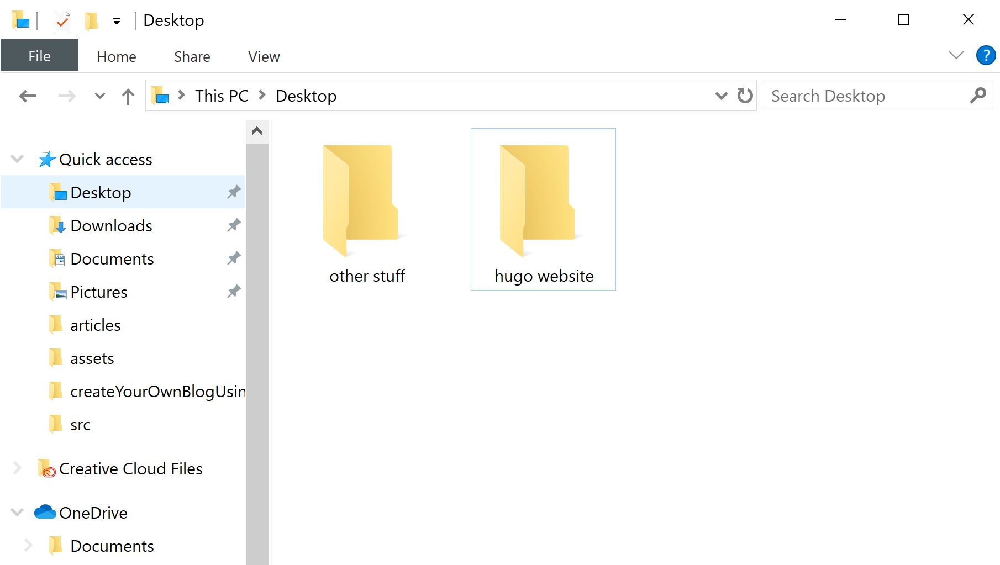
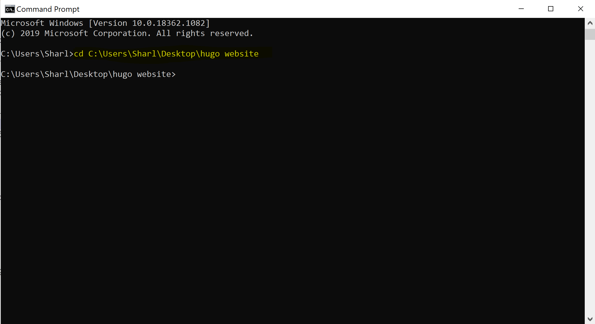
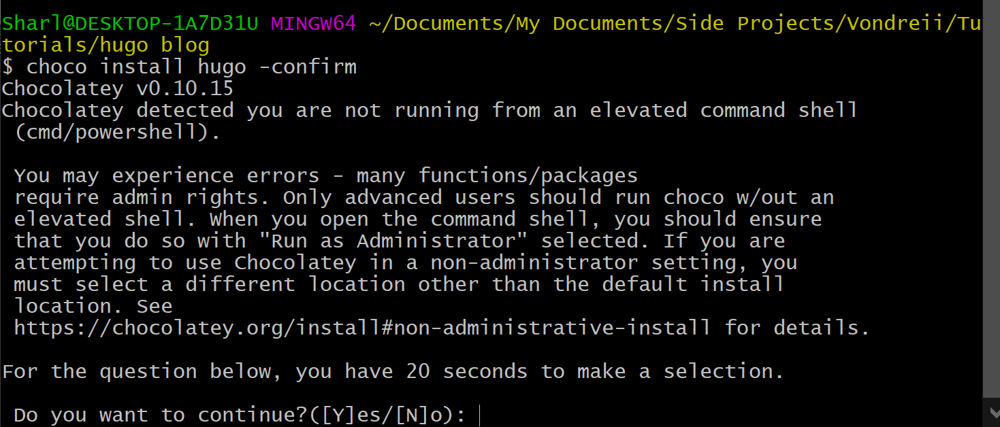
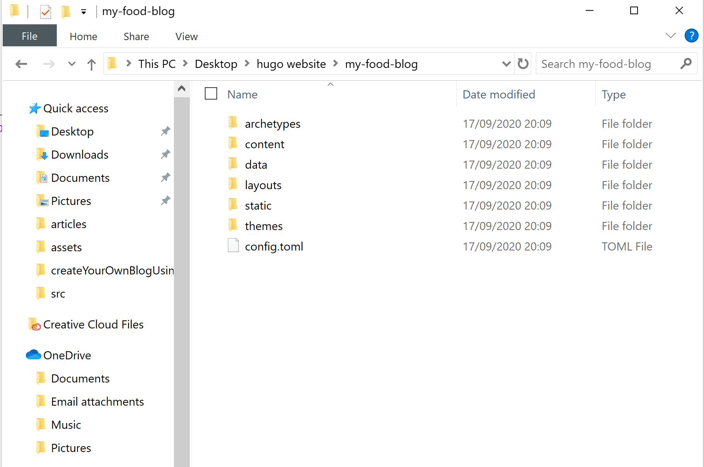
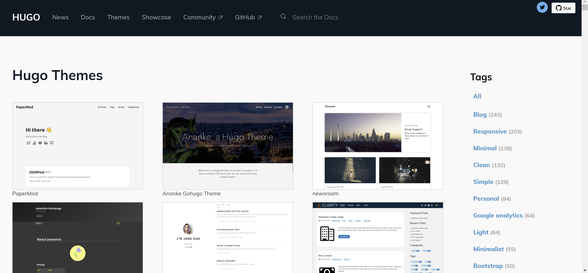

<div class="writtenContent">

#### 27 Nov 2020
# Creating Your Own Blog Using Hugo
___

<!-- ----------- Intro ----------- -->
<div class="avatar-block">
    
    <h5 class="avatar-text avatar-align"> by Vondreii</h5>
</div>
<br>
<div class="image-container">
    
  	<div class="image-description"><p>Photo by <a href="https://unsplash.com/@lucabravo">Luca Bravo</a> on Unsplash</p></div>
</div>
<!-- ----------------------------- -->

For this tutorial we will create our own blog site from scratch using a framework called Hugo. 

Online platforms such as Squarespace, Wix or Wordpress are very convenient to use to customise and create your own website. Though, they can get expensive when it comes to hosting, registeration and adding premium features.
  
Hugo is a framework where you can create your own website, completely from scratch without much effort or without knowing too much (or any) of the internal programming.
There are also many web hosting platforms that can easily host a Hugo project for free - meaning, the only money you will spend will be for the custom domain name!

You can choose from lots of amazing free themes. Each blog post is written as a `.md` file, also known as `markdown`. Markdown can just be written as plain English with a few added symbols to symbolise where the headings are, which words are bold, or any other special formatting that may be needed.

We will primarily be using Windows, however there are equivalent ways of doing some of the steps on a MAC. Most of the steps should be the same.

We will go through everything from:

* Installing Hugo
* Using a theme
* Personalising the website
* Adding content

### Installing Hugo

Create a folder where you want to store your project.

<!-- ----------- Image ----------- -->
<div class="image-container">
	
	<div class="image-description"><p>Create a folder for your project</p></div>
</div>
<!-- ----------------------------- -->

Go into the command prompt and navigate to the folder you have created. Run `cd <path to your project folder>`. For example, I created my folder `hugo website` in the Desktop, so I would run:

```bash
cd C:\Users\Sharl\Desktop\hugo website

```

<!-- ----------- Image ----------- -->
<div class="image-container">
	
	<div class="image-description"><p>CMD</p></div>
</div>
<!-- ----------------------------- -->

Now, we will install hugo and create a new project from scratch. In the command prompt, we will run a few commands that will install hugo and create the base of the website.

For windows, if you use chocolatey for package management, run:

```bash
choco install hugo -confirm

```

otherwise if you use Scoop for package management, run:
```bash
scoop install hugo

```

You can check what you are using by going into your `C:\ProgramData` folder and seeing if you either have chocolatey or scoop.

<!-- ----------- Image ----------- -->
<div class="image-container">
	
	<div class="image-description"><p>More options to install hugo: https://gohugo.io/getting-started/installing/</p></div>
</div>
<!-- ----------------------------- -->

To install hugo using a MAC:

```bash
brew install hugo

```

To install hugo using Linux:

```bash
brew install hugo

```

### Creating a new project

Now that we have hugo installed, we can start our project.

In the command prompt, run `hugo new site <name of blog here>`. For this example, we will make a blog about food, which will be called 'My Food Blog':

```bash
hugo new site my-food-blog

```

This will create a new folder called my-food-blog. If you open the folder, you will see that the 'skeleton' or 'base' folders have automatically been created, which should look something like this:

<!-- ----------- Image ----------- -->
<div class="image-container">
	
	<div class="image-description"><p>Root folder</p></div>
</div>
<!-- ----------------------------- -->

### Using a Theme

You can browse through the themes listed at https://themes.gohugo.io/.

<!-- ----------- Image ----------- -->
<div class="image-container">
	
	<div class="image-description"><p>Themes to choose from at themes.gohugo.io</p></div>
</div>
<!-- ----------------------------- -->

When I was first using hugo, I followed the [Free Code Camp Hugo Tutorial](https://www.freecodecamp.org/news/your-first-hugo-blog-a-practical-guide/), and they recommend using the Ghostwriter theme if you are starting out. We will instead pick a different design.

We will be using the Hugo-sugoi theme for now. You can read about it [here](https://themes.gohugo.io/hugo-sugoi/) and check out the demo [here](https://themes.gohugo.io/theme/hugo-sugoi/).

Download the source code from [Github](https://github.com/aanupam23/hugo-sugoi) (Click on the Green **Code** button, then **Download ZIP**).

Extract the zip, and copy the `hugo-sugoi-master` into your `my-food-blog\themes` folder. Don't forget to make sure that the folder has been extracted correctly. For example, make sure the theme's code is nested under `my-food-blog\themes\hugo-sugoi-master` and not `my-food-blog\themes\hugo-sugoi-master\hugo-sugoi-master`.

<!-- ----------- Image ----------- -->
<div class="image-container">
	
	<div class="image-description"><p>Extract the folder into your Hugo project.</p></div>
</div>
<!-- ----------------------------- -->


Now rename the folder from `hugo-sugoi-master` to `hugo-sugoi`.

### Personalise your site

We will just make a few modifications before running the code.

Open `my-food-blog\config.toml` and overwrite the code to this (substituting your details):

```toml
baseURL = "/"
languageCode = "en-us"
title = "Your website's name"
theme = "hugo-sugoi"

[Params]
  herotitle = "Your website's name"
  facebook = "https://facebook.com/XXX"
  twitter = "https://twitter.com/XXX"
  youtube = "https://youtube.com/XXX"
  github = "https://github.com/XXX"
  email = "XXX@example.com"

```

If you want to exclude some of the social media, you can just delete the lines that you do not need.

The HTML files are split up into **partials**. These partials only contain the HTML code for that particular section. For example, the `header.html` will only contain the HTML code for what is in the header of your website.

Go into `my-food-blog\themes\hugo-sugoi\layouts\partials\header.html`.

Change:

```js
<label for="drop" class="toggle"><i class="fas fa-bars u-pull-right" aria-hidden="true"></i> 
	<span><i class="fas fa-fire" aria-hidden="true"></i> 
		Sugoi // Change Sugoi to your website's name (or, 'Home')
	</span>
</label> 

```

Also, change:

```js
<li><a href="{{ .Site.BaseURL }}">
	<span><i class="fas fa-fire" aria-hidden="true"></i>
		Sugoi // Change Sugoi to your website's name (or, 'Home')
	</span>
</a></li>

```

This next part is completely optional, you can complete it if you want to add some basic social media links.

Go into `my-food-blog\themes\hugo-sugoi\layouts\partials\hero.html`. To add some social media links at the top, you can make the following modifications:

```js
<div class="section hero">
	<div class="container">
		<h3 class="section-heading">{{ .Site.Params.herotitle}}</h3>
		<a class="button button-primary" href="{{ .Site.Params.herolink}}">{{ .Site.Params.herolinktext}}</a>

		// Add this code block here
		<br>
		<a class="button" style="color:rgb(112, 126, 250)" href="{{ .Site.Params.facebook}}">Facebook</a>
		<a class="button" style="color:rgb(148, 217, 238)" href="{{ .Site.Params.twitter}}">Twitter</a>
		<a class="button" style="color:rgb(253, 130, 121)" href="{{ .Site.Params.youtube}}">Youtube</a>
		<a class="button" style="color:rgb(255, 251, 250)" href="{{ .Site.Params.github}}">Github</a>
		<a class="button" style="color:rgb(132, 241, 214)" href="{{ .Site.Params.email}}">Email</a>
		// -----

	</div>
</div>

```

They will use the links that you specified in the previous `my-food-blog\config.toml` file.

If you want to add more social media links at the bottom, you can download this [zip file](../../assets/downloads/images.zip) and copy the contents into `my-food-blog\static\images`.  

Go into `my-food-blog\themes\hugo-sugoi\layouts\partials\footer.html` and copy and paste the social media links you want:

```js
<footer>
	// ------------------------------------ Add social media links
	<!-- Facebook -->
	<a href="{{ .Site.Params.facebook}}"></a> 
	<span style="padding:15px">

	<!-- Youtube -->
	<a href="{{ .Site.Params.youtube}}"></a> 
	<span style="padding:15px">

	<!-- Twitter -->
	<a href="{{ .Site.Params.twitter}}"></a> 
	<span style="padding:15px">
			
	<!-- Github -->
	<a href="{{ .Site.Params.github}}"></a> 
	<span style="padding:15px">

	<!-- Email -->
	<a href="{{ .Site.Params.email}}"></a> 
	// ------------------------------------

	<br>
	<span class="copyright">
			{{ with .Site.Copyright | default "&copy;" }} {{ . | safeHTML }} {{ now.Format "2006"}} {{ end }}
			<a href="https://github.com/aanupam23/hugo-sugoi" title="hugo-sugoi" alt="hugo-sugoi" target="_blank">Hugo-Sugoi</a>
	</span>
</footer>

```

### Add some content

Try running your site. Navigate to the root directory (`my-food-blog`) of any terminal or command line, and run:

```bash
hugo serve

```

Now go into `http://localhost:1313/` in one of your browsers. Your website should look like this:

<!-- ----------- Image ----------- -->
<div class="image-container">
	
	<div class="image-description"><p>Hugo site without content</p></div>
</div>
<!-- ----------------------------- -->

As you can see, there are no posts! We will need to add in some content. Each post is going to be written in a separate markdown file.
For example, if you wanted to write something on Chocolate Lava Cakes, you would have a file called `ChocolateLavaCake.md` where you would write your text.

The hugo-sugoi theme comes with some examples. Navigate to `my-food-blog\themes\hugo-sugoi\exampleSite`. There you will see a folder called `content`.

Copy this `content` folder and paste it into the `my-food-blog` folder, where the root of the project is (overwrite the existing one). 

Run the program again:

```bash
hugo serve

```

Now you have some content!

<!-- ----------- Image ----------- -->
<div class="image-container">
	
	<div class="image-description"><p>Hugo site with content</p></div>
</div>
<!-- ----------------------------- -->

Go into `my-food-blog\content\post` and observe the 4 markdown files that represent the 4 posts:
-  air-nation-list-style.md
-  code-blocks.md
-  prince-zuko.md
-  water-nation-pride-and-peace.md

You can open any one of them to see the format of how you need to write your posts in Markdown.

In a Markdown file, you can just write the content as plain English - like you would on Microsoft Word - except you can use symbols to signify headings or special styling in your text. For example:

`# Something` is a main heading, like this:  

# Something 

<br>

`## Something` is a next level sub heading, like this:  

## Something 

<br>

`### Something` is an even lower sub level heading, like this: 

### Something

<br>

`**Something**` Will make something bold, like this: **Something** 

`*Something*` Will make something italicized, like this: *Something* 

`[Something](https://www.google.com)` is a link: [Something](https://www.google.com)

There are a few places where you can read some of the syntax used for markdown:
* https://www.markdownguide.org/basic-syntax/
* https://www.markdownguide.org/cheat-sheet/

Now everytime you want to start a new post, all you have to do is write it in a new `Markdown` file, inside the `content/post` folder! 

You can view the final source code in [GitHub](https://github.com/vondreii/hugo-framework).

### Resources
* https://www.freecodecamp.org/news/your-first-hugo-blog-a-practical-guide/
* https://gohugo.io/getting-started/installing/