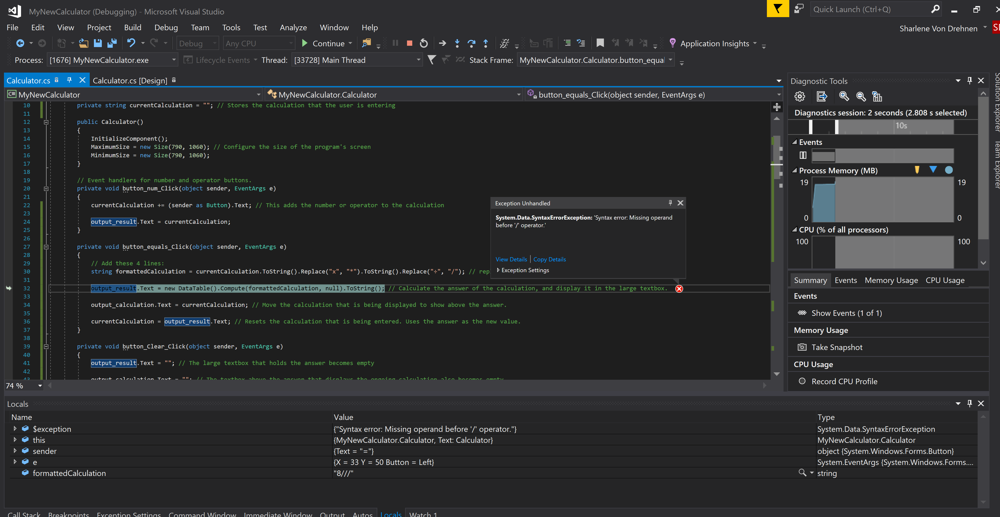

<div class="writtenContent">

#### 26 Sept 2020
# Creating A Calculator in C# (Part 3)
___

<!-- ----------- Intro ----------- -->
<div class="avatar-block">
    
    <h5 class="avatar-text avatar-align"> by Vondreii</h5>
</div>
<br>
<!-- ----------------------------- -->

<div class="center extraPadding">
    <a href="/posts/post/creatingACalculatorInCSharp" class="button">Part 1</a>
    <a href="/posts/post/creatingACalculatorInCSharpPart2" class="button">Part 2</a>
    <a href="/posts/post/creatingACalculatorInCSharpPart3" class="button">Part 3</a>
</div>

### 10. Handling errors and invalid input

In Part 2 we added the basic functionalities to the calculator, so we are now able to display the answer to a calculation and erase the display with both C and CE.

The final part of the work involves making the program more robust so invalid inputs or unexpected user inputs can be handled appropriately. Error handling is a very important part of building any program or application. At no point should an application close due to an error that occurs at runtime.

Currently, if the user were to enter something like **18++++.....34**, it will still be calculated, but because it is invalid, the program will stop with a runtime error:

<!-- ----------- Image ----------- -->
<div class="image-container">
    
	<div class="image-description"><p>Runtime error - SyntaxErrorException</p></div>
</div>
<!-- ----------------------------- -->

This is a close up view of the error:

<!-- ----------- Image ----------- -->
<div class="image-container">
    
	<div class="image-description"><p>Runtime error - SyntaxErrorException</p></div>
</div>
<!-- ----------------------------- -->

The error is a **SyntaxErrorException**, and happens at this line:

```js
output_result.Text = new DataTable().Compute(formattedCalculation, null).ToString();
```

This is because the format of the calculation is invalid, and so the `Compute` function that we are using is unable to calculate anything.

Currently, this is what the code looks like for when you press the equals button:

```js
private void button_equals_Click(object sender, EventArgs e)
{
    string formattedCalculation = currentCalculation.ToString().Replace("x", "*").ToString().Replace("÷", "/"); // replaces text with symbols used in programming

    output_result.Text = new DataTable().Compute(formattedCalculation, null).ToString(); // Calculate the answer of the calculation, and display it in the large textbox.

    output_calculation.Text = currentCalculation; // Move the calculation that is being displayed to show above the answer.

    currentCalculation = output_result.Text; // Resets the calculation that is being entered. Uses the answer as the new value.
}
```

To stop the error from happening, we are going to modify this code a little bit. 

In the `button_equals_Click` function, we are going to add something called a `try-catch` block around our code to stop the programming from crashing.

It will look a bit like this:

```js
try
{
    // The code that could potentially cause a runtime error / crash goes in here.
}
catch
{
    // If something goes wrong (i.e. an error happens), add what the program will do in response.
}
```

Basically, any code that we think might might throw an error will go into the `try` block. If there is an error at any point, the code from the `catch` block will execute.

We are going to add our code into the `try` section of the `try-catch` block. 

```js
private void button_equals_Click(object sender, EventArgs e)
{
    try
    {
        // current code goes into the try block
        string formattedCalculation = currentCalculation.ToString().Replace("x", "*").ToString().Replace("÷", "/"); 
        output_result.Text = new DataTable().Compute(formattedCalculation, null).ToString();
        output_calculation.Text = currentCalculation; 
        currentCalculation = output_result.Text; 
    }
    catch (Exception exception)
    {
        // If something goes wrong (i.e. an error happens), add what the program will do in response.
    }
}

```

In part 1 we added a label to the front part of our interface, called **err_not_valid**.

<!-- ----------- Image ----------- -->
<div class="image-container">
    
	<div class="image-description"><p>Invalid calculation error message</p></div>
</div>
<!-- ----------------------------- -->

The only property we care about for this message is the **Visibility**. The default visibility is set to **false**, which means that the error message is always invisible.

However, if there is an error, we want the visibility to be **true**, which means the user will be able to see the message.

Otherwise, if the calculation is correct, we want the error message to be invisible again.

In the `catch` block, add the line `err_not_valid.Visible = true;` and in the `try` block, add the line `err_not_valid.Visible = false;`

```js
private void button_equals_Click(object sender, EventArgs e)
{
    try
    {
        string formattedCalculation = currentCalculation.ToString().Replace("x", "*").ToString().Replace("÷", "/"); 
        output_result.Text = new DataTable().Compute(formattedCalculation, null).ToString();
        output_calculation.Text = currentCalculation; 
        currentCalculation = output_result.Text; 
        err_not_valid.Visible = false; // Add this
    }
    catch (Exception exception)
    {
        err_not_valid.Visible = true; // Add this
    }
}

```

Run the program again and try adding random inputs like **4xxx÷÷÷÷9**. The program will no longer throw an error, and will instead display the error message at the bottom of the screen. If you then erase the invalid input and add a proper one, the error message will disappear.

<!-- ----------- Video ----------- -->
<div class="image-container">
    <video controls="true" allowfullscreen="true" poster="../../../assets/articles/post-images/creatingACalculatorInCSharpPart3/with-error-handling_preview.PNG" class="image">
    <source src="../../../assets/articles/post-images/creatingACalculatorInCSharpPart3/with-error-handling.mp4" type="video/mp4">
    </video>
</div>
<!-- ----------------------------- -->

Notice that if you add **4++5** or **4--5**, these are still considered valid inputs as the `Compute` function can still calculate them and display an answer, so we will not worry about those.

### 11. Pressing the equals button twice

Try pressing the equals button twice. This is what happens:

<!-- ----------- Video ----------- -->
<div class="image-container">
    <video controls="true" allowfullscreen="true" poster="../../../assets/articles/post-images/creatingACalculatorInCSharpPart3/twice_equals_preview.PNG" class="image">
    <source src="../../../assets/articles/post-images/creatingACalculatorInCSharpPart3/twice_equals.mp4" type="video/mp4">
    </video>
</div>
<!-- ----------------------------- -->

The previously saved calculation at the top gets overwritten by the answer. This might be acceptable, depending on if you don't mind something like that happening. However, we are going to fix this.

We are going to do this using a boolean called `equalsAlreadyPressed`.

We will declare `equalsAlreadyPressed` at the top of the file with the other variable we declared earlier (`currentCalculation`).

```js
public partial class Calculator : Form
{
    private string currentCalculation = ""; // We added this in Part 2
    private bool equalsAlreadyPressed = false; // Add this line here

    public Calculator()
    {
        InitializeComponent();
        MaximumSize = new Size(790, 1060);
        MinimumSize = new Size(790, 1060);
    }
    
...
```

`equalsAlreadyPressed` will first be false, meaning that the equals button has not been pressed yet. 

We will go back into our `try-catch` block in the `button_equals_Click` function.

```js
private void button_equals_Click(object sender, EventArgs e)
{
    try
    {
        string formattedCalculation = currentCalculation.ToString().Replace("x", "*").ToString().Replace("÷", "/"); 
        output_result.Text = new DataTable().Compute(formattedCalculation, null).ToString();
        output_calculation.Text = currentCalculation; 
        currentCalculation = output_result.Text; 
        err_not_valid.Visible = false; 
        equalsAlreadyPressed = true; // Add this line here
    }
    catch (Exception exception)
    {
        err_not_valid.Visible = true; 
    }
}
```

Once the equals button is pressed, `equalsAlreadyPressed` will become true.

When the equals button has already been pressed, we don't want it to be pressed again. At the beginning of `button_equals_Click`, we will put a return block to stop the rest of the code from executing when the equals button is pressed a second time in a row.

```js
private void button_equals_Click(object sender, EventArgs e)
{
    if (equalsAlreadyPressed) // Add this if statement 
    {
        return; // Add this return
    }

    // If equalsAlreadyPressed is true, the rest of this code will not execute anymore:
    try
    {
        string formattedCalculation = currentCalculation.ToString().Replace("x", "*").ToString().Replace("÷", "/"); 
        output_result.Text = new DataTable().Compute(formattedCalculation, null).ToString();
        output_calculation.Text = currentCalculation; 
        currentCalculation = output_result.Text; 
        err_not_valid.Visible = false; 
        equalsAlreadyPressed = true;
    }
    catch (Exception exception)
    {
        err_not_valid.Visible = true; 
    }
}
```

Once the user starts pressing other buttons (numbers, operators etc), the equals button is no longer being pressed twice in a row, so we can now set `equalsAlreadyPressed` back to false. 

An appropriate place to do this would be in the `button_num_Click` event function, which is used when the user presses other buttons other than the equals button:

```js
private void button_num_Click(object sender, EventArgs e)
{
    currentCalculation += (sender as Button).Text;
    output_result.Text = currentCalculation;
    equalsAlreadyPressed = false; // Add this line here
}
```

Try running the program again. When you press the equals button twice, the top previous calculation should no longer be overwritten.

<!-- ----------- Video ----------- -->
<div class="image-container">
    <video controls="true" allowfullscreen="true" poster="../../../assets/articles/post-images/creatingACalculatorInCSharpPart3/twice_equals_preview.PNG" class="image">
    <source src="../../../assets/articles/post-images/creatingACalculatorInCSharpPart3/twice_equals_fixed.mp4" type="video/mp4">
    </video>
</div>
<!-- ----------------------------- -->

### 12. Adding an icon and running the executable

At the top-left corner of your calculator there is an icon. We don't really want to use the default icon, so we will add our own.

I found some free icons at [icons-icons.com](https://icon-icons.com/search/icons/?filtro=calculator). Feel free to choose any icon you like. Make sure you select to download the **.ico** format. The one I'm using is [this one](../../assets/downloads/Icon.zip).

**1.** Right click on the project in the solutions explorer.

**2.** Select **Properties**

<!-- ----------- Image ----------- -->
<div class="image-container">
    
	<div class="image-description"><p>Changing the icon</p></div>
</div>
<!-- ----------------------------- -->

**3.** Make sure Icon and Manifest is selected. 

**4.** Press Browse and select the .ico file you downloaded.

**5.** Make sure to save your changes (**ctrl+S** or **File > Save All**).

<!-- ----------- Image ----------- -->
<div class="image-container">
    
	<div class="image-description"><p>Changing the icon</p></div>
</div>
<!-- ----------------------------- -->

**6.** Go back to the calculator interface and click on the form (the properties window should show you the properties for the form in the right).

**7.** Go down to **Icon** and click on the 3 dots to select your **.ico** icon file.

<!-- ----------- Image ----------- -->
<div class="image-container">
    
	<div class="image-description"><p>Changing the icon</p></div>
</div>
<!-- ----------------------------- -->

Your C# project folder will automatically have an executable file of your program. Just before we find it, go to the top and select **Build > Build Solution** to do one final compilation of the program.

<!-- ----------- Image ----------- -->
<div class="image-container">
    
	<div class="image-description"><p>Build the solution</p></div>
</div>
<!-- ----------------------------- -->

Now, open the folder that stores your project. If you go to **ProjectName >> bin >> Debug**, you should see an executable file (ending in .exe).

<!-- ----------- Image ----------- -->
<div class="image-container">
    
	<div class="image-description"><p>Application directory - location of executable file</p></div>
</div>
<!-- ----------------------------- -->

The name of your **.exe** file will depend on what the name of your project is.

You can make a copy of the **MyNewCalculator.exe** file and store is anywhere else on your computer. That way you can run your program just by clicking on it, without having to open the source code!

Better yet, you can create a shortcut to your .exe file and store it on the Desktop.

<!-- ----------- Video ----------- -->
<div class="image-container">
    <video controls="true" allowfullscreen="true" poster="../../../assets/articles/post-images/creatingACalculatorInCSharpPart3/final_preview.PNG" class="image-full">
    <source src="../../../assets/articles/post-images/creatingACalculatorInCSharpPart3/final.mp4" type="video/mp4">
    </video>
</div>
<!-- ----------------------------- -->

Now you should hopefully have a functional and efficiently working calculator! Enjoy :)

Don't forget you can also view the final source code for the calculator, exactly as it was explained in this tutorial.

<div class="download-container">
    <div class="download-link">
        <a href="https://github.com/vondreii/Calculator-Example" class="button">↓ Final Source Code at completion of Part 3 ↓</a>
    </div>
</div>

<br><br>

</div>