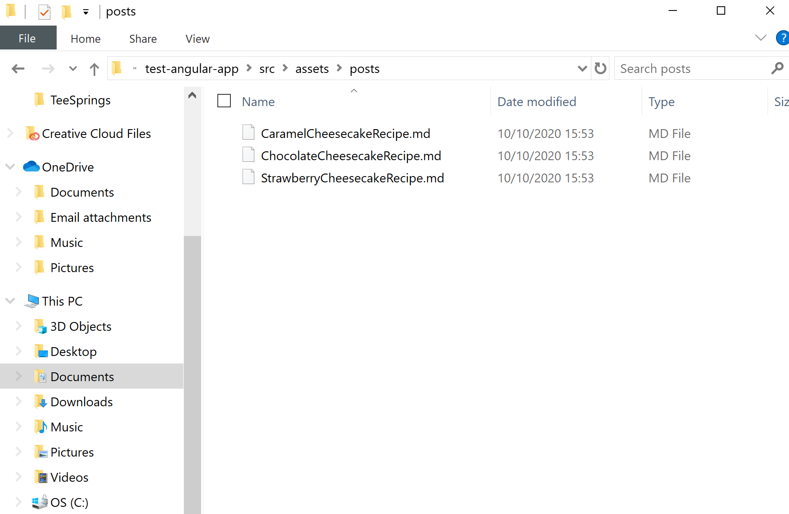
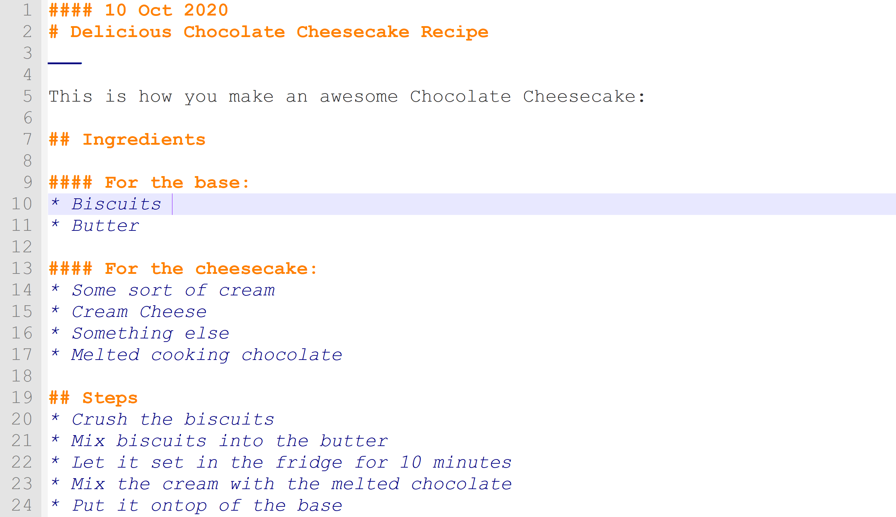
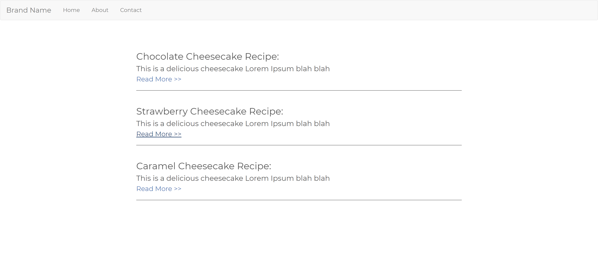
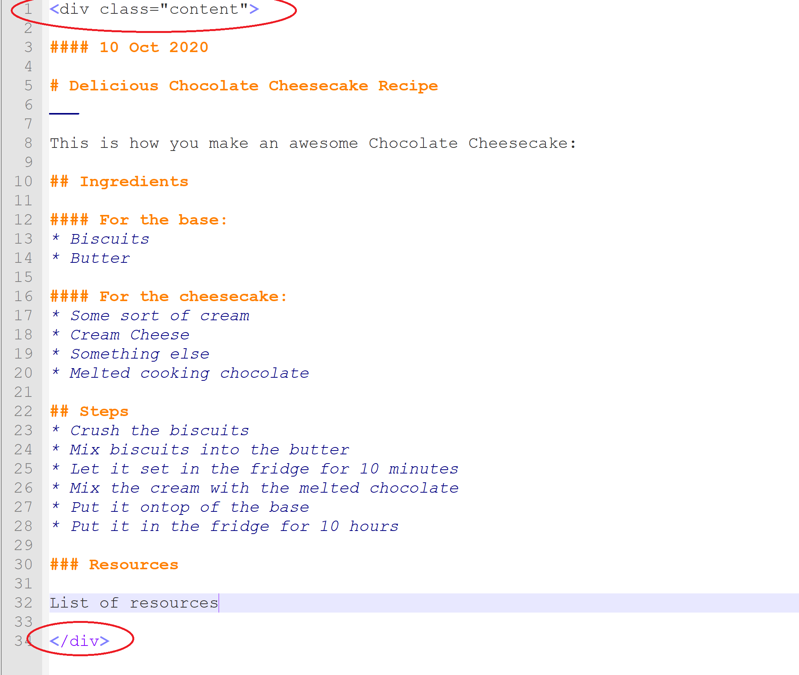

<div class="writtenContent">

#### Date
# Iterating Over Markdown Files In Angular
___

<!-- ----------- Intro ----------- -->
<div class="avatar-block">
    
    <h5 class="avatar-text avatar-align"> by Vondreii</h5>
</div>
<br>
<div class="image-container">
    
  	<div class="image-description"><p>Photo by <a href="https://unsplash.com/@shuttergames">Credit</a> on Unsplash</p></div>
</div>
<!-- ----------------------------- -->

Blah Blah Sometimes you want to do blah....

This tutorial expands on the one from (Link to Pepsi's MD one). An alterative framework to this kind of post-structure is also to use Hugo, which you can read about *here* and *here*. However for this tutorial we will be using the Angular framework.

Assuming you already have a simple Angular project set up, for example, like the one from [creating A Simple Angular Web Application](/posts/post/creatingASimpleAngularWebApplication). You can download the source code of this working simple Angular App from [here](https://github.com/vondreii/Example-Angular-Project-Tutorial).

In this example we're going to work with **Posts**. This could be anything... blog posts, news posts, just any list that would be added to over time.

### Markdown and Angular

Each post is going to be written in a Markdown file. Markdown is like a document where you can write things in plain English, except you can use symbols to signify headings or special styling in your text. For example:

`**Something**` Will make something bold, like this: **Something** 
... Add more.

A long list can be viewed here (Link to the Markdown documentation)

We are going to store all these Markdown files in a folder. Then we will use Angular to read each post, display a preview on the main page, which you can then use to link to the actual page. For example:

[Image of Vondreii]

[Image of A post on Vondreii]

### 1. Creating each post as a Markdown file

We are going to store them in the assets folder. Navigate to `src\assets`, and create a new folder. You can call it `posts`.
So, the path to the folder where we will be storing your posts is `src\assets\posts`. But we will get to this in more detail later.

Go ahead and make a few example posts. Here I have made 3 files, where I plan to write separate posts about 3 different cheesecake recipes:

<!-- ----------- Image ----------- -->
<div class="image-container">
    
	<div class="image-description"><p>Result</p></div>
</div>
<!-- ----------------------------- -->

Go ahead and populate some of these files with the content you would like to post. You can just add something small for now, after all we want to make sure the actual functionality works first.

This is an example of my Chocolate Recipe Post:

<!-- ----------- Image ----------- -->
<div class="image-container">
    
	<div class="image-description"><p>Result</p></div>
</div>
<!-- ----------------------------- -->

Please don't quote this recipe.

To make things easier to understand, we will do a quick hard-coded example, starting with linking the pages for these three posts. Then we will fix it up later to dynamically iterate over an unlimited number of posts.

You first need a component where you will display these posts. If you are using the finished example from [creating A Simple Angular Web Application](/posts/post/creatingASimpleAngularWebApplication), you will already have a `Home` component. Otherwise, you can run:

```js
ng g c home

```

This will create a folder with `home.component.html`, `home.component.css`, `home.component.spec.ts` and `home.component.ts`.

Go into your `home.component.html` file and copy the following code:

```css
<div class="content">
    <div class="post">
        <h3>Chocolate Cheesecake Recipe:</h3>
        <p>This is a delicious cheesecake Lorem Ipsum blah blah</p>
        <a routerLink="/posts/post/ChocolateCheesecakeRecipe">Read More >></a>
        <br>
    </div>
    <div class="post">
        <h3>Strawberry Cheesecake Recipe:</h3>
        <p>This is a delicious cheesecake Lorem Ipsum blah blah</p>
        <a routerLink="/posts/post/StrawberryCheesecakeRecipe">Read More >></a>
        <br>
    </div>
    <div class="post">
        <h3>Caramel Cheesecake Recipe:</h3>
        <p>This is a delicious cheesecake Lorem Ipsum blah blah</p>
        <a routerLink="/posts/post/CaramelCheesecakeRecipe">Read More >></a>
        <br>
    </div>
</div>

```

This is a list of the posts that will be displayed when the user enters this page on your website. There are 3 posts for each of the files we made our posts in (for the three chocolate, strawberry and caramel cheesecake pages). These will each have a heading, a description, and a `routerLink` (for example, **/posts/post/ChocolateCheesecakeRecipe** which we will configure later on). The `routerLink` is going to hold the link/route to the page that will be opened when the user clicks on the link.

We can style it using this CSS for now, however feel free to change it up later on to fit your own style:

```css
@import url('https://fonts.googleapis.com/css2?family=Montserrat&display=swap');

.navbar {
    font-family:'Montserrat', sans-serif;
}

.content {
    padding:20px 350px;
    text-align:left;
    text-decoration:none;
    font-size:17px;
    color:rgb(85, 85, 85);
    border:none;
    font-family:'Montserrat', sans-serif;
    line-height:2rem;
}

/* post list - Medium devices (ipads) #2 */
@media screen and (min-width:767px) and (max-width:1100px) {
    .content {
        padding:30px 120px;line-height:1.8rem;
    }
}
/* post list - Smallest screens (phones) */
@media screen and (max-width:766px) {
    .content {
        padding:30px 30px;line-height:1.9rem;
    }
}

.post p {
    padding: 0;
    font-family:'Montserrat', sans-serif;
}
  
.post {
    padding:20px 0px;
    border-bottom: 1px solid rgb(85, 85, 85);
}  

```

Try running the application now. Run the command:

```bash
ng serve --open

```

You can now preview what your webapp looks like, which should open up in a web browser. It should looks something like this:

<!-- ----------- Image ----------- -->
<div class="image-container">
    
	<div class="image-description"><p>Result</p></div>
</div>
<!-- ----------------------------- -->

If you try to click on a link, you will notice that they are not functional. Now it's time to add the functionality to open the post when you click on the link.

### 2. Installing and configuring Markdown functionality

The configurations are all taken from [Add and View Markdown Files in your Angular App](https://sorakhan.com/post-003), so feel free to follow it there as well.

Run:

```bash
npm install ngx-markdown --save

```

And go into `App.Module.ts` and make these modifications:

```js

import { BrowserModule } from '@angular/platform-browser';
import { NgModule, SecurityContext } from '@angular/core'; // add securityContext
import { AppRoutingModule } from './app-routing.module';
....

// Add both of these:
import { MarkdownModule } from 'ngx-markdown'; // add this
import { HttpClientModule, HttpClient } from '@angular/common/http'; // add this

@NgModule({
  declarations: [
    ...
  ],
  imports: [
    AppRoutingModule,
    ...
    HttpClientModule, // add this
    MarkdownModule.forRoot({ loader: HttpClient, sanitize: SecurityContext.NONE }) // add this
  ],
  providers: [],
  bootstrap: [AppComponent]
})

```

### 3. Linking to the Markdown files from the Home page

We want to make a separate component where we can display the contect from the markdown files. We will store it inside the Home component. Run the command:

```bash
ng g c home/posts

```

This will create a component called `posts`, which will be inside the `home` component.

There should now be four new files generated inside the new `posts` folder: `posts.component.html`, `posts.component.css`, `posts.component.spec.ts` and `posts.component.ts`.

We are going to display the content of the markdown files in a single div. 

Inside the `posts.component.html` file, copy and paste this code:

```css
<div markdown [src]="post"></div>

```

Now go into `posts.component.ts`.

```js
import { Component, OnInit } from '@angular/core';
import { ActivatedRoute } from '@angular/router'; // add this

@Component({
  selector: 'app-posts',
  templateUrl: './posts.component.html',
  styleUrls: ['./posts.component.css']
})
export class PostsComponent implements OnInit {

  post: string; // add this
  href: string; // add this

  constructor(private route: ActivatedRoute) { } // Modify this, to add the ActivatedRoute

  ngOnInit(): void {
    let articleName = this.route.snapshot.paramMap.get('article'); // add this
    this.href = window.location.href; // add this
    this.post = './assets/posts/' +  articleName + '.md'; // add this
  }
}
```

Now we want to create the routes, or paths that we will link to, which will be part of the domain name.
We are basically now setting up the `/posts/post/ChocolateCheesecakeRecipe`, `/posts/post/StrawberryCheesecakeRecipe` and `/posts/post/CaramelCheesecakeRecipe` links that we were using earlier. 

When the user clicks on the link, these paths will determine which page is loaded. This is based on the filename of your Markdown file. If you now add new markdown file called **ChurrosRecipe**, the path to that page will be `/posts/post/ChurrosRecipe`.

To do this, go into your `app-routing.module.ts` file and make the following modifications:

```js
import { PostsComponent } from './home/posts/posts.component'; // Add this

...
const routes: Routes = [
  ...
  { path: 'posts/post/:article', component: PostsComponent }, // Add this
];
...

```

Now your markdown files should be all set to view. Before running the program and viewing your markdown files, you can add some very simple styling in your markdown files so they will look consistent with the home page. I've wrapped all the text inside a `<div class="content">`, like this:

<!-- ----------- Image ----------- -->
<div class="image-container">
    
	<div class="image-description"><p>Result</p></div>
</div>
<!-- ----------------------------- -->

Now you can run `ng serve --open` again to view your web application. If everything worked, it should now look something like this:

<!-- ----------- Video ----------- -->
<div class="image-container">
    <video controls="true" allowfullscreen="true" poster="../../../assets/articles/post-images/iteratingOverMDFilesInAngular/postListPreview.PNG" class="image-full">
    <source src="../../../assets/articles/post-images/iteratingOverMDFilesInAngular/markdownWorks.mp4" type="video/mp4">
    </video>
</div>
<!-- ----------------------------- -->

As you can see, all your three pages are displayed on the home page, all linking to their corresponding post.

### 4. Dynamically iterating over multiple posts

Now, we don't want to have to hard-code a new post into the html everytime we add a new one. So we will need to do something where we can store posts in the backend TypeScript file, and the html can just iterate over it.

To be continued

### Resources

* [Add and View Markdown Files in your Angular App](https://sorakhan.com/post-003)
* [nmp ngx-markdown](https://www.npmjs.com/package/ngx-markdown)
* [Add a blog to your Angular website using markdown files](https://medium.com/@david.dalbusco/add-a-blog-to-your-angular-website-using-markdown-files-31cdb0627bdd)

<br><br>

</div>