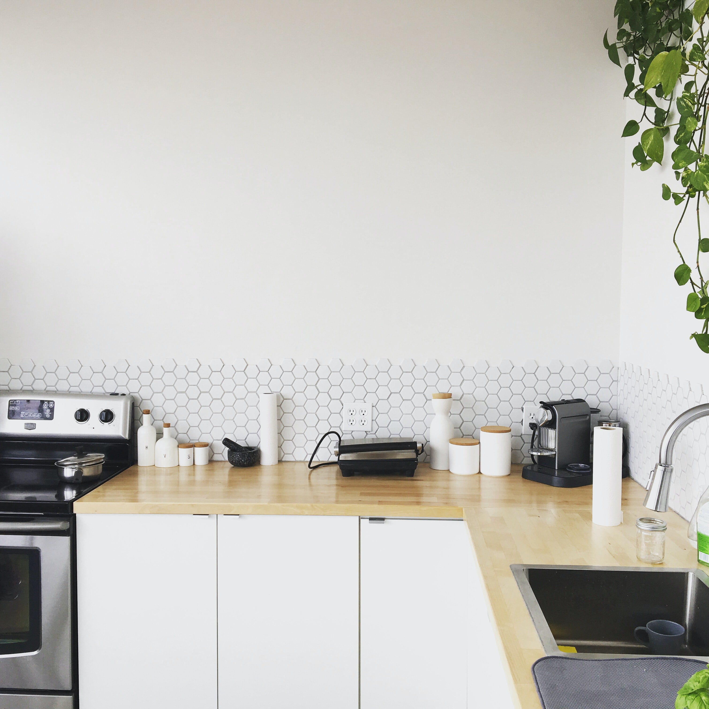
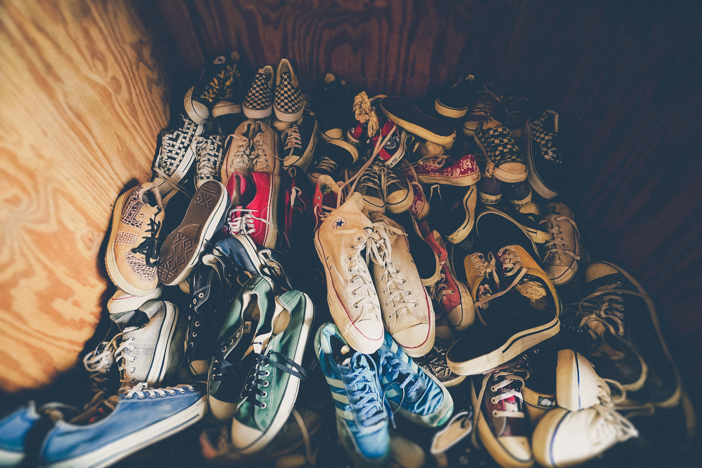
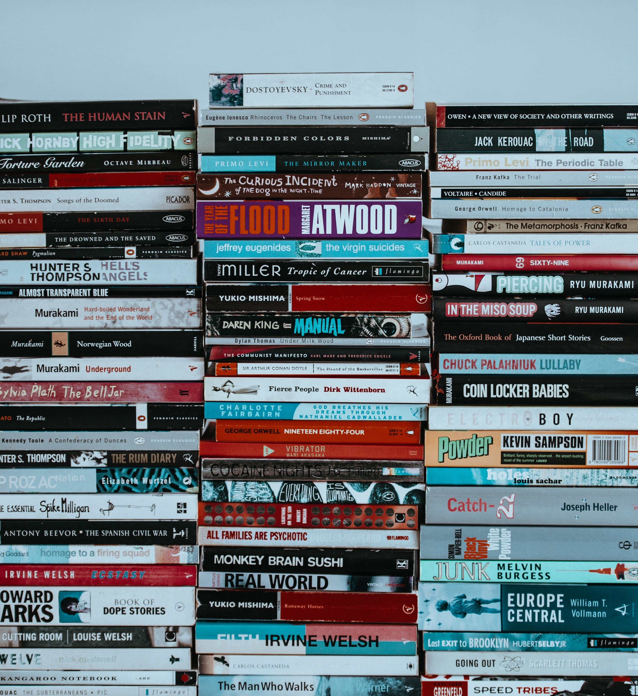

  
<a class="photoCred" style="margin-top: 300px; float: right;" href="https://unsplash.com/@karenuppal" target="_blank" rel="noopener noreferrer" title="Download free do whatever you want high-resolution photos from Igor Miske"><svg xmlns="http://www.w3.org/2000/svg" style="height:12px;width:auto;vertical-align:middle;top:-2px;fill:white" viewBox="0 0 32 32"><title>unsplash-logo</title><path d="M10 9V0h12v9H10zm12 5h10v18H0V14h10v9h12v-9z"></path></svg>Karen Uppal</a>

 

## Decluttering Your Home
___

###### 12 May 2020 by [@Vondreii](https://www.instagram.com/vondreii/?hl=en)
___

Decluttering helps us organise the things around us and can also help improve our overall wellbeing. Having a home or workspace that is well organised can improve productivity and make you feel more in control overall. Here is a list of some items that could be decluttered right now. These are just examples, so you do not have to remove any items that are of sentimental value.

### Room 1: Living Room

1. **Old/damaged cables** that are no longer used.
2. **Trinkets** that are on display. Of course, don't remove the ones ones that have sentimental meaning.
3. **Books** that are never read.
4. **DVDs** or **CDs** that are never played (we have Netflix now!).
5. **Devices** that are no longer used, such as old DVD players. If you have kids that moved out (and they left their game consoles) you can give it to them.
6. **Magazines, loose papers or receipts.**
7. **Small furniture** (if you have too many sidetables/stools around).
8. If you have too many **photo frames**, you could reduce the amount that are on display.
9. **Small things** sitting on/around the coffee table (such as coasters or mugs).
10. **Plants** on display.
11. **Light sources**. 1 or 2 lampshades depending on the living room size should be enough.

<!-- ----------- Image ----------- -->

  
  

Photo by <a href="https://unsplash.com/@sidekix">Sidekix Media </a>on Unsplash

<!-- ----------------------------- -->

### Room 2: Dining Room

12. **Placemats or coasters** that haven't been used.
13. **Table covers/rollers** that haven't been used.
14. **Silverware** on display in nearby cabinets.
15. **Old china** that's on display.
16. Old/unused **cloths or hand towels**.
	
### Room 3: Kitchen

17. **Plates** that you haven't used in a while.
18. **Cutlery** that you haven't used in a while.
19. **Pots and pans** that you haven't used in a while.
20. Old/unused **kitchen appliances** (how often do you use that mini-pancake maker?).
21. Check the expiry dates on any **stock/cans** that have been there for a while.
22. **Containers**.
23. **Cups!**
24. **Food that isn't expired** but has been there for a while. Use them to cook something.
25. **Cleaning products** that are not used.
26. **Ladels/serving spoons** that are not used.
27. **Other cooking materials** that are not used (for example, extra chopping boards, graters or mixers).

<!-- ----------- Image ----------- -->

  
  

Photo by <a href="https://unsplash.com/@mikael">Mikael Cho </a>on Unsplash

<!-- ----------------------------- -->

### Room 4: Bathroom

28. Old/unused **towels**.
29. **Bathrobes** that haven't been worn in a while.
30. **Lotions/moisturizing products** that haven't been used. For example, if you have a stockpile of lotions that you barely touch because you only use one or two.
31. **Old makeup.** This is the same as the above, keep the ones you use frequently and get rid of the rest.
32. Old/unused **floor slippers**.
33. **Bathroom plants** if there are too many or if they do not add much to the decor.
34. Old/unused **hair products** such as hairspray.
35. Old/broken **appliances** such as broken hairdryers or curling irons.
36. **Empty toilet rolls** you might have forgotten to throw away.
37. Old/unused **bathoom mats**.
38. Old/unused **toothbrushes**.

### Room 5: Bedroom

39. Old/unused **clothes**.
40. Old/unused **shoes**.
41. Old/unused **handbags**.
42. **Clothes that no longer fit** even though you used to wear them.
43. Old/unused **bedsheets or pillow cases**.
44. Old/unused **blankets**.
45. What's inside your **bedside table?** If you don't use it, toss it.
46. **Stickers/photos on the mirror** of the dressing table, if you have any.
47. More **trinkets** and items on display around cupboards or shelves.
48. **Personal items** such as keychains or old wallets that are no longer used.
49. Old/unused **luggages**.
50. **Boxes** that have been kept from previous things you bought.

<!-- ----------- Image ----------- -->

  
  

Photo by <a href="https://unsplash.com/@jakobowens1">Jakob Owens </a>on Unsplash

<!-- ----------------------------- -->
	
### Room 6: Spare Bedroom

51. Anything left in **storage** in containers under the bed or in bookshelves that hasn't been used in a while (and that is not important).
52. Again, **trinkets** and items on display around cupboards or shelves.
53. **Furniture.** If you aren't going to be storing much here you can keep the dressing tables/bookshelves to a minimum.

	
### Room 7: Study/Work Area

54. Old **Textbooks**.
55. Old **notes and study materials**.
56. **Art supplies** that may not be used (such as paint, markers).
57. **Stationary** (such as empty books or broken pens).
58. Unused **hardware** (such as broken hard drives or usbs).
59. More broken **cables**.
60. **Sticky notes** that are no longer valid.
	
### Room 8: Garage Area

61. More things kept in **storage** that are no longer used.
62. Old/unused **tools** like electric drills or multiple screwdrivers.
63. Old/unused **car accessories**.

<!-- ----------- Image ----------- -->

  
  

Photo by <a href="https://unsplash.com/@anniespratt">Annie Spratt </a>on Unsplash

<!-- ----------------------------- -->
	
### Conclusion

As you can see, there are so many possible things you could consider decluttering in your home. It can be very difficult to do this in one go, so doing it in sections can help.
It is useful to have three piles: **'definitely keeping'**, **'maybe'** and **'definitely do not need.'**  
**Definitely Keeping:** Keep!  
**Maybe:** Keep them in a bag and go through them in a few weeks and decide again.  
**Definitely Do Not Need:** These items can be put in bags and given to charity organisations (like the Salvation Army), sold for extra cash, or put on the side of the road for council collection. 

### Resources

* [https://brightside.me/inspiration-psychology/ten-reasons-why-decluttering-your-home-can-change-your-life-for-the-better-233960/](https://brightside.me/inspiration-psychology/ten-reasons-why-decluttering-your-home-can-change-your-life-for-the-better-233960/)

  

