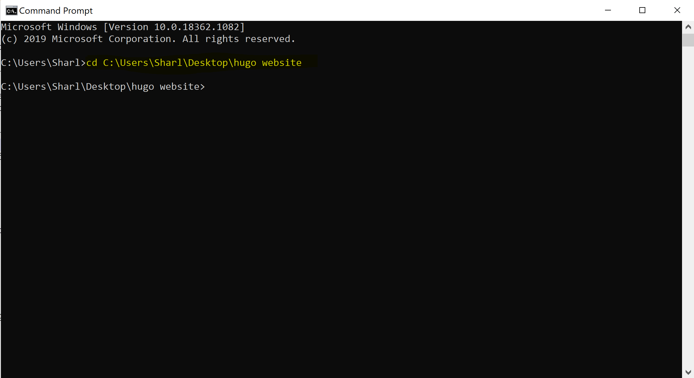
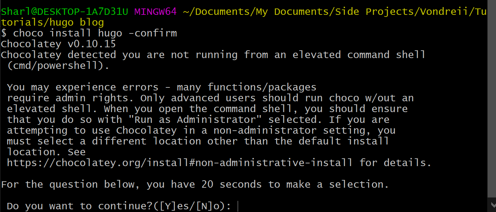
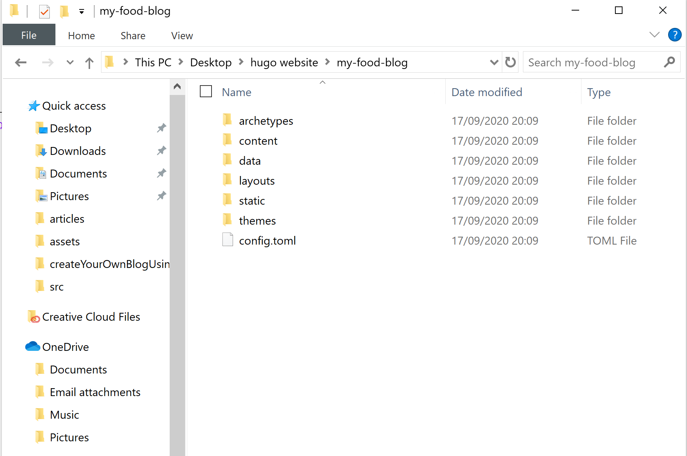
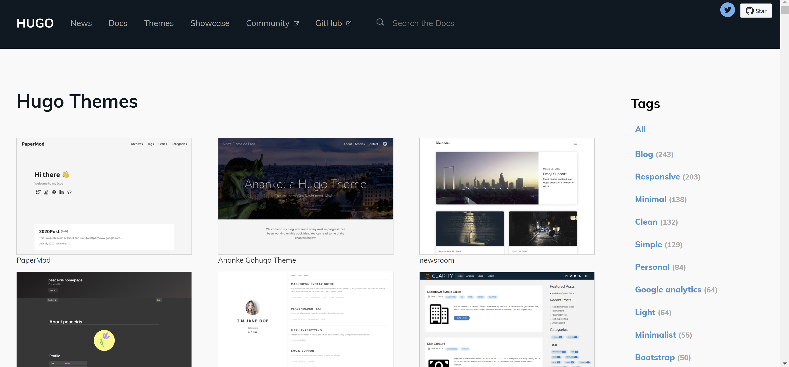

<br>
<div class="writtenContent">

## Creating Your Own Blog Using Hugo
___

###### 16 Sept 2020 by [@Vondreii](https://www.instagram.com/vondreii/?hl=en)
___

For this tutorial we will create our own blog site from scratch using a framework called Hugo. 

Online platforms such as Squarespace, Wix or Wordpress are very convenient to use to customise and create your own website, though they can get expensive when it comes to hosting, registeration and adding premium features.
  
Hugo is a framework where you can create your own website, completely from scratch without much effort or without knowing too much (or any) of the internal programming.
There are also many web hosting platforms that can easily host a Hugo project for free - meaning, the only money you will spend will be for the custom domain name!

You can choose from lots of amazing free themes. Each blog post is written as a `.md` file, also known as `markdown`. Markdown is just english, but with a few added symbols to symbolise where the headings are, which words are bold, or any other special formatting that might be needed.

We will primarily be using Windows, however there are equivalent ways of doing some of the steps on a MAC. Most of the steps should be the same.

We will go through everything from:

* Installing Hugo
* Creating a new project
* Adding a theme
* Customising the theme (if needed)
* Hosting your new website 

### Installing Hugo

Create a folder where you want to store your project.

<!-- ----------- Image ----------- -->
<div class="image-container">
	
	<div class="image-description"><p>Create a folder for your project</p></div>
</div>
<!-- ----------------------------- -->

Go into the command prompt and navigate to the folder you have created. Run `cd <path to your project folder>`. For example, I created my folder `hugo website` in the Desktop, so I would run:

```bash
cd C:\Users\Sharl\Desktop\hugo website

```

<!-- ----------- Image ----------- -->
<div class="image-container">
	
	<div class="image-description"><p>CMD</p></div>
</div>
<!-- ----------------------------- -->

Now, we will install hugo and create a new project from scratch. In the command prompt, we will run a few commands that will install hugo and create the base of the website.

For windows, if you use chocolatey for package management, run:

```bash
choco install hugo -confirm

```

otherwise if you use Scoop for package management, run:
```bash
scoop install hugo

```

You can check what you are using by going into your `C:\ProgramData` folder and seeing if you either have chocolatey or scoop.

<!-- ----------- Image ----------- -->
<div class="image-container">
	
	<div class="image-description"><p>More options to install hugo: https://gohugo.io/getting-started/installing/</p></div>
</div>
<!-- ----------------------------- -->

To install hugo using a MAC:

```bash
brew install hugo

```

To install hugo using Linux:

```bash
brew install hugo

```

### Creating a new project

Now that we have hugo installed, we can start our project.

In the command prompt, run `hugo new site <name of blog here>`. For this example, we will make a blog about food, which will be called 'My Food Blog':

```bash
hugo new site my-food-blog

```

This will create a new folder called my-food-blog. If you open the folder, you will see that the 'skeleton' or 'base' folders have automatically been created, which should look something like this:

<!-- ----------- Image ----------- -->
<div class="image-container">
	
	<div class="image-description"><p>More options to install hugo: https://gohugo.io/getting-started/installing/</p></div>
</div>
<!-- ----------------------------- -->


### Creating the basic structure of the website

You can browse through the themes listed at https://themes.gohugo.io/.

<!-- ----------- Image ----------- -->
<div class="image-container">
	
	<div class="image-description"><p>More options to install hugo: https://gohugo.io/getting-started/installing/</p></div>
</div>
<!-- ----------------------------- -->

When I was first using hugo, I followed the tutorial from https://www.freecodecamp.org/news/your-first-hugo-blog-a-practical-guide/, and they recommend using the Ghostwriter theme if you are starting out. We will instead pick a different design, since for a food blog we want to be using more images.

So, we will be using the Hestia Pure theme for now. You can check out the demo here: https://themes.gohugo.io/theme/hestia-pure/.

You can browse the themes page until you find it, otherwise the direct link to the theme is https://themes.gohugo.io/hestia-pure/.

### Resources
* https://www.freecodecamp.org/news/your-first-hugo-blog-a-practical-guide/
* https://gohugo.io/getting-started/installing/