<div class="parallax" style="height: 350px; background-image: url('../../../assets/articles/web-dev-images/hostingAngularApplicationUsingNetlify/header-dark.jpg');">
  <div class="imageTextCollage"><a class="photoCred" style="margin-top: 300px; float: right;" href="https://unsplash.com/@domenicoloia" target="_blank" rel="noopener noreferrer" title="Download free do whatever you want high-resolution photos from Igor Miske"><span style="display:inline-block;padding:2px 3px"><svg xmlns="http://www.w3.org/2000/svg" style="height:12px;width:auto;vertical-align:middle;top:-2px;fill:white" viewBox="0 0 32 32"><title>unsplash-logo</title><path d="M10 9V0h12v9H10zm12 5h10v18H0V14h10v9h12v-9z"></path></svg></span><span style="display:inline-block;padding:2px 3px">Domenico Loia</span></a></div>
</div>
<br>
<div class="writtenContent">

## Hosting An Angular Application Using Github And Netlify
___

###### 30 Aug 2020 by [@Vondreii](https://www.instagram.com/vondreii/?hl=en)
___

For this tutorial, you will need a working Angular App ready to host, and a Github Account already set up.

If you don't have an Angular App, you can follow the steps in this tutorial: [Creating A Simple Angular Web Application](/webdev/post/creatingASimpleAngularWebApplication) to make one.
Otherwise, you can download the source code of a working simple Angular App from [here](https://github.com/vondreii/Example-Angular-Project-Tutorial).

If you don't have a Github repository, you can follow the steps in this tutorial: [Setting Up A Github Repository and Creating A Local Copy](/coding/post/settingUpASimpleGithubRemoteAndLocalRepository).

### Github with Netlify

Netlify is a free hosting platform where you can host your website live using a customisable domain name provided with a .netlify.app extension at the end (you can also link your own custom domain if you'd like).
One way Netlify does this is by connecting to an existing repository and hosting your website code stored there.

In this tutorial we will go through how to host an Angular web application using Netlify in 4 steps:

* Adding your Angular code to your repository
* Creating a Netlify account 
* Linking Netlify to your Github repository
* Changing any additional configurations to host the website successfully

### 1. Adding your Angular code to your repository

If you do not yet have a local copy of the Github repository, navigate to your repository on GiHub.
Click on the **Code** link, and make a note of the link under **Clone with HTTPS**.

<div class="blog-image-container">
    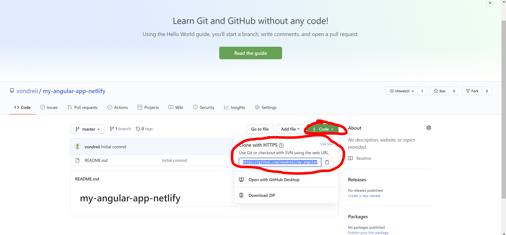
	<div class="content-photo-credit"><p>Repository settings</p></div>
</div>

Open your command prompt. Navigate to any location, for example, the **Desktop**:

```Bash
cd Desktop
```

Then, run the command: `git clone <<put-the-link-here>>`. For example, my link was `https://github.com/vondreii/my-angular-app-netlify.git`, so I would write:

```Bash
git clone https://github.com/vondreii/my-angular-app-netlify.git
```

For example:

<div class="blog-image-container">
    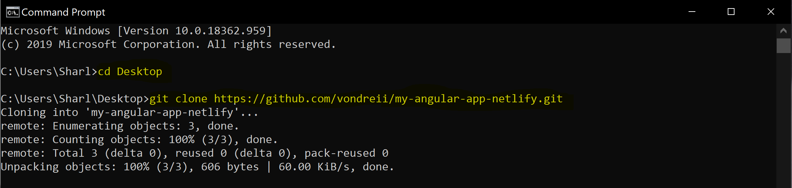
	<div class="content-photo-credit"><p>Running this command will create a new folder</p></div>
</div>

This should automatically create a new folder locally on your computer, which will be linked to your online repository.
In this example, my repository is called `My-Angular-App-Netlify`, so the new folder that was created in my Desktop was also called `My-Angular-App-Netlify`.

You want to add the code to your Angular Wepsite into this folder, insuring that the root of the angular application contains your `e2e`, `node_modules` and `src` folders, as well as other root level files, as shown below:

<div class="blog-image-container">
    
	<div class="content-photo-credit"><p>Running this command will create a new folder</p></div>
</div>

Now run the following commands to push the code to your remote repository:

```Bash
git add .
```

```Bash
git commit -m "Added Angular Code"
```

```Bash
git push
```

If you already have a repository that stores your Angular code, just ensure that the correct folders and files make up the root folder as shown in the previous image. 

Once you have pushed your code, go to your repository on your Github page. You should be able to see that your repository has now updated with the code to your Angular website.

<div class="blog-image-container">
    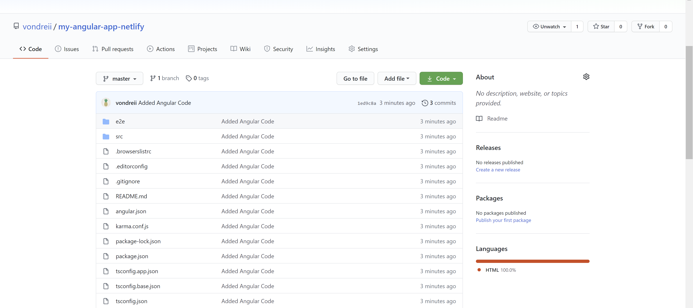
	<div class="content-photo-credit"><p>Angular code in remote repository</p></div>
</div>

### 3. Creating a Netlify Account 
	
Now that we have a Github repository storing the code online, we can create a Netlify Account. This will be used to host the actual website.

Go to Netlify's [home page](https://www.netlify.com/) and click on Sign up.

<div class="blog-image-container">
    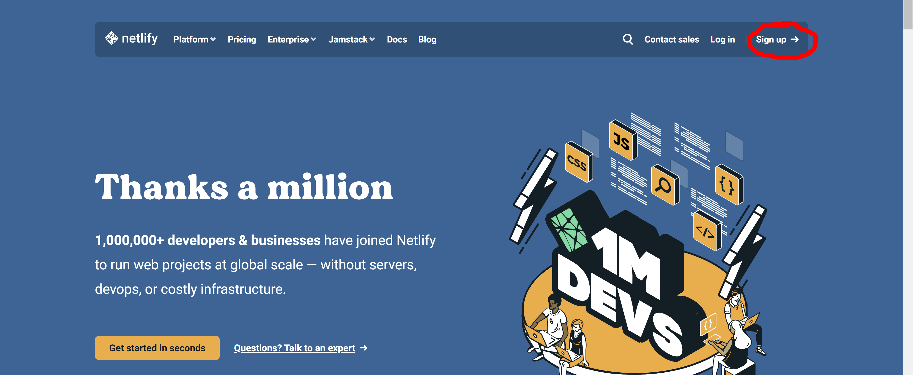
	<div class="content-photo-credit"><p>Netlify</p></div>
</div>

You will be given a few different options to choose from of where you want to link Netlify to. Since we are going to be using Gihub, select Github and follow the prompts to sign in.

<div class="blog-image-container">
    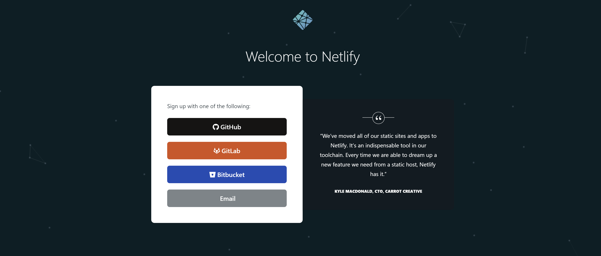
	<div class="content-photo-credit"><p>Sign up to Netlify using GitHub</p></div>
</div>

Here you will sign in as if you are signing in to Github. Put in your username/email and password for your Github account.

<div class="blog-image-container">
    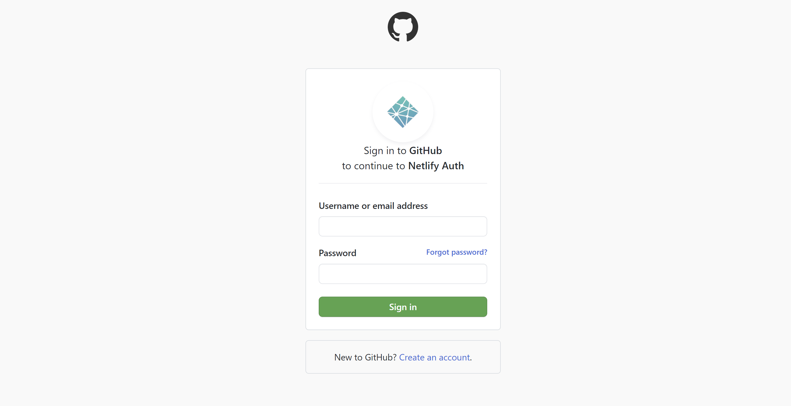
	<div class="content-photo-credit"><p>Login using GitHub</p></div>
</div>

Follow the prompts to complete the account setup. When authorizing Netlify, select 'Authorize netlify.'

<div class="blog-image-container">
    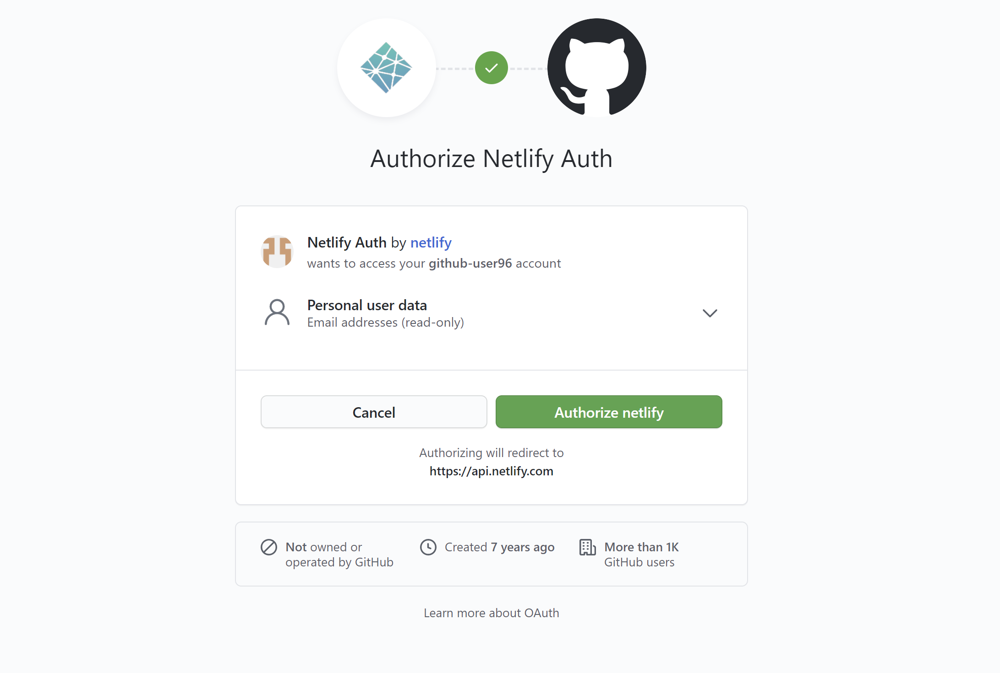
	<div class="content-photo-credit"><p>Authorize Netlify</p></div>
</div>

Now you have your Netlify account setup! You should be able to see your main dashboard and a quick start guide pop-up. You can either read through or exit the quick start guide.

<div class="blog-image-container">
    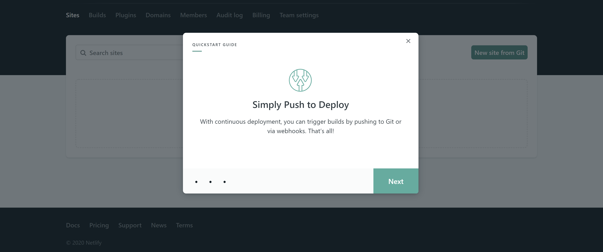
	<div class="content-photo-credit"><p>Completed account setup</p></div>
</div>

### 4. Linking a Netlify Project to your Github repository

Once way that Netlify hosts your website is by connecting to a Github repository that stores the code of your website. We already have a Github repository that stores your website's code. 
All we have to do now is link that Github repository with Netlify, so Netlify will be able to host it.
That way your website can display using a domain like http://angular-project.netlify.app

Select **New Site From Git:**

<div class="blog-image-container">
    
	<div class="content-photo-credit"><p>Select New site from Git</p></div>
</div>

Select **Github**, since we will be linking to our Github repository:

<div class="blog-image-container">
    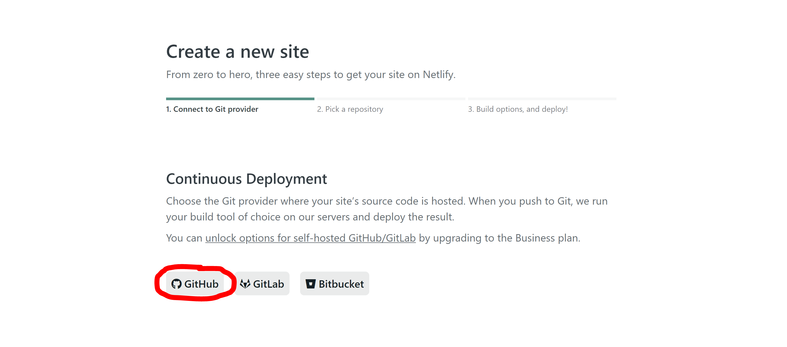
	<div class="content-photo-credit"><p>Select 'Github'</p></div>
</div>

Grant permission to Netlify:

<div class="blog-image-container">
    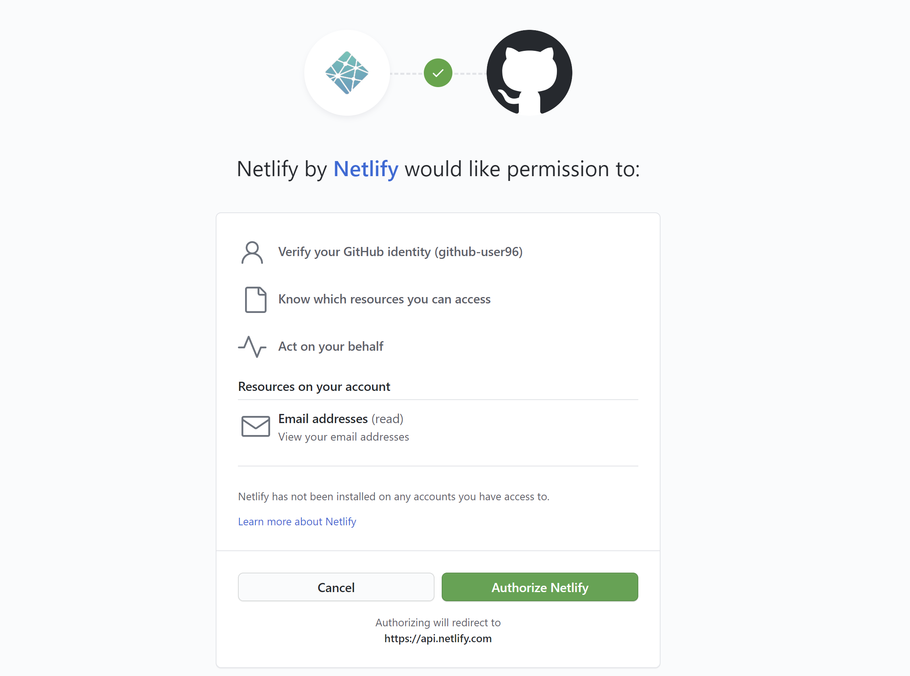
	<div class="content-photo-credit"><p>Select 'Authorize Netlify'</p></div>
</div>

You will then be asked to install Netlify. Here, you are not installing anything on your local computer. You are 'installing' or connecting your Netlify account to be associated with your Github account.
You can either choose:
* **All repositories:** Netlify will have access to all repositories that you will have on your account. 
* **Select repositories:** You are only giving Netlify permission to certain repositories of your choice.

In this case, it does not really matter which option you choose as the end result will be the same. For this tutorial we will choose to give Netlify access only to the repository we want to host:

<div class="blog-image-container">
    
	<div class="content-photo-credit"><p>Select repositories you will allow Netlify access to</p></div>
</div>

A list of Github repositories will appear and you can now select the one you want to host.
Select the repository where you have stored your Angular code:

<div class="blog-image-container">
    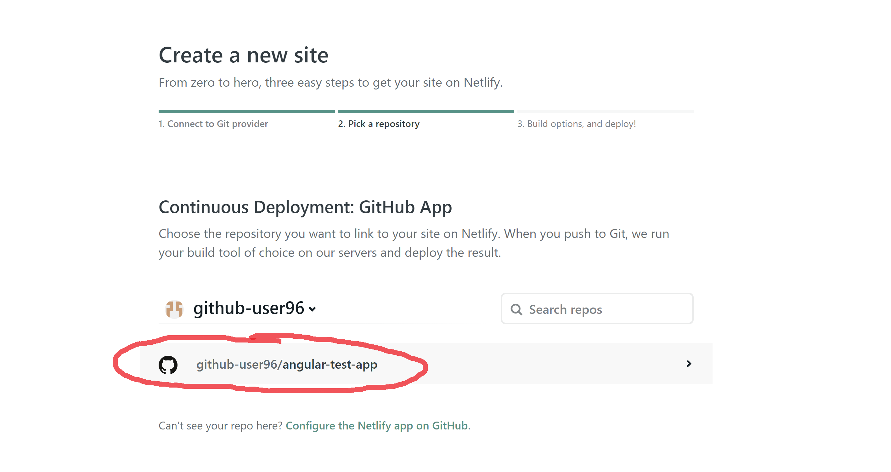
	<div class="content-photo-credit"><p>Select the repository you want to host</p></div>
</div>

Now you will be presented with a page asking for some information about the deployment of the website:

<div class="blog-image-container">
    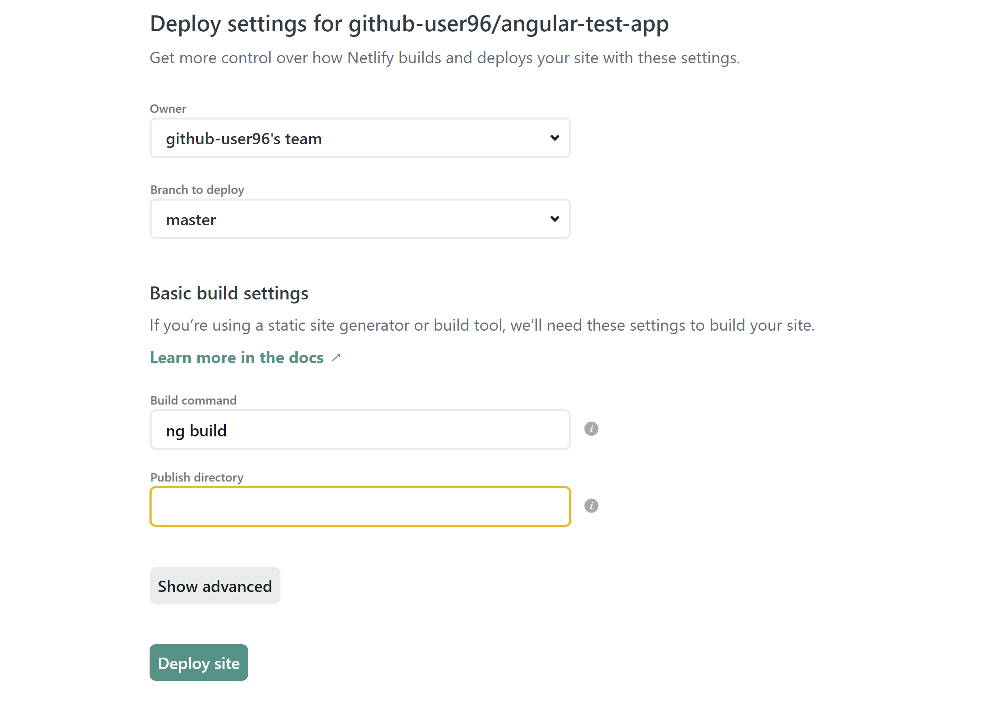
	<div class="content-photo-credit"><p>Fill in basic details</p></div>
</div>

Keep the **Owner** and **Branch to deploy** fields at the default value (unless you specifically need to change them).
For Basic the Build Setting fields:

**Build command:** Type in `ng build`. Sometimes `ng build --prod` may work for some people instead (this can be changed later if needed).

**Publish directory:** Leave this blank for now, we will fill it in later when we have the information.

Finally select **Deploy site.**

Now you have linked your github repository to your Netlify account! You will be redirected to a page that you can use to manage or control your site's deployment settings. Netlify randomly generates a domain name, such as the one below.
However, we will change this later via the settings.

<div class="blog-image-container">
    
	<div class="content-photo-credit"><p>Netlify connected</p></div>
</div>

Netlify will automatically attempt to build and host your code. However your site will fail and there will still be errors if you try to deploy at this stage.
You will need to still complete some extra configurations in order for hosting to work properly. 

<div class="blog-image-container">
    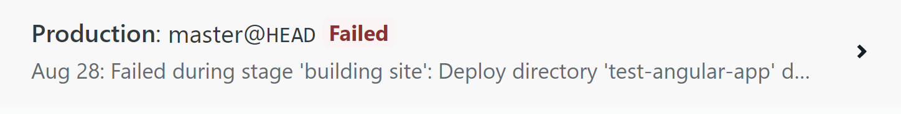
	<div class="content-photo-credit"><p>Failed deploys</p></div>
</div>

### 5. Changing any additional configurations to host the site successfully

#### Adding the _redirects file

Go back to your application's directory (the local repository where your code is stored on your computer).

First you will need to add a _redirects file. Without it, you will get a screen showing an error if you try to navigate or refresh your pages.

<!-- ToDo: Add an image of the error page that happens without _redirects -->

If you want, you can download a completed _redirects file from <a href="../../assets/downloads/redirects.zip"> here </a>.
Unzip the folder and copy the _redirects file into your `AngularApp > src` folder so it looks like this:

<div class="blog-image-container">
    
	<div class="content-photo-credit"><p>_redirects folder</p></div>
</div>

Otherwise, you can create the file manually. 
Create a new file called `_redirects` (without an extension) in `AngularApp > src` (as shown above). 

Add the following code into the file: 

```Bash
/*    /index.html    200
```

#### Build/Compile your project

You need to build/compile your angular project. Run the following command in your `AngularApp` directory. 

```Bash
ng build
```

Once the code finishes building, a dist folder will be created as shown in the image below:

<div class="blog-image-container">
    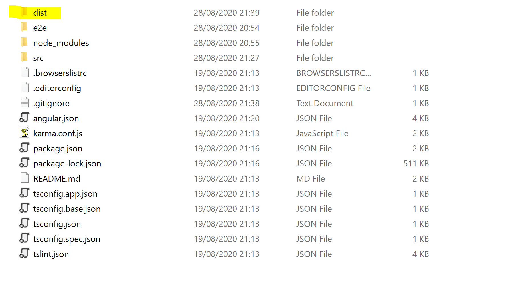
	<div class="content-photo-credit"><p>dist folder created</p></div>
</div>

Now open the `.gitignore` file:

<div class="blog-image-container">
    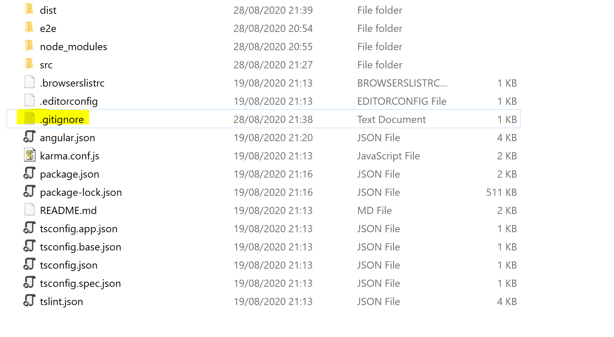
	<div class="content-photo-credit"><p>.gitignore file</p></div>
</div>

The top part of the file should look like this: 

<div class="blog-image-container">
    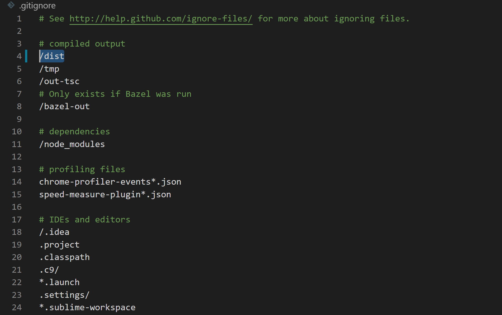
	<div class="content-photo-credit"><p>.gitignore code</p></div>
</div>

Completely delete the line `/dist` (the line highlighted in the image above). 

This is because when you push your changes to the remote repository, git will be ignoring your `/dist` folder and will therefore not include it.

Now we can push the changes we made to the github repository.

```Bash
git add .
```

```Bash
git commit -m "Added redirects, updated gitignore and compiled the project"
```

```Bash
git push
```
	
If you go to your remote repository you will see that your `dist/{project-name}` is now stored:

<div class="blog-image-container">
    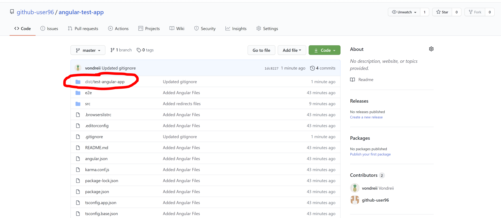
	<div class="content-photo-credit"><p>dist/{project-name} stored remotely on Github</p></div>
</div>

It is important that you have your `dist/{project-name}` folder here because Netlify will use this to host your website.
Here, you can see that mine is `dist/test-angular-app`.

#### Configure your Build settings

Finally, go back to your site's page on Netlify and click on the **Deploy settings** for your site.

<div class="blog-image-container">
    
	<div class="content-photo-credit"><p>dist/{project-name} stored remotely on Github</p></div>
</div>

Click on **Build and Deploy**, then **Edit Settings:**

<div class="blog-image-container">
    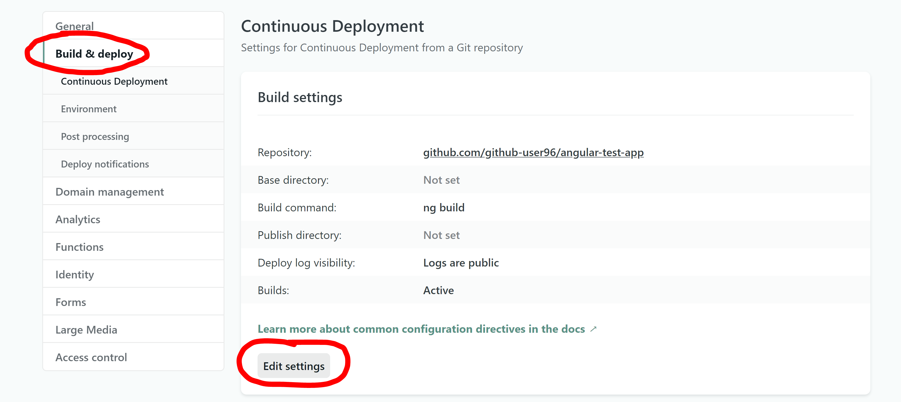
	<div class="content-photo-credit"><p>Deploy Settings</p></div>
</div>

Edit the **Publish directory** field, which we left blank previously. Here, this is where you put your `dist/{project-name}` from before. (This is the dist folder that shows in your Github remote repository).
For example, mine was `dist/test-angular-app`:

<div class="blog-image-container">
    
	<div class="content-photo-credit"><p>Change the Publish Directory</p></div>
</div>

Press save.

#### Change your domain name

If you want to change the domain name to something that is not automaticaly generated, go back to the **Deploy settings.**

<div class="blog-image-container">
    
	<div class="content-photo-credit"><p>Deploy settings</p></div>
</div>

Click on **Domain Management** and **options**:

<div class="blog-image-container">
    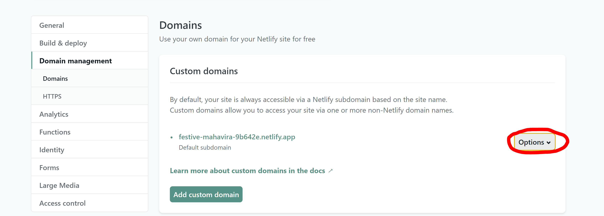
	<div class="content-photo-credit"><p>Domain Management tab</p></div>
</div>

Type in your new domain.

<div class="blog-image-container">
    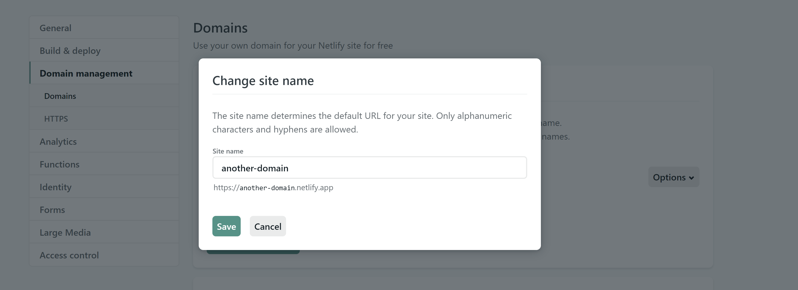
	<div class="content-photo-credit"><p>Enter your new domain name</p></div>
</div>

Because this will be a free domain, Netlify will add a `.netlify.app` extension at the end. If you do not want this you will need to purchase or acquire another domain and add this to Netlify to use instead.


#### Run, Test and Deploy your website

Go back to your site's page on Netlify. Netlify should automatically attempt to deploy your site again. If not, you can select the **Trigger Deploy** option.

Wait for a while until your site finishes deploying.

Go into the search bar and type your new domain name, for example http://another-domain.netlify.app, and you should now be able to see your website up and running:

<div class="blog-image-container">
    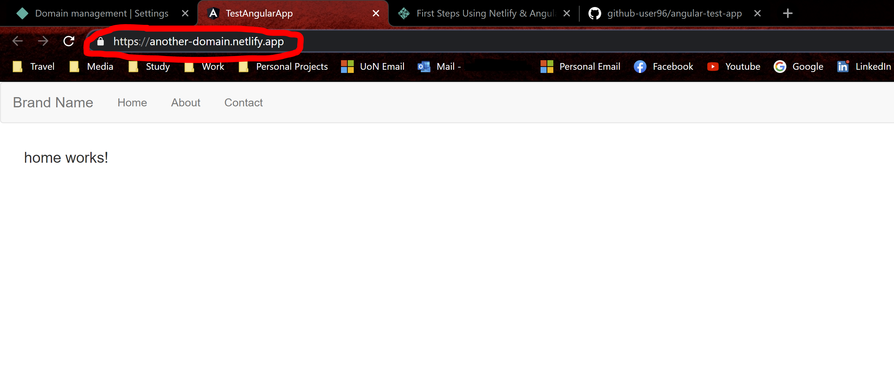
	<div class="content-photo-credit"><p>Run your new site</p></div>
</div>
 
### Key Points
If you want to make changes to your website, all you have to do is edit your Angular app code in your local repository, and run `git add .`, `git commit -m "type message here"`, and `git push` to save it to your remote Github repository.
Everytime you `git push`, Netlify will automatically trigger an attempt to re-deploy your code including the new changes.

<!-- ToDo add some images to show this somehow. -->

### Resources

* [First Steps Using Netlify & Angular](https://www.netlify.com/blog/2019/09/23/first-steps-using-netlify-angular/)
* [Deploying an Angular App to Netlify](https://scotch.io/tutorials/deploying-an-angular-app-to-netlify)

<br><br>

</div>