 

## Linking A Namecheap Domain To Firebase
___

###### 04 Oct 2020 by [@Vondreii](https://www.instagram.com/vondreii/?hl=en)
___

Assuming you already have a website hosted on Firebase, you might not be satisfied with the default free domain name (which ends in something like **.firebaseapp.com** or **.web.app**). 

If you've already bought a Namecheap domain name, this is how you can link it to your Firebase hosted website.

### Linking a custom domain using Namecheap

Go into your Firebase account and go to the console. Select the project that you deployed your app to. 

<!-- ----------- Image ----------- -->

	
	

Firebase console

<!-- ----------------------------- -->

In the sidebar, click on **Hosting**, then **Add custom domain**. 

<!-- ----------- Image ----------- -->

	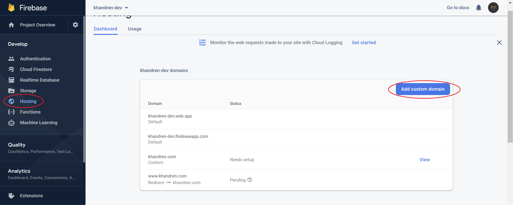
	

Hosting dashboard

<!-- ----------------------------- -->

Type in the custom domain you want to add:

<!-- ----------- Image ----------- -->

	
	

Add Custom Domain

<!-- ----------------------------- -->

If you want to redirect it to an existing website, you can add it here too:

<!-- ----------- Image ----------- -->

	
	

Example of redirecting an address to another one

<!-- ----------------------------- -->

When you select **continue**, the next screen will give you some information that you will need to use to help you verify your namecheap domain name in order for you to be able to link it to your new website:

<!-- ----------- Image ----------- -->

	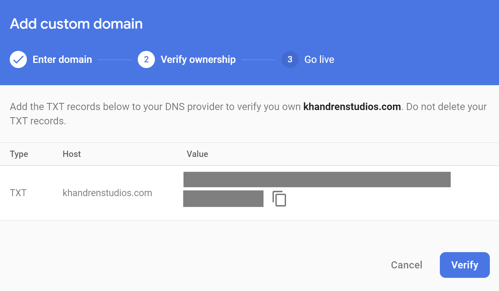
	

Domain verification details

<!-- ----------------------------- -->

Keep the host name and the value saved. We will use this later.

Now go to [Namecheap](https://www.namecheap.com/) and login. You should do this in another tab so you don't lose the page opened in Firebase. 

In Namecheap, go to your **dashboard**:

<!-- ----------- Image ----------- -->

	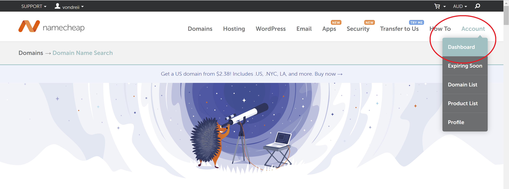
	

Namecheap dashboard

<!-- ----------------------------- -->

Then go to the **domain list** of your Namecheap account, and click on **manage** for the domain that you want to link with the website you just hosted.

<!-- ----------- Image ----------- -->

	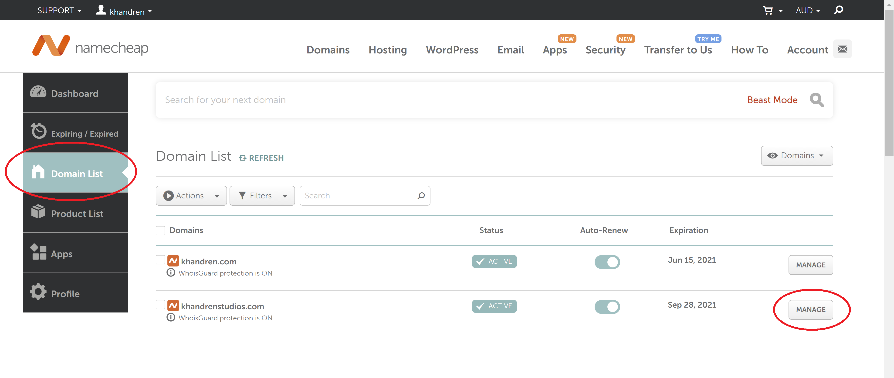
	

Namecheap domain list

<!-- ----------------------------- -->

Click on **Advanced DNS**:

<!-- ----------- Image ----------- -->

	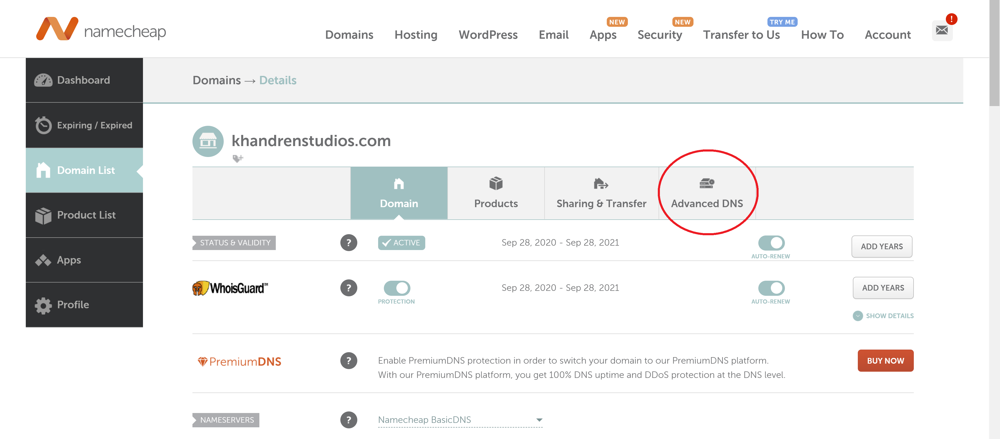
	

Advanced DNS settings

<!-- ----------------------------- -->

Here, you will see multiple record entries. At the bottom of this list, click on **Add new record**. In the dropdown, select **TXT Record**:

<!-- ----------- Image ----------- -->

	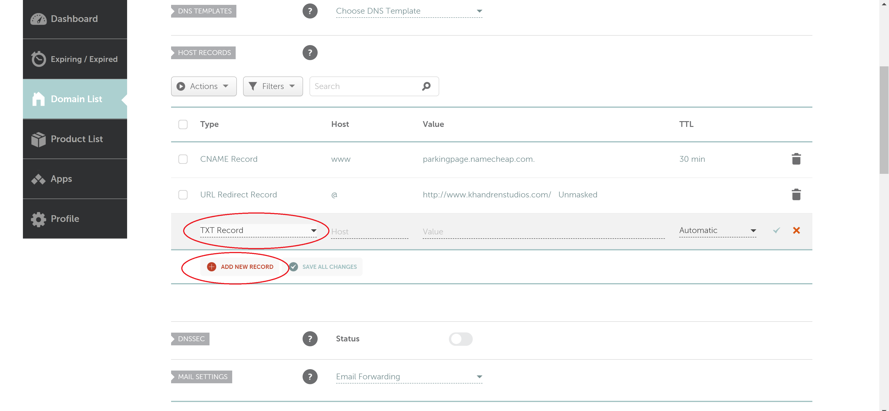
	

Add a new TXT record

<!-- ----------------------------- -->

In the **Host** field, type `@`. 

Switch back to the Firebase window that you should have kept opened from the previous steps. Copy the whole text inside the **Value** field.

Go back to Namecheap and paste it into the **Value** field here:

<!-- ----------- Image ----------- -->

	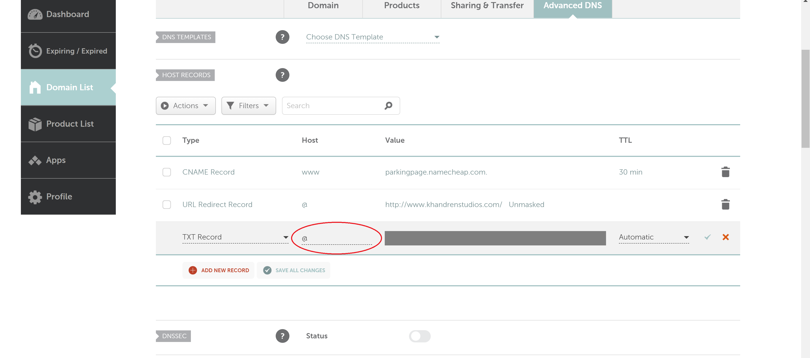
	

Add details to the new TXT record

<!-- ----------------------------- -->

Once you are done, select the **green tick** on the right or select **Save all changes**.

Select **Add new record** again, this time we will add a CNAME entry, with `www` as the host and your **domain name** as the value.

<!-- ----------- Image ----------- -->

	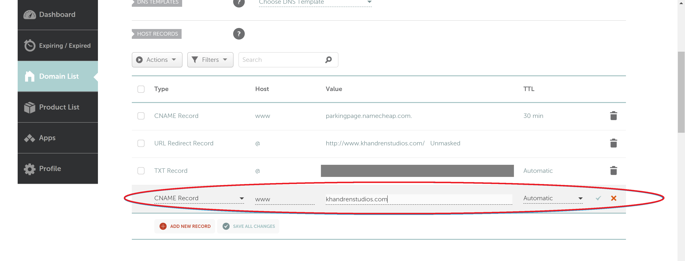
	

Add a CNAME record

<!-- ----------------------------- -->

Once again, select the **green tick** on the right or select **Save all changes**.

By this point, namecheap may have automatically removed your old records as you were adding these new ones.

Switch back to firebase and click **Verify**. You might get an error the first time and will have to wait for a while or click it a second or third time.

After that you should get this screen, showing a list of **A Records** that you will need to add for your Namecheap domain setup (the actual IP addresses have been blocked for security reasons):

<!-- ----------- Image ----------- -->

	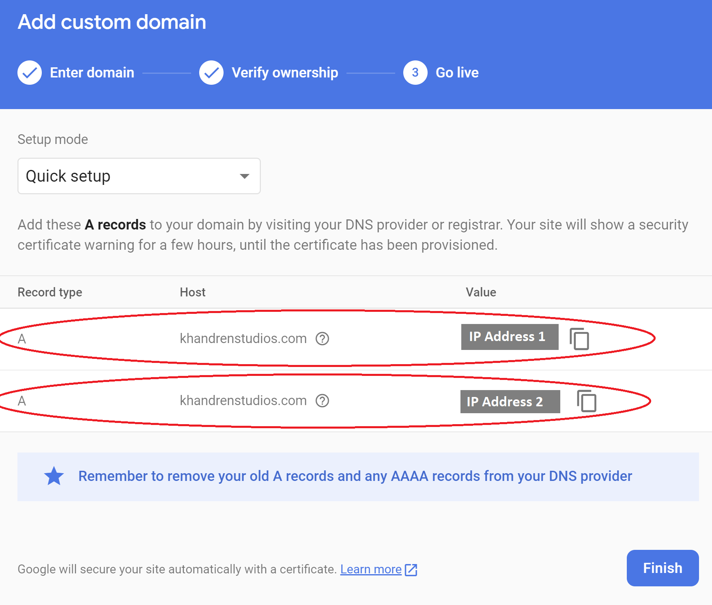
	

IP addresses

<!-- ----------------------------- -->

You will need to save the IP addresses listed here.

Once again, go back to Namecheap, where you should still have your advanced DNS settings opened.

Add the **A Record**, with the host as `@` and the value as the first IP address:

<!-- ----------- Image ----------- -->

	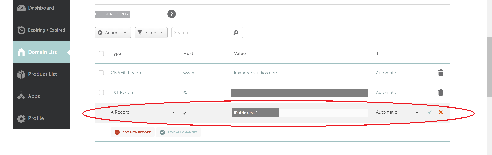
	

Add a new A Record using the first IP address

<!-- ----------------------------- -->

Add the second **A Record**, also with the host as `@` and the value as the second IP address:

<!-- ----------- Image ----------- -->

	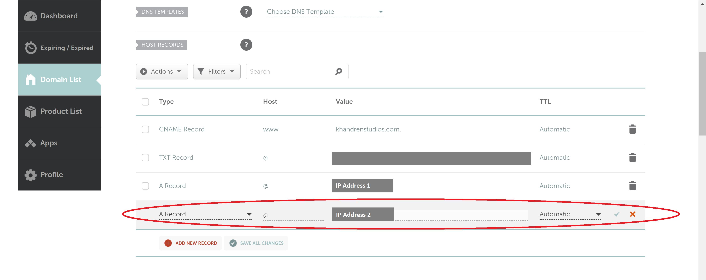
	

Add a new A Record using the second IP address

<!-- ----------------------------- -->

Switch back to firebase, and press **finish**.

Now you should be all set! You may still have to wait up to 24 hours for your website to start showing when you try to access it using your new bought domain name.

  

