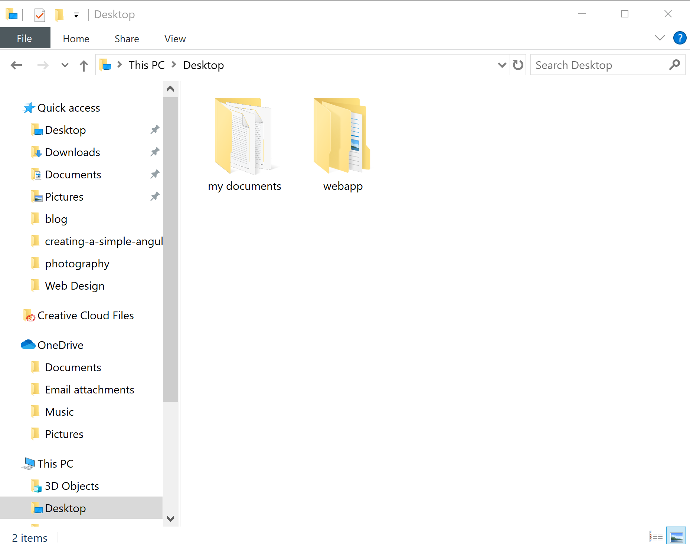
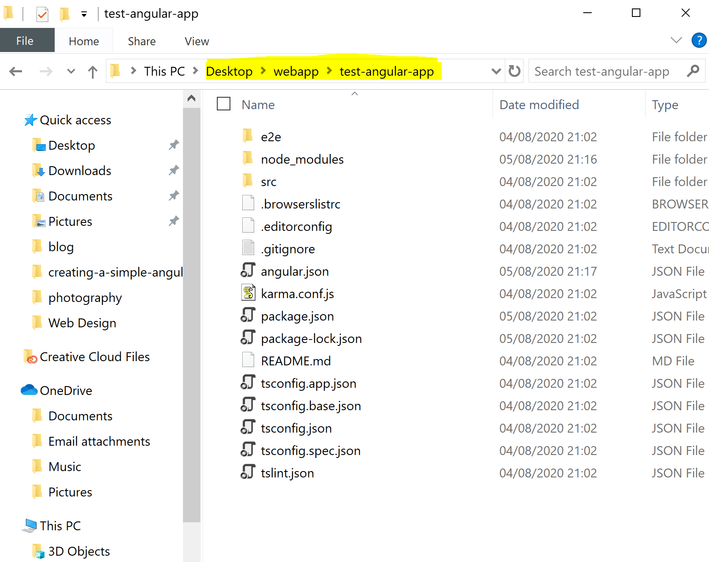
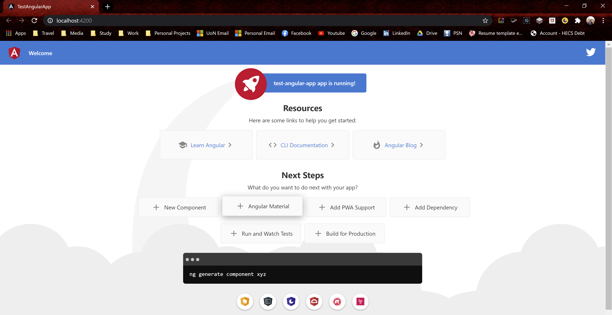
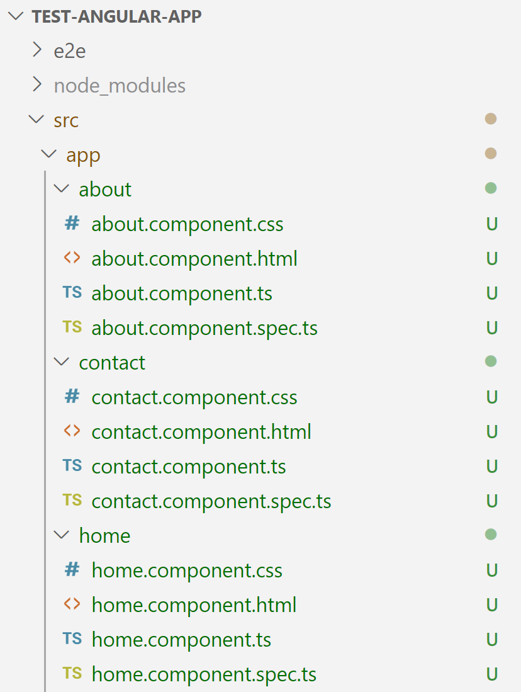
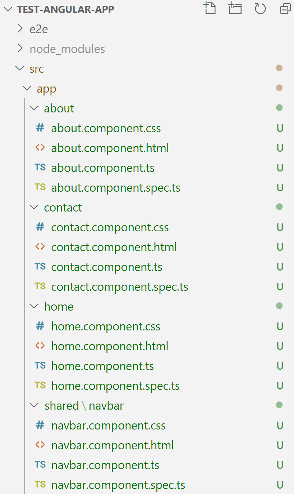
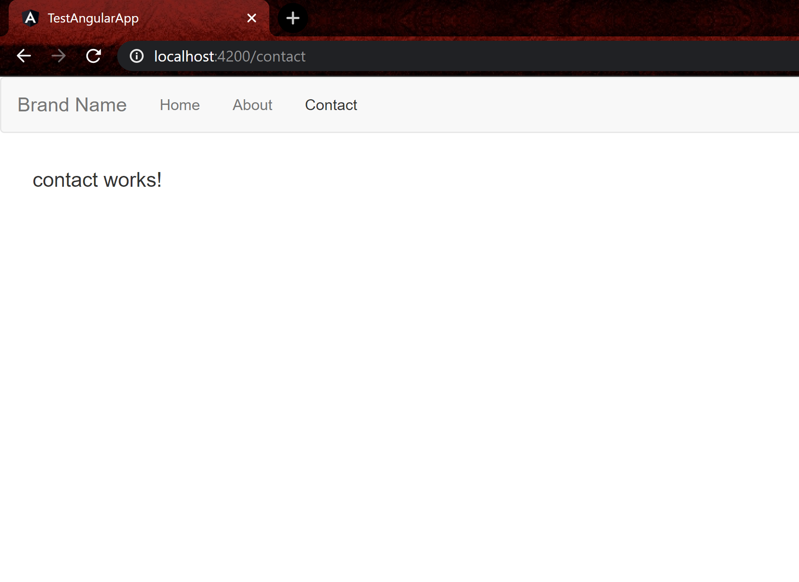

<div class="writtenContent">

#### 04 Aug 2020
# Creating A Simple Angular Web Application
___

<!-- ----------- Intro ----------- -->
<div class="avatar-block">
    
    <h5 class="avatar-text avatar-align"> by Vondreii</h5>
</div>
<br>
<!-- <div class="image-container">
    
  	<div class="image-description"><p>Photo by <a href="https://unsplash.com/@ffstop">Fotis Fotopoulos</a> on Unsplash</p></div>
</div> -->
<!-- ----------------------------- -->

This tutorial will go through how you can create a simple angular web app in 3 stages:

* Setting up the environment
* Adding pages to the app
* Adding the navbar and configuring routes 

### Setting up the environment

First you will need to install the `Angular CLI` to be able to create Angular projects. You can do this by opening your command prompt or terminal and running:

```bash
npm install -g @angular/cli

```

Navigate to a place in your files directory where you would like to store your project. Make a new folder, for example, `webapp`:

<!-- ----------- Image ----------- -->
<div class="image-container">
	
	<div class="image-description"><p>Angular app project folder</p></div>
</div>
<!-- ----------------------------- -->

In a command line or terminal, navigate to the location of this folder. For example, if your folder location is `C:\Users\user1\Desktop\webapp`, then you would run:

```bash
cd C:\Users\user1\Desktop\webapp

```

Now run the following command to create a new Angular Application, which will be stored within the `webapp` folder:

```bash
ng new test-angular-app --routing=true --style=css

```

You can change this based on your needs.
* The `--routing` parameter adds Angular routing (either `true` or `false`)
* The `--style` parameter allows you to choose which stylesheet format you would like to use (can be `CSS`, `SCSS`, `Sass`, `Less`, or `Stylus`). For this tutorial we are using CSS. 
* If you want to use SCSS with MDBootstrap, you can read how to [Create an Angular app with MDBootstrap](https://sorakhan.com/post-001). 

Now you have the framework to develop an Angular App. If you open the `test-angular-app` folder (which contains the source code) it should look similar to this:

<!-- ----------- Image ----------- -->
<div class="image-container">
	
	<div class="image-description"><p>Source Code</p></div>
</div>
<!-- ----------------------------- -->

Note that the root of the application is in `Desktop/webapp/test-angular-app`.
Navigate to the `test-angular-app` folder in the command line and run the command:

```Bash
ng serve --open

```

Wait for the program to compile. When it finishes, a web browser should open with your webpage running locally - if the default angular app home page is shown, then you are on the right track:

<!-- ----------- Image ----------- -->
<div class="image-container">
	
	<div class="image-description"><p>Default angular opening webpage</p></div>
</div>
<!-- ----------------------------- -->

### Adding pages to the app

We will now make three basic pages, the `Home` page, the `About` page and a `Contact` page for the sake of having some basic navigation.

To open the source code you can open the whole folder in `Visual Studio Code` if you have it [installed](https://code.visualstudio.com/download). Otherwise you can manually edit the files.
In the root of the app's directory, run the following commands one after another in the command window: 

```Bash
ng g c home

```

```Bash
ng g c about

```

```Bash
ng g c contact

```

Three components/folders will be generated: `src/app/about`, `src/app/home` and `src/app/contact`.

<!-- ----------- Image ----------- -->
<div class="image-container">
	
	<div class="image-description"><p>About, home and contact components newly added</p></div>
</div>
<!-- ----------------------------- -->

Each component has a html, css and typescript file. By default there is a single html line for each. For example, the Contact page has `<p>contact works!</p>`. We will leave the default content for this tutorial, 
however you can choose to add your own html and css if you wish. As you build the website you can add content and styling using these pages. 

There is also a master CSS styling file located in `src/styles.css`, which applies styling to all the pages. In `src/styles.css`, replace the existing code with:

```CSS
p {
    padding: 10px 30px;
    font-size: 14pt;
    font-family: Arial, Helvetica, sans-serif;
}

```  

### Adding the navbar and configuring routes 

Now, we want to add a navigation bar to the app to link these pages together. For this tutorial we will use a bootstrap navbar.

You can add Bootstrap to the Angular app by first installing Bootstrap. 

In the root directory of the application, run one of the following commands:

```js
npm install bootstrap@3.3.7 // For Bootstrap 3.3.7

```

```js
npm install bootstrap // for Bootstrap 4

```

After that, go to `angular.json`, find the `styles` and `scripts` arrays and make the following modifications:

```Javascript
"styles": [
  "src/styles.css",
  "./node_modules/bootstrap/dist/css/bootstrap.css", // add this
],
"scripts": [
  "./node_modules/bootstrap/dist/js/bootstrap.js" // add this
]
```

We can now add a navbar using Bootstrap. First, create a navbar component in a `shared` folder, by running the command:

```Bash
ng g c shared/navbar

```

This will create a navbar component:

<!-- ----------- Image ----------- -->
<div class="image-container">
	
	<div class="image-description"><p>App structure with navbar</p></div>
</div>
<!-- ----------------------------- -->

Go to `src/app/shared/navbar/navbar.component.html` and replace the existing code with the following:

```CSS
<nav class="navbar navbar-default">
    <div class="container-fluid">
      <div class="navbar-header">
        <a class="navbar-brand" routerLink="">Brand Name</a>
      </div>
      <ul class="nav navbar-nav">
        <li><a routerLink="">Home</a></li>
        <li><a routerLink="/about">About</a></li>
        <li><a routerLink="/contact">Contact</a></li>
      </ul>
    </div>
</nav>

```

This is based on a basic navbar template taken directly from [W3Schools](https://www.w3schools.com/bootstrap/bootstrap_navbar.asp).

As you can see, each link has a `routerLink` attribute, with a value such as `""`, `"/about"` or `"/contact"` respectively. These are the routes that the webapp will use.
In order for these routes to work they will need to be configured.

Go to `src/app/app-routing-module.ts` and make the following modifications:

```Javascript
import { NgModule } from '@angular/core';
import { Routes, RouterModule } from '@angular/router';

import { CommonModule } from '@angular/common'; // add this
import { AboutComponent } from './about/about.component'; // add this
import { HomeComponent } from './home/home.component'; // add this
import { ContactComponent } from './contact/contact.component'; // add this

// add paths for home, about and contact inside the Routes array, like this:
const routes: Routes = [
	{ path: '', component: HomeComponent },
	{ path: 'about', component: AboutComponent },
	{ path: 'contact', component: ContactComponent }
];

@NgModule({
	imports: [
		CommonModule, // add this
		RouterModule.forRoot(routes)],
	exports: [RouterModule]
})
export class AppRoutingModule { }

```

In `src/app/home/app.component.html` replace the existing code with:

```CSS
<app-navbar></app-navbar> <!-- add this -->
<router-outlet></router-outlet> <!-- add this -->

```

Now run `ng serve --open` again to see the basic three webpages you have created.

If you have left the default content on the html pages, you will only see a simple message on each page saying that the page works:

<!-- ----------- Image ----------- -->
<div class="image-container">
	
	<div class="image-description"><p>Expected result</p></div>
</div>
<!-- ----------------------------- -->

You now have a very basic foundation of a simple Angular Application. 

You can view the completed source code for this [here](https://github.com/vondreii/angular-netlify).
Don't forget to run `npm install` if you want to compile and view the web application.

### Key Points
* You can add more components using the `ng g c` command (for example, `ng g c login`, or `ng g c our-products`. 
* You can use the master stylesheet, `src/styles.css` to add styling for all pages.
* Each component has their own html, css and typescript files.
* You can display components within other components by using a special tag. For example, if you want to reference the navbar component in the about page, you would write `<app-navbar></app-navbar>` in the about HTML. Similarly you could also write `<app-contact></app-contact>` in the home HTML.
* When you add a page, and you want to route to it, don't forget to configure it in `src/app/app-routing-module.ts`.

### Resources
* [Create an Angular app with MDBootstrap](https://sorakhan.com/post-001)
* [How to Add Bootstrap to an Angular CLI project](https://loiane.com/2017/08/how-to-add-bootstrap-to-an-angular-cli-project/)
* [Bootstrap Navigation Bar](https://www.w3schools.com/bootstrap/bootstrap_navbar.asp)
* [Getting started with a basic Angular app](https://angular.io/start)

<br><br>

</div>