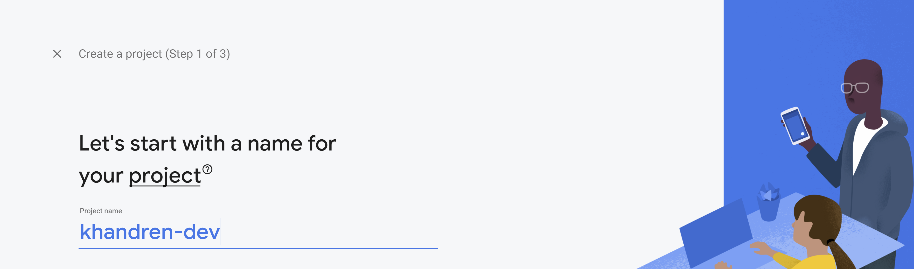
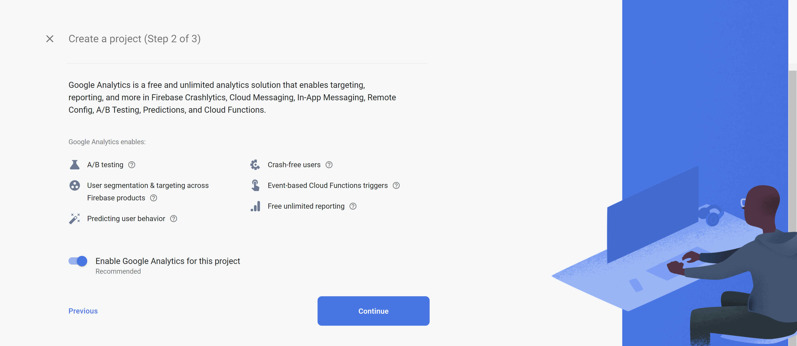
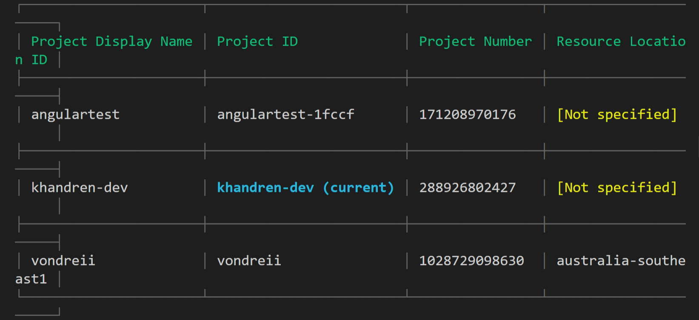

<div class="writtenContent">

#### 03 Oct 2020
# Hosting An Angular App On Firebase
___

<!-- ----------- Intro ----------- -->
<div class="avatar-block">
    
    <h5 class="avatar-text avatar-align"> by Vondreii</h5>
</div>
<br>
<!-- <div class="image-container">
    
  	<div class="image-description"><p>Photo by <a href="https://unsplash.com/@courtniebt13">Courtnie Tosana</a> on Unsplash</p></div>
</div> -->
<!-- ----------------------------- -->

If you already have an Angular Project set up, you might want to host it on a domain like http://www.mywebsite.web.app. Assuming you already have an Angular project coded up, we will go through step by step how to:
* Creating a project on Firebase (for your app)
* Connect your Angular app to the Firebase Project
* Host your website

### Why Firebase?

Firebase is a platform that allows you to not only host your website but to also set up things like a [no-sql realtime updating database](https://firebase.google.com/docs/database). When you start hosting a website on Firebase, you will automatically get a domain name for free which will always end in **domainname.firebaseapp.com** or **domainname.web.app**.

You can also host on firebase for **FREE!**

For this tutorial we will assume that:

- You already have a Firebase account
- You already have an Angular project ready to host as a website

### Creating a new project on Firebase

Log into your Firebase account and go to the console, and click on **Add project**.

<!-- ----------- Image ----------- -->
<div class="image-container">
	
	<div class="image-description"><p>Add a new project on Firebase</p></div>
</div>
<!-- ----------------------------- -->

Give a name to your project:

<!-- ----------- Image ----------- -->
<div class="image-container">
	
	<div class="image-description"><p>Name your project</p></div>
</div>
<!-- ----------------------------- -->

You can choose to enable analytics, which will allow you to see all kinds of statistical data (like user views) on your website:

<!-- ----------- Image ----------- -->
<div class="image-container">
	
	<div class="image-description"><p>Enable/disable Google Analytics</p></div>
</div>
<!-- ----------------------------- -->

If you **enable** Google Analytics, you might have to select a Google Analytics Account. If you already have one, you can select it, otherwise you can use the default one created for your Firebase account.

### Linking your Angular app to the Firebase project

The docs from https://firebase.google.com/docs/hosting/?authuser=1#how_does_it_work, explain what commands you need to run in order to get your local Angular app code connected to Firebase.  

As a summary, you will need to install `firebase npm` first. 

Go to the root folder of your application's source code and open the terminal or command line. To install firebase npm, run the following line:

```bash
npm install -g firebase-tools
```

Wait for it to finish installing. To see if the installation was successful, you can run the command:

```bash
firebase
```

This will show you all the available firebase commands and functionality.

After that, you will want to login to your firebase account via your terminal or command line, in order to have access to your projects. 

Run the command:

```bash
firebase login
```

This will open a web browser or prompt that will ask you to sign in to Firebase. Put in your account username and password to authenticate yourself.

Once you've done that, go back to your terminal or command line and run this:

```bash
firebase projects:list
```

If your login was succesfull, running this command will give you a list of all the firebase projects you have in that account. 

<!-- ----------- Image ----------- -->
<div class="image-container">
	
	<div class="image-description"><p>List of Firebase projects</p></div>
</div>
<!-- ----------------------------- -->

This list should correlate with the projects you have listed on your firebase console.

The **blue (current)** directory is the app you are currently in. This is the firebase project we will deploy the application to so we can start hosting it. In this example, it is **khandren-dev**.

If you want to change it and deploy your website on a different firebase app, you can use:

```bash
firebase use <<project id of the project>>
```

After that, you will need to initialize the firebase project in that directory. Run: 

```bash
firebase init
```

You will get some prompts asking you a few questions (the answers you should choose are written in comments):

```js
Are you ready to proceed? // yes
Which Firebase CLI features do you want to set up for this folder? Press Space to select features, then Enter to confirm your choices. 
// Choose the "Hosting: Configure and deploy Firebase Hosting sites"
```

Assuming you have not built your project yet, answer the following questions like this:

```js
What do you want to use as your public directory? // public (we will change this later)
Configure as a single-page app (rewrite all urls to /index.html)? // No
```

The basic configuration is now set up! Now we will modify a few settings to get it to work.

### Deploying and Hosting your code

Build your project:

```bash
ng build
```

Wait for this to complete. If there are no errors in your code, you can proceed.

At some point while connecting firebase to your Angular project, a new `firebase.json` file was added. Find it in your Angular project and open it.

<!-- ----------- Image ----------- -->
<div class="image-container">
	
	<div class="image-description"><p>Firebase json file</p></div>
</div>
<!-- ----------------------------- -->

This is what it currently looks like:

```js
{
  "hosting": {
    "public": "public", 
    "ignore": [
      "firebase.json",
      "**/.*",
      "**/node_modules/**"
    ]
  }
}
```

You want to change the `public` attribute so it reads from the folder that has the build. This will be your `dist/applicationName` folder. 

As an example, the Angular application I am trying to host is called Khandren. So I would change it to `dist/khandren`:

```js
{
  "hosting": {
    "public": "dist/khandren", // change this
    "ignore": [
      "firebase.json",
      "**/.*",
      "**/node_modules/**"
    ]
  }
}
```

To find out what you need to write, open your dist folder:

<!-- ----------- Image ----------- -->
<div class="image-container">
	
	<div class="image-description"><p>dist folder</p></div>
</div>
<!-- ----------------------------- -->

Whatever is inside it, you will use after `dist/`. So that's where we got `dist/khandren` for this example.

<!-- ----------- Image ----------- -->
<div class="image-container">
	
	<div class="image-description"><p>application build folder</p></div>
</div>
<!-- ----------------------------- -->

It is important that you have your `dist/{project-name}` folder here because Firebase will read from this folder and use it when hosting your website.

Now we can finally start hosting it. If you want to first test how the site will look before deploying and hosting, you can run:

```bash
firebase serve

```

You will then have to open a web browser and view it via http://localhost/xxxx.

If you are satisfied with the way it looks you can go ahead and run:

```bash
firebase deploy

```

You can now see which web domain your website is hosting on. As you can see, the default free firebase domain will always end in a 
**domainname.firebaseapp.com** or **domainname.web.app**.

```bash
Project Console: https://console.firebase.google.com/project/khandren-dev/overview
Hosting URL: https://khandren-dev.web.app

```

Either way, you can now open any web browser and type in your domain name, and you will be able to see your website live and hosted across the web.

If you're happy with the default domain name given, then you are all set with your new hosted website!

Otherwise, if you want to add a custom domain, check out [Linking A Namecheap Domain To Firebase](/content/post/linkingANamecheapDomainToFirebase).

### Resources
* [Firebase - How does it work](https://firebase.google.com/docs/hosting/?authuser=1#how_does_it_work)
* [How to switch apps from the Firebase CLI Stackoverflow question](https://stackoverflow.com/questions/36432458/how-do-i-switch-apps-from-the-firebase-cli)

<br><br>

</div>