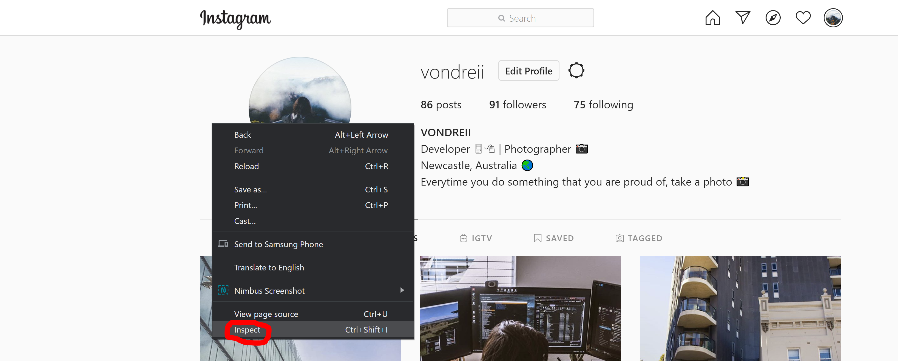
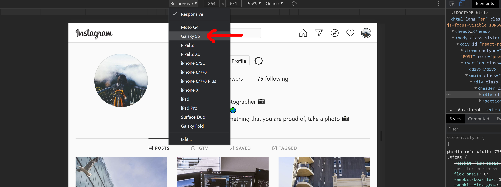
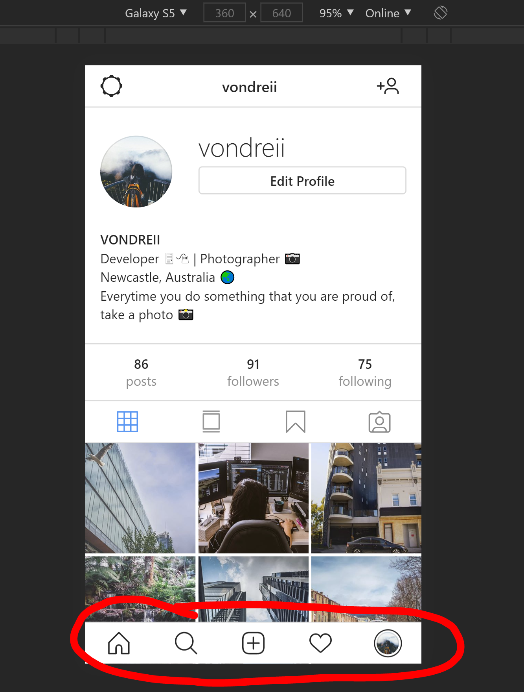
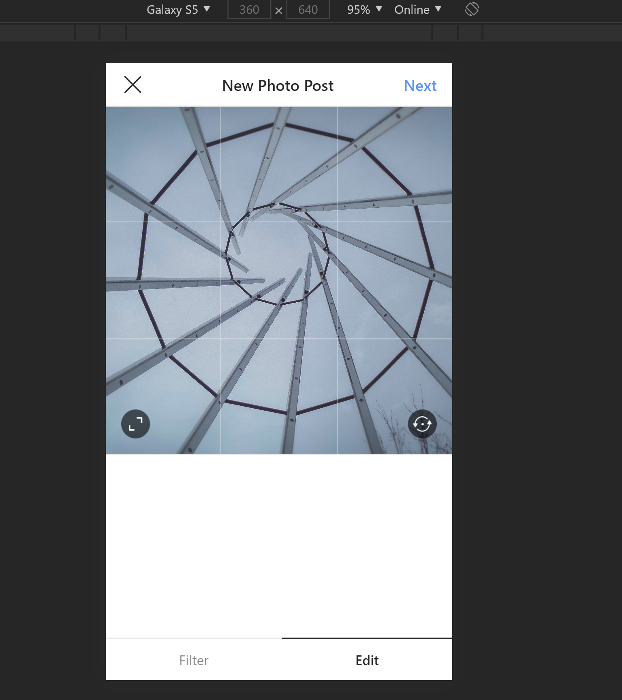
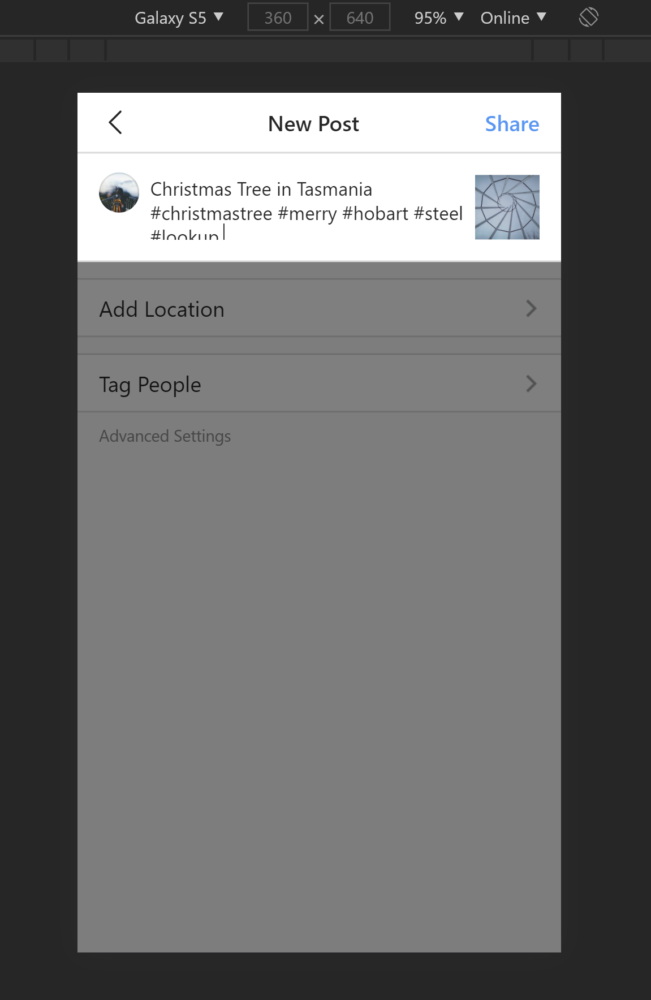
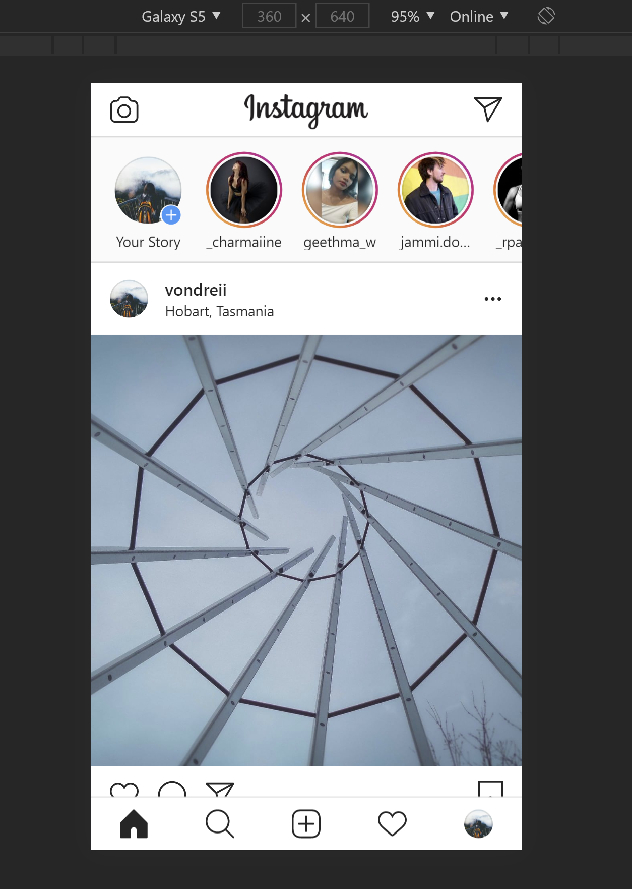

#### 11 Aug 2020
# Adding Photos To Instagram Using A Desktop Computer
___

<!-- ----------- Intro ----------- -->

    
    <h5 class="avatar-text avatar-align"> by Vondreii</h5>

 

    
  	

Photo by <a href="https://unsplash.com/@emmamatthews">Emma Matthews Digital Content Production</a> on Unsplash

<!-- ----------------------------- -->

Sometimes you need to upload photos to Instagram on a computer, especially if you are using a computer to edit photos or create vector art. It can be really annoying to keep transferring them onto your phone and uploading it from there (and if you can't airdrop it using an IPhone, the quality of these photos can be reduced).

First, open a web browser and navigate to your Instagram account. We will be using Google Chrome as an example. 

Right click anywhere on the page and select **Inspect Element**:

<!-- ----------- Image ----------- -->

	

<!-- ----------------------------- -->

In the top bar there is an option to view the screen on a different device. You can select any phone device - for this post we have selected the Samsung Galaxy S5.

<!-- ----------- Image ----------- -->

	

<!-- ----------------------------- -->

The screen size should now change to the shape of a phone (but the upload button will not be visible).

Now go to the top of your web browser bar and hit the refresh button to refresh the webpage. 
When the page reloads, the Instagram bar should now be visible:

<!-- ----------- Image ----------- -->

	

<!-- ----------------------------- -->

If you click on the upload icon (the plus symbol in the very center of the menu bar) you should be able to start the uploading process as if you were using your phone.

<!-- ----------- Image ----------- -->

	

<!-- ----------------------------- -->

<!-- ----------- Image ----------- -->

	

<!-- ----------------------------- -->

<!-- ----------- Image ----------- -->

	

<!-- ----------------------------- -->

Now you should finally be able to upload photos to your Instagram account on your computer!

  

