 

## Creating A Calculator in C#

###### 26 Sept 2020 by [@Vondreii](https://www.instagram.com/vondreii/?hl=en)
___

<!-- ----------- Video ----------- -->

    <video controls="true" allowfullscreen="true" poster="../../../assets/articles/coding-images/creatingACalculatorInCSharpPart3/final_preview.PNG" class="image-full">
    <source src="../../../assets/articles/coding-images/creatingACalculatorInCSharpPart3/final.mp4" type="video/mp4">
    </video>

<!-- ----------------------------- -->

    <a href="/coding/post/creatingACalculatorInCSharp" class="button">Part 1</a>
    <a href="/coding/post/creatingACalculatorInCSharpPart2" class="button">Part 2</a>
    <a href="/coding/post/creatingACalculatorInCSharpPart3" class="button">Part 3</a>

We are going to give you a step-by-step guide on how you can make your very own calculator application (complete with an executable file for the program!) This tutorial is separated into 3 sections:

* **Part 1** covers creating the interface for the calculator. We are going to be using Visual Studio's C# Windows Forms to add buttons to the calculator.
* **Part 2** covers adding in the basic functionality to the calculator (adding, subtracting, all of that calculator stuff).
* **Part 3** will go through handling any invalid inputs and runtime exceptions. We will also 'finalise' the calculator. 

Before we start:
* Make sure you have Visual Studio downloaded onto your computer. If you don't have Visual Studio you can get the Community version for free, from [Microsoft's Visual Studio Download page](https://visualstudio.microsoft.com/downloads/). For this tutorial we are going to be using Visual Studio 2017. 
* You don't have to have a lot (or any) programming knowledge to be able to complete this tutorial. It helps to have some basic knowledge of variables and functions, but I've tried to explain each step as much as possible.

The final source code can also be viewed and downloaded from Github:

    

        <a href="https://github.com/vondreii/Calculator-Example" class="button">↓ Final Source Code at completion of Part 3 ↓</a>
    

### 1. Creating a new project 

Open up Visual Studio. At the top, go to **File > New > Project** to create a new project.

<!-- ----------- Image ----------- -->

    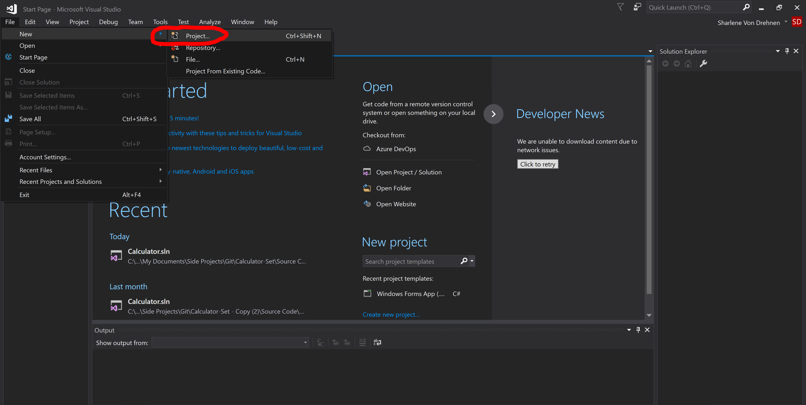
	

Create a new project

<!-- ----------------------------- -->

Now we need to set up the settings for the project. 

<!-- ----------- Image ----------- -->

    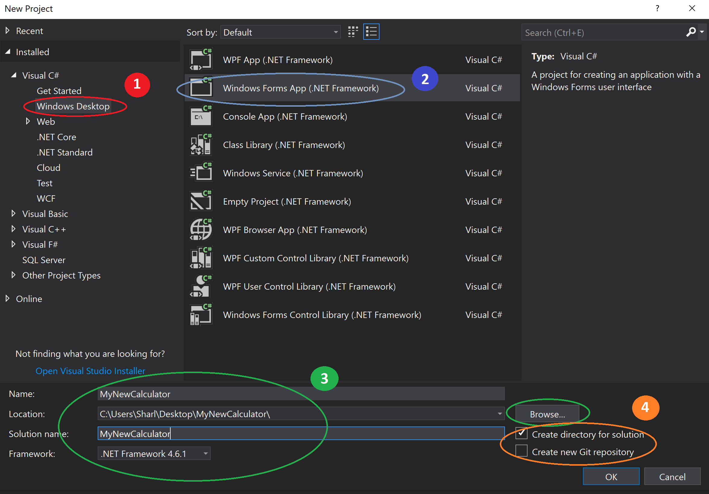
	

Setting up the project settings

<!-- ----------------------------- -->

**1.** In the left-hand side bar, select **Windows Desktop**.

**2.** Since we are only going to be making a simple desktop application with an interface, we can select **Windows Forms App**.

**3.** Fill in the details of what you want to name your project and where you would like to store this project on your computer. You can select **Browse** to choose where the project will save to. You can leave the Framework as the default unless you want to specify a different one.

**4.** You can configure if you want a new folder to be created for the project, or if you want a new GitHub repro to be created. I'm going to be leaving these as the default settings.

Select **OK** at the bottom when finished.

When the project loads, it should look similar to this:

<!-- ----------- Image ----------- -->

    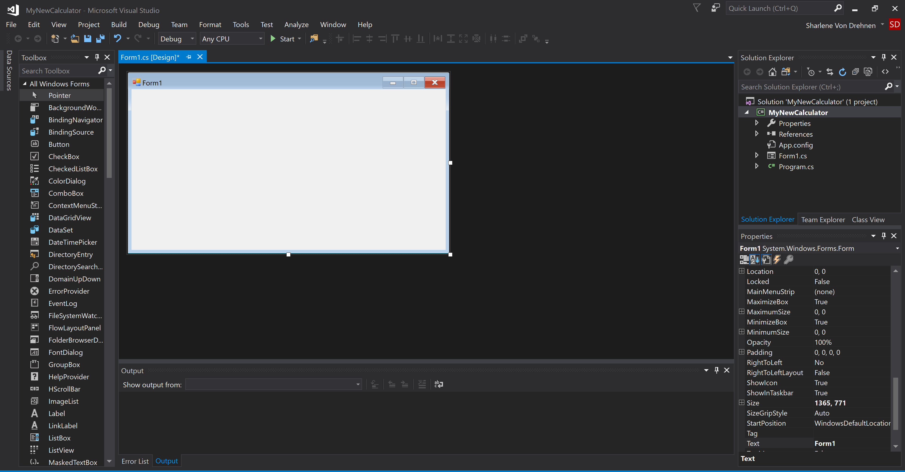
	

Visual Studio layout

<!-- ----------------------------- -->

### 3. Adding Calculator Buttons to the Interface

Visual Studio is a big software and it would be impossible to cover all the functions it can do, so for this basic calculator we will just go through what we need, as we go.

<!-- ----------- Image ----------- -->

    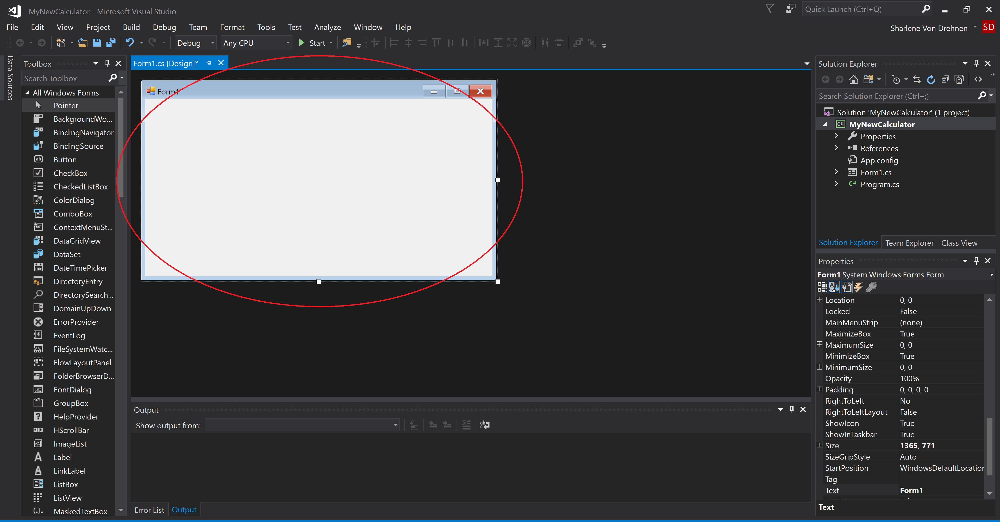
	

The layout with the form

<!-- ----------------------------- -->

At the very center is a **Form.** It isn't really a 'form' where you have to answer any questions given to you... it's really just an interface that can accept user input. 
If you are new to this concept, you can think of it as a canvas and we can design what textboxes or buttons we want the user to see and use when they open the application.

For example, on this form we are going to have many buttons (like a calculator!) with each button either being a number (1, 2, 3, 4, 5, etc) or an operator (+, -, etc).

<!-- ----------- Image ----------- -->

    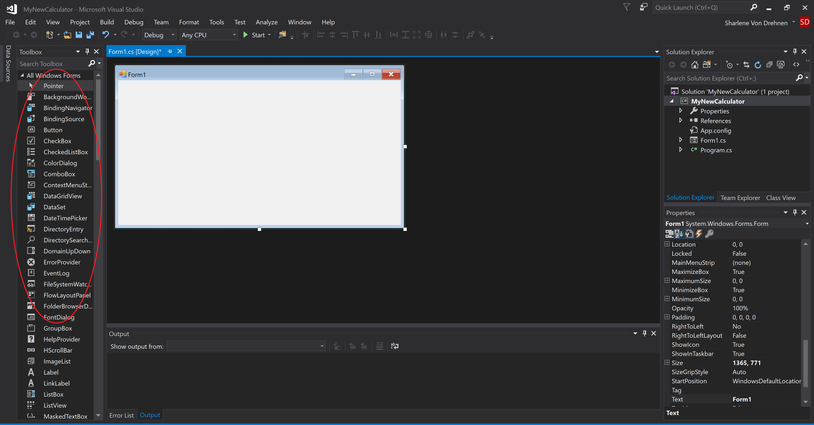
	

Toolbox items

<!-- ----------------------------- -->

Somewhere on the side, you should see a **Toolbox menu**. If you can't see this, go to the top **View Tab** dropdown and select **Toolbox.**

In the toolbox menu, there should be the option to add a **Button**. Click on the word **Button** and drag it onto the interface.

<!-- ----------- Image ----------- -->

    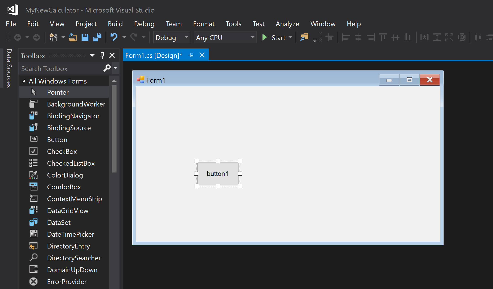
	

Click and drag a button to add it

<!-- ----------------------------- -->

You can also resize the button to a square by dragging the outer corners, or move the button around to position it wherever you want it to be.

Don't double click on the button yet, because if you do it will take you to the source code which we will look at later.

<!-- ----------- Image ----------- -->

    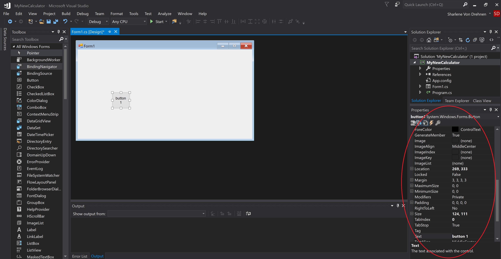
	

Properties for the button

<!-- ----------------------------- -->

Every object that you add onto the form will have a set of properties. This will be displayed in the properties window (as shown in the above image). For example, if you have button1 highlighted, you will be able to see all the properties of button1 (it's name, size, height, background colour, and other things). We are going to change some of these settings to the following:

* **Name:** button_num
* **Back-Color:** Any grey/silver colour
* **Font:** Microsoft Sans Serif, 12pt
* **Size:** 120, 120
* **Text:** 1

Once you've done that, you can click and drag another button onto the interface (this will be button 2). Now, select the second button. The properties window should automatically change, and should now show you the properties for button 2.

Change the properties for button 2 as well, just like how we changed it for button 1. We will keep the back-color, size and the font the same for all numbers. Just make sure to change the **Text** to 2 and the **Name** to button_num2.

Here is my progress so far, with 2 buttons: 

<!-- ----------- Image ----------- -->

    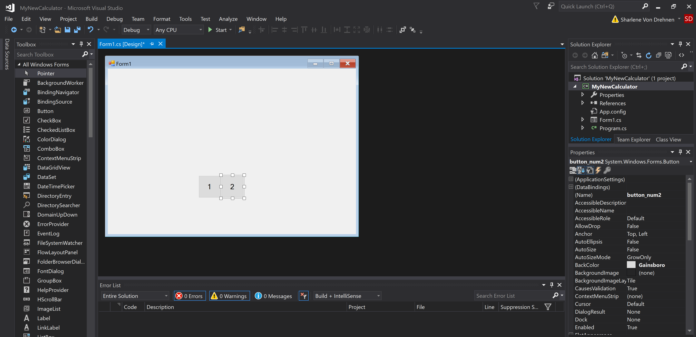
	

Adding a second button

<!-- ----------------------------- -->

You can now repeat the same process for all buttons 0-9. Once you've done that, the interface should now look like this:

<!-- ----------- Image ----------- -->

    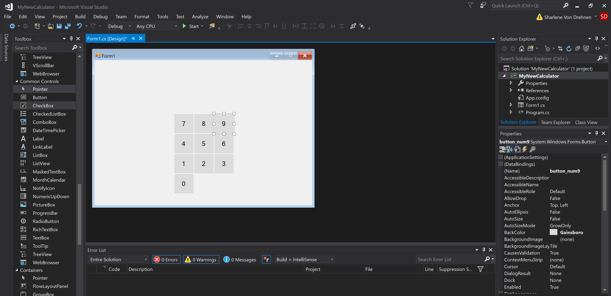
	

Adding the remaining buttons

<!-- ----------------------------- -->

Now we can repeat the same process again, except this time with operator buttons.

I'm going to be adding a darker grey to the operators. This is an example of the properties I added for my plus button:

* **Name:** button_plus
* **Back-Color:** A darker grey
* **Font:** Microsoft Sans Serif, 12pt
* **Size:** 120, 120
* **Text:** +

The **Name** for each button will change based on the operator. For example, button_plus, button_minus, button_divide, button_rightBracket, etc.

Here is what it looks like with all of the operators: 

<!-- ----------- Image ----------- -->

    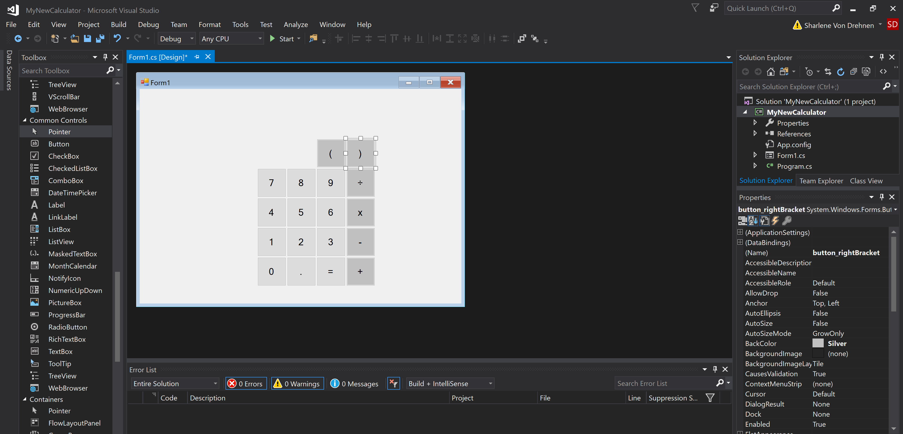
	

Adding all the operators

<!-- ----------------------------- -->

Now we can add the **C** and **CE** buttons. **C** Stands for _Clear_ and clears the whole calculator input. **CE** stands for _Clear_ _Entry_ and clears the last number or operator that was added.

I'm going to make these orange with white text. These are the properties for the Clear button:

* **Name:** button_Clear
* **Back-Color:** Orange
* **Fore-Color:** White
* **Font:** Microsoft Sans Serif, 12pt
* **Size:** 120, 120
* **Text:** C

You can also add the same styling to the Clear Entry button.

<!-- ----------- Image ----------- -->

    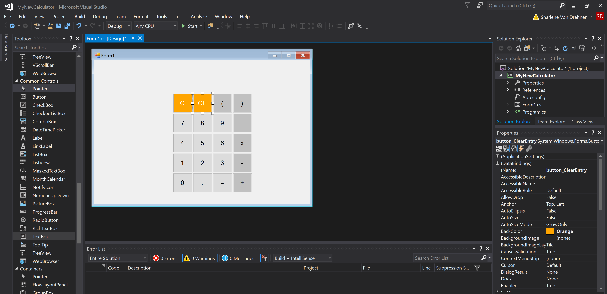
	

Adding C and CE buttons

<!-- ----------------------------- -->

While we're at it, we might as well change some of the properties of the form itself. Click once anywhere on the actual form, and go into the properties window. Change both the **Name** and **Text** to **Calculator**.

You should also right-click **Form1** under the Solutions Explorer and rename that to _Calculator_ as well.

<!-- ----------- Image ----------- -->

    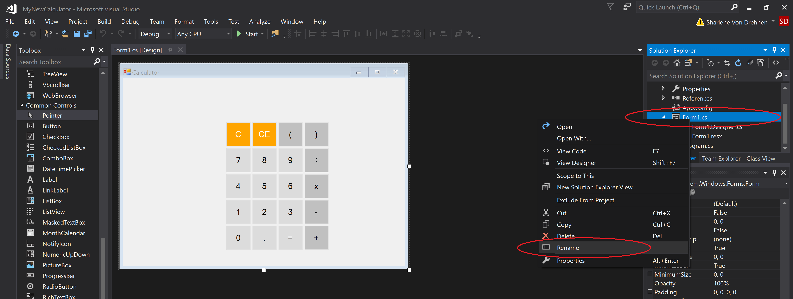
	

Rename the form

<!-- ----------------------------- -->

### 4. Adding the answer output display

Now we need to add a display for the user to see the answer of their calculation. 

Add a panel. Change the properties of the panel to have a **Back-Color** of **White.**
Move and resize the panel so it is at the very top, above the buttons. Like this:

<!-- ----------- Image ----------- -->

    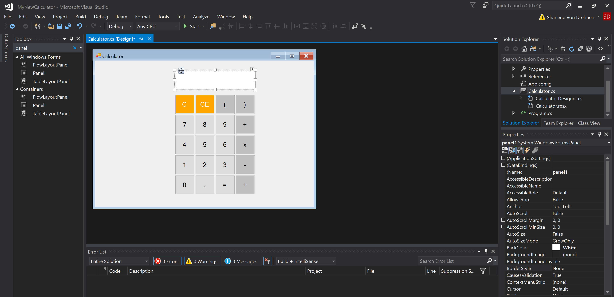
	

Add a panel

<!-- ----------------------------- -->

The panel is going to act as a large display window. We are going to put two textboxes inside this panel, and both of them will output something to the user.
When the calculator is in use, we want it to look something like this:

<!-- ----------- Image ----------- -->

    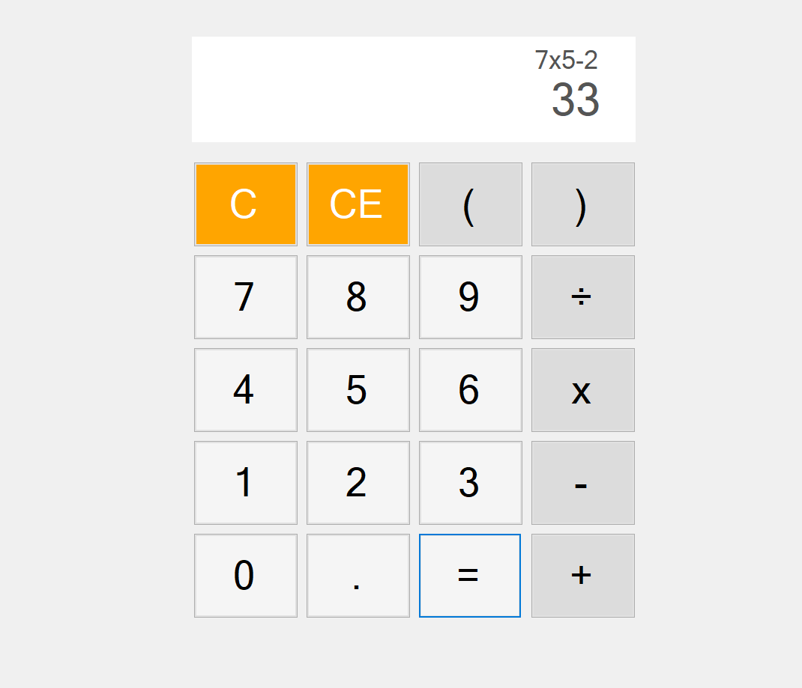
	

Goal design for the calculator

<!-- ----------------------------- -->

At the top of the display, we will show the current calculation that will update as the user enters numbers. The final result will display at the bottom.
Both of these will be added as textboxes.

Add a Textbox near the panel:

<!-- ----------- Image ----------- -->

    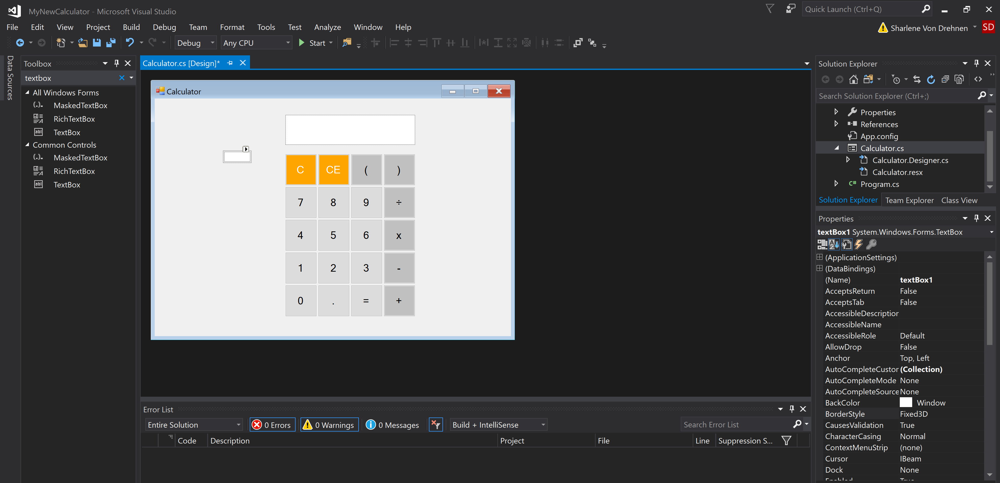
	

Add the first textbox

<!-- ----------------------------- -->

The textbox looks a bit small at first so we will have to change some properties to make it more presentable. Select the textbox to open it's properties, and change the following:

* **Name:** output_result
* **BorderStyle:** None
* **Enabled:** False
* **Font:** Microsoft Sans Serif, 14pt
* **Size:** Change the first number to be 400
* **Text-Align:** Right

The textbox is disabled because we don't want the user to be able to type any numbers manually. Many calculators can do that, but for simplicity, we just want them to be able to press the buttons and have the result show on the display when they press the equals button. 

Now click and drag the textbox so it goes ontop of the panel, like this: 

<!-- ----------- Image ----------- -->

    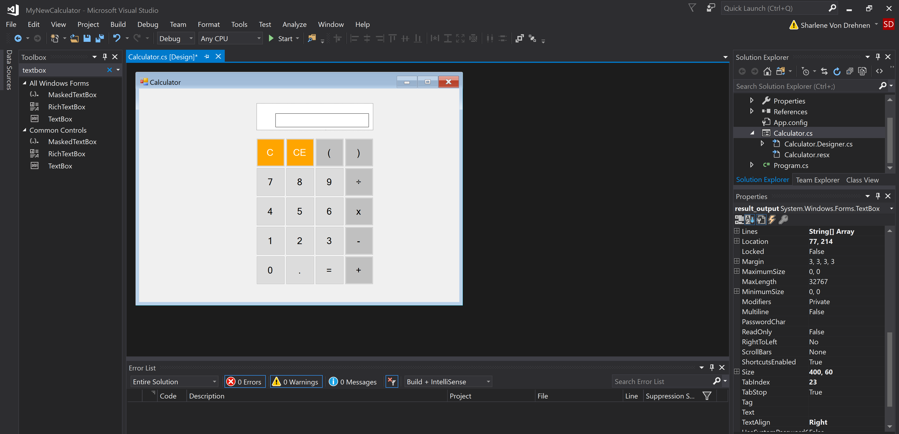
	

Drag the girst textbox so it is ontop of the panel

<!-- ----------------------------- -->

Now, click and drag another textbox onto the interface. Change the properties like so:

* **Name:** output_calculation
* **BorderStyle:** None
* **Enabled:** False
* **Font:** Microsoft Sans Serif, 10pt
* **Size:** Change the first number to be 400
* **Text-Align:** Right

Now position the second textbox at the top of the panel:

<!-- ----------- Image ----------- -->

    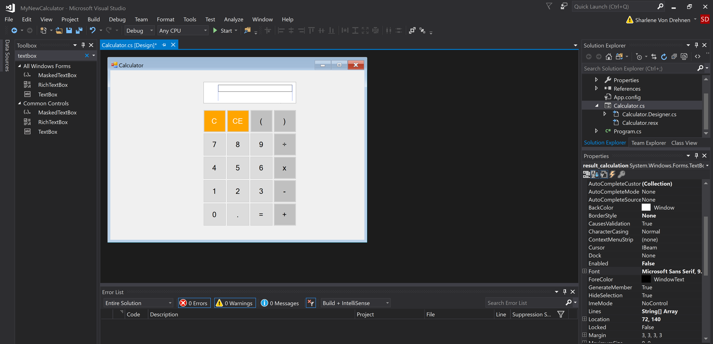
	

Add a second textbox ontop of the panel

<!-- ----------------------------- -->

### 5. Adding error warnings

I will also add a single error warning for when the user enters a calculation that is invalid. For example, if they entered **5+4+-x....**, the calculator shouldn't calculate it, it should instead display a message.

Click and drag a label from the toolbox. These are going to be the properties:

* **Name:** err_not_valid
* **ForeColor:** Red
* **Text:** Calculation not valid
* **Visible:** False

The visibility is initially false because we want the error warning to stay invisible and only show when the user has entered a wrong input. The functionality for this wil be discussed in Part 2, so for now we will just add the text label for the warning. 

This is what the final design of the calculator should look like:

<!-- ----------- Image ----------- -->

    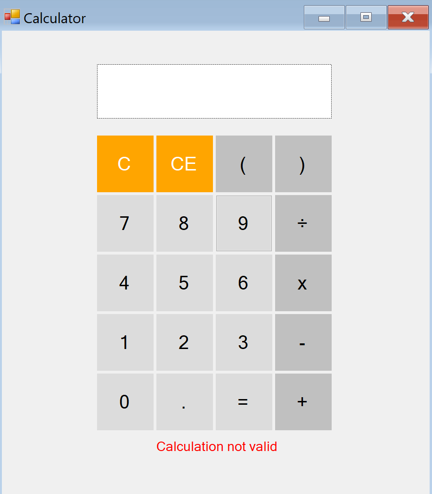
	

Warning label

<!-- ----------------------------- -->

Continue on to the next steps to add the functionality.

    <a href="/coding/post/creatingACalculatorInCSharpPart2" class="button">Next steps >></a>

  

### Resources
* https://product.hubspot.com/blog/git-and-github-tutorial-for-beginners
* https://www.freecodecamp.org/news/the-beginners-guide-to-git-github/

  

