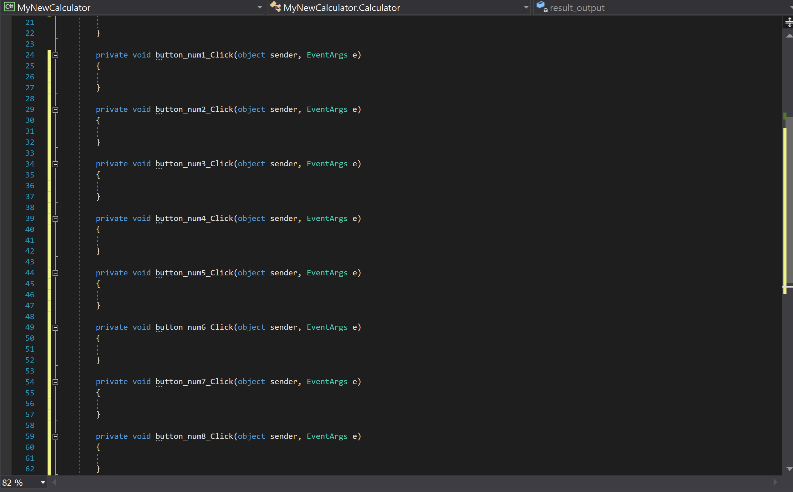
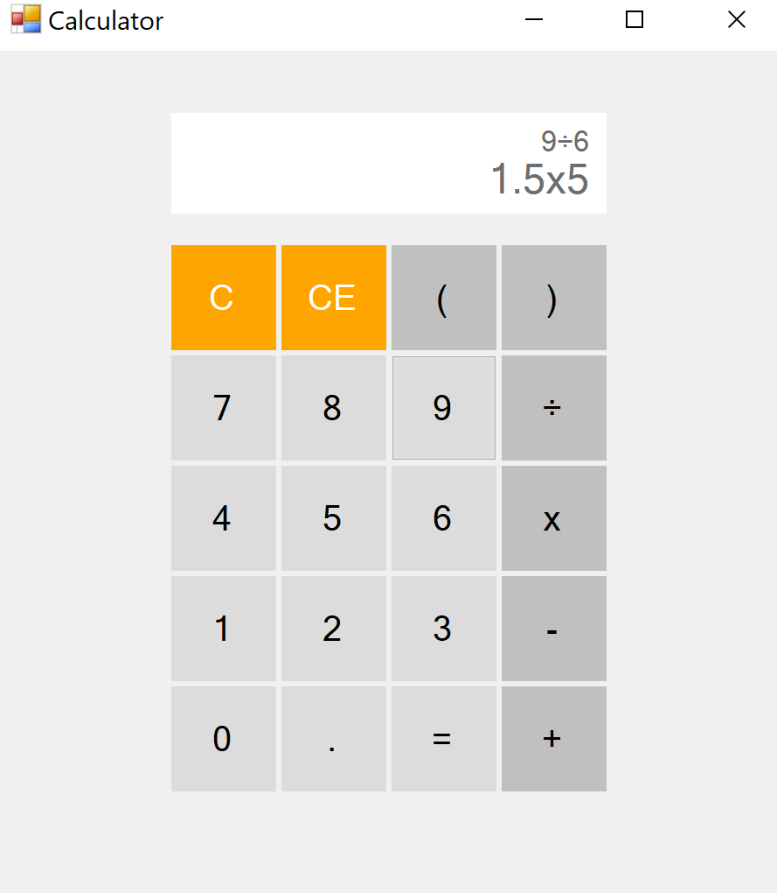
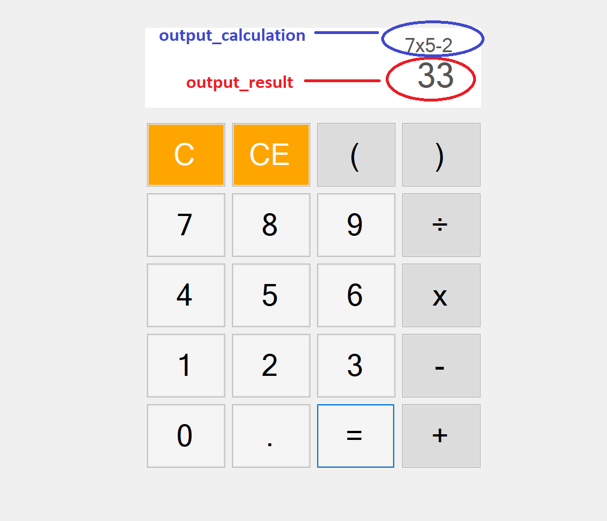
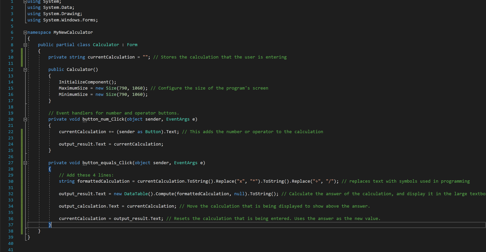

<br>
<div class="writtenContent">

## Creating A Calculator in C# (Part 2)
___

###### ??? [@Vondreii](https://www.instagram.com/vondreii/?hl=en)
___

<div class="center extraPadding">
    <a href="/coding/post/creatingACalculatorInCSharp" class="button">Part 1</a>
    <a href="/coding/post/creatingACalculatorInCSharpPart2" class="button">Part 2</a>
    <a href="/coding/post/creatingACalculatorInCSharpPart3" class="button">Part 3</a>
</div>

### 6. Running the program for the first time

Put something here about configuring the size

* Add manifest file and add 

```js
<application xmlns="urn:schemas-microsoft-com:asm.v3">
  <windowsSettings>
    <dpiAware xmlns="http://schemas.microsoft.com/SMI/2005/WindowsSettings">true</dpiAware>
  </windowsSettings>
</application>

```

* This is to stop the text from being blurry.

### 7. Adding the functionality to numbers and operators  

We are now going to add the basic functionality of pressing buttons, pressing the equals sign and getting an answer to the calculation. This is what we want it to look like:

<!-- ----------- Video ----------- -->
<div class="image-container">
    <video controls="true" allowfullscreen="true" poster="../../../assets/articles/coding-images/creatingACalculatorInCSharpPart2/goal_preview.png" class="image">
    <source src="../../../assets/articles/coding-images/creatingACalculatorInCSharpPart2/goal.mp4" type="video/mp4">
    </video>
</div>
<!-- ----------------------------- -->

Notice that as the user presses numbers on the calculator, the display is updated in real time to show the current calculation that is about to be made.

Everytime the user presses the equals button, the text gets moved to the very top and is shown above the final answer.

Double click on a number button to open the source code.

<!-- ----------- Video ----------- -->
<div class="image-container">
    <video controls="true" allowfullscreen="true" poster="../../../assets/articles/coding-images/creatingACalculatorInCSharpPart2/button_num_1_preview.png" class="image-full">
    <source src="../../../assets/articles/coding-images/creatingACalculatorInCSharpPart2/button_num_1.mp4" type="video/mp4">
    </video>
</div>
<!-- ----------------------------- -->

Each button will have their own method block. It looks like this (exactly how you see it in the video):
```js
private void button_num1_Click(object sender, EventArgs e)
{

}

```

These generated code blocks are events. So when the user presses the **1** button, the code inside **button_num1_Click** will run (at the moment it is empty, but we will add some later).

If you click on the button for number two, the same thing will happen:

<!-- ----------- Video ----------- -->
<div class="image-container">
    <video controls="true" allowfullscreen="true" poster="../../../assets/articles/coding-images/creatingACalculatorInCSharpPart2/button_num_2_preview.png" class="image-full">
    <source src="../../../assets/articles/coding-images/creatingACalculatorInCSharpPart2/button_num_2.mp4" type="video/mp4">
    </video>
</div>
<!-- ----------------------------- -->

Click on all the numbers and operators (0-9), (+, -, x, ÷, right and left brackets, and the dot). You should now have a list of button methods in the source code, and you should start to see something like this:

<!-- ----------- Image ----------- -->
<div class="image-container">
    
	<div class="image-description"><p>Create a new project</p></div>
</div>
<!-- ----------------------------- -->

Now, add the line: 
`private string currentCalculation = "";` 
towards the top of the file, at this location:

```js
public partial class Calculator : Form
{
    private string currentCalculation = ""; // Add this line here, before the Calculator()

    public Calculator()
    {
        InitializeComponent();
    }
       
...
```
`currentCalculation` is a variable that is going to store the calculation that the user is entering. 
For example, if the user entered **3+3**, then the value of `currentCalculation` will be **3+3**. If the user then clicks **+**, then **5**,
the value of `currentCalculation` will change to **3+3+5**.

The next step is to actually display the calculation back to the user as they are typing it. The following code does exactly that:

```js
private void AddToCalculation(string numberOrOperator) 
{
    currentCalculation += numberOrOperator; // This adds the number or operator to the calculation

    output_result.Text = currentCalculation; // This displays the updated calculation back onto the screen. 
    
    // Note: 'output_result' needs to be consistent with what you named the textbox on the interface. If you called it something else (for example, 'result', this line would instead be result.Text = currentCalculation) 
}
```
Here is a break down of what this means.

* `currentCalculation += numberOrOperator;`

Everytime the user enters a number or an operator, it is going to be added to the calculation. 

* `output_result.Text = currentCalculation;`

`output_result` is the name that we gave to the larger textbox that appears at the bottom of the display. Here, the value of this textbox will constantly change to display the calculation which is constantly being updated as the user types it.

Copy and paste the code block in the same place as shown below: 

<!-- ----------- Image ----------- -->
<div class="image-container">
    
	<div class="image-description"><p>Create a new project</p></div>
</div>
<!-- ----------------------------- -->

For the `AddToCalculation` method to actually work we need to use it. Everytime a number or operator is pressed, we want it to be added to the calculation.

For example, the line `AddToCalculation("1");` would add the number **1** to the calculation. If we add `AddToCalculation("1");` inside **button_num1_Click**, then everytime the user presses the 1 button, the number 1 will be added to the calculation. 

For each of these generated methods, we want to add the line `AddToCalculation("1");`, changing the number or operator to match with the button being pressed. The full code should look something like this:

```js
private void button_num0_Click(object sender, EventArgs e)
{
    AddToCalculation("0");
}

private void button_num1_Click(object sender, EventArgs e)
{
    AddToCalculation("1");
}

private void button_num2_Click(object sender, EventArgs e)
{
    AddToCalculation("2");
}

private void button_num3_Click(object sender, EventArgs e)
{
    AddToCalculation("3");
}

private void button_num4_Click(object sender, EventArgs e)
{
    AddToCalculation("4");
}

private void button_num5_Click(object sender, EventArgs e)
{
    AddToCalculation("5");
}

private void button_num6_Click(object sender, EventArgs e)
{
    AddToCalculation("6");
}

private void button_num7_Click(object sender, EventArgs e)
{
    AddToCalculation("7");
}

private void button_num8_Click(object sender, EventArgs e)
{
    AddToCalculation("8");
}

private void button_num9_Click(object sender, EventArgs e)
{
    AddToCalculation("9");
}

private void button_plus_Click(object sender, EventArgs e)
{
    AddToCalculation("+");
}

private void button_minus_Click(object sender, EventArgs e)
{
    AddToCalculation("-");
}

private void button_times_Click(object sender, EventArgs e)
{
    AddToCalculation("*");
}

private void button_divide_Click(object sender, EventArgs e)
{
    AddToCalculation("/");
}

private void button_rightBracket_Click(object sender, EventArgs e)
{
    AddToCalculation(")");
}

private void button_leftBracket_Click(object sender, EventArgs e)
{
    AddToCalculation("(");
}

private void button_dot_Click(object sender, EventArgs e)
{
    AddToCalculation(".");
}
```

In programming, the **'*'** symbol means times, and the **/** symbol means divide, so that is why we are using them above.

Run the program by pressing the green play button at the top.

If there are no errors in the code, you should be getting something that looks like this:

<!-- ----------- Video ----------- -->
<div class="image-container">
    <video controls="true" allowfullscreen="true" poster="../../../assets/articles/coding-images/creatingACalculatorInCSharpPart2/updateCalculation_preview.png" class="image">
    <source src="../../../assets/articles/coding-images/creatingACalculatorInCSharpPart2/updateCalculation.mp4" type="video/mp4">
    </video>
</div>
<!-- ----------------------------- -->

Notice that the **equals** button still does not work, and neither does the **C** or **CE** buttons.

Also, if you press times or divide, the symbols  **'*'** and **/** will show. Although these are definitely needed in order to do the internal calculation, we don't want these to be displayed. We want to display the more user friendly and familiar **x** and **÷** symbols instead.

Copy the following code above your `AddToCalculation` method:

```js
private string Format(string answer)
{
    return answer.ToString().Replace("*", "x").ToString().Replace("/", "÷");
}
```

We will use this everytime we are going to display something to the user. It will automatically format the times and divide symbols and display them properly.

Change the code inside your `AddToCalculation` from this:

```js
currentCalculation += numberOrOperator;
output_result.Text = currentCalculation;

```

to this, instead:

```js
currentCalculation += numberOrOperator;
output_result.Text = Format(currentCalculation); // We are now going to use the format method to display the familiar times and divide symbols

```

And your calculator should now display those symbols properly.

<!-- ----------- Image ----------- -->
<div class="image-container">
    
	<div class="image-description"><p>Create a new project</p></div>
</div>
<!-- ----------------------------- -->

### 8. Getting an answer using the equals button  

Go back to the interface and double click the **equals** button. It should open the event handler code block for when it is pressed:

<!-- ----------- Video ----------- -->
<div class="image-container">
    <video controls="true" allowfullscreen="true" poster="../../../assets/articles/coding-images/creatingACalculatorInCSharpPart2/equals_preview.PNG" class="image-full">
    <source src="../../../assets/articles/coding-images/creatingACalculatorInCSharpPart2/button_equals.mp4" type="video/mp4">
    </video>
</div>
<!-- ----------------------------- -->

When the user presses the **equals** button, we want the answer to appear on the display, with the calculation for it displayed above.

Copy the 3 lines below into the `button_equals_Click` method that was just created.

```js
private void button_equals_Click(object sender, EventArgs e)
{
    // Add these 3 lines:
    output_result.Text = Format(new DataTable().Compute(currentCalculation, null).ToString()); // Calculate the answer of the calculation, and display it in the large textbox.
     
    output_calculation.Text = Format(currentCalculation); // Move the calculation that is being displayed to show above the answer.
    
    currentCalculation = output_result.Text; // Resets the calculation that is being entered. Uses the answer as the new value.
}
```

`output_result.Text` refers to the larger bottom textbox, and `output_calculation` refers to the smaller textbox we added above it.

<!-- ----------- Image ----------- -->
<div class="image-container">
    
	<div class="image-description"><p>Create a new project</p></div>
</div>
<!-- ----------------------------- -->

Your code should now look like this:

<!-- ----------- Image ----------- -->
<div class="image-container">
    
	<div class="image-description"><p>Create a new project</p></div>
</div>
<!-- ----------------------------- -->

If you run the program, it should now look like this:

<!-- ----------- Video ----------- -->
<div class="image-container">
    <video controls="true" allowfullscreen="true" poster="../../../assets/articles/coding-images/creatingACalculatorInCSharpPart2/equals_preview.PNG" class="image">
    <source src="../../../assets/articles/coding-images/creatingACalculatorInCSharpPart2/equals.mp4" type="video/mp4">
    </video>
</div>
<!-- ----------------------------- -->

### 9. Clearing the display with C and CE

**C** stands for clear, and means to clear the whole display. Double click on the **C** button to open it in the source code.

Add the 3 lines of code inside the `button_Clear_Click` method:

```js
private void button_Clear_Click(object sender, EventArgs e)
{
    // Add these 3 lines:
    output_result.Text = ""; // The large textbox that holds the answer becomes empty

    output_calculation.Text = ""; // The textbox above the answer that displays the ongoing calculation also becomes empty

    currentCalculation = ""; // The calculation itself is reset 
}
```

If anything is being displayed to the user, they will be removed and the calculation that the user is entering will also be reset. After adding the code and running the program, this is what it will look like now:

<!-- ----------- Video ----------- -->
<div class="image-container">
    <video controls="true" allowfullscreen="true" poster="../../../assets/articles/coding-images/creatingACalculatorInCSharpPart2/clear_preview.png" class="image">
    <source src="../../../assets/articles/coding-images/creatingACalculatorInCSharpPart2/clear.mp4" type="video/mp4">
    </video>
</div>
<!-- ----------------------------- -->

**CE** stands for clear entry. If pressed, it will delete/undo the most recent buttons pressed. Similar to what you did before with the **C** button, double click the **CE** button to open it in the source code. 

Copy the following code into the `button_ClearEntry_Click` method that was just created.

```js
private void button_ClearEntry_Click(object sender, EventArgs e)
{
    // Add these 3 lines:
    if (currentCalculation.Length > 0) // If the calculation is not empty
    { 
        currentCalculation = currentCalculation.Remove(currentCalculation.Length - 1, 1); // Remove the last number or operator from the calculation
    }
    output_result.Text = Format(currentCalculation); // Re-display the calculation onto the screen
}

```

If successful, your calculator should now look like this if you run the program:

<!-- ----------- Video ----------- -->
<div class="image-container">
    <video controls="true" allowfullscreen="true" poster="../../../assets/articles/coding-images/creatingACalculatorInCSharpPart2/clear_entry_preview.png" class="image">
    <source src="../../../assets/articles/coding-images/creatingACalculatorInCSharpPart2/clear_entry.mp4" type="video/mp4">
    </video>
</div>
<!-- ----------------------------- -->

You now have the basic functionalities of a calculator. 

Continue on to the next steps to handle invalid inputs and to finalise the calculator.

<div class="read-more-container">
    <a href="/coding/post/creatingACalculatorInCSharpPart3" class="button">Next steps >></a>
</div>

<br><br>

</div>