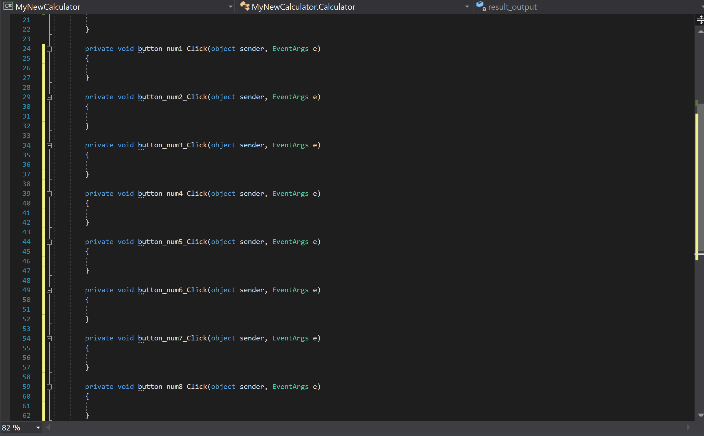
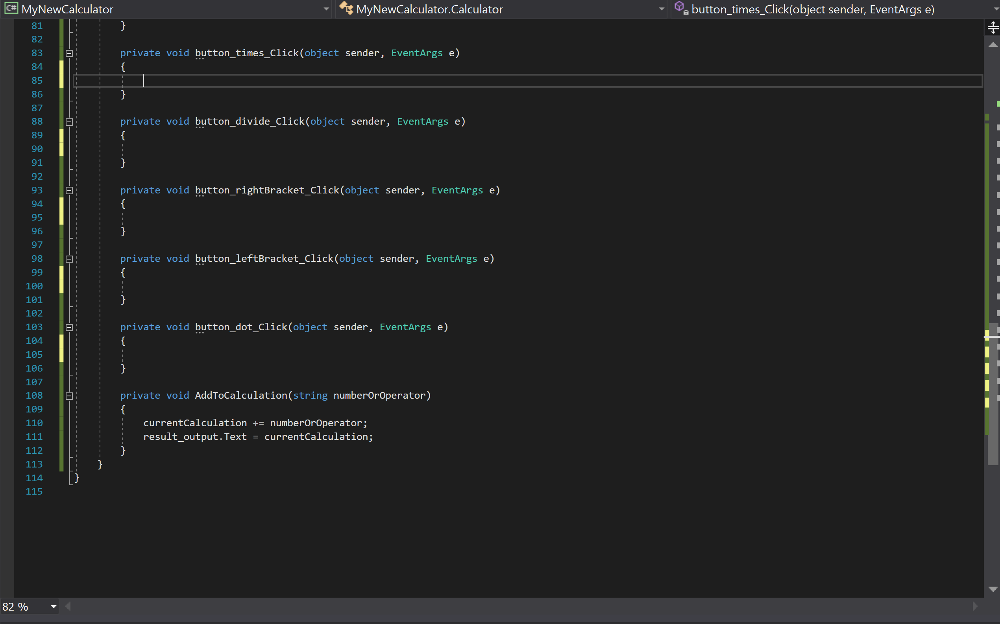

<br>
<div class="writtenContent">

## Creating A Calculator in C# (Part 2)
___

###### ??? [@Vondreii](https://www.instagram.com/vondreii/?hl=en)
___

<div class="center extraPadding">
    <a href="/coding/post/creatingACalculatorInCSharp" class="button">Part 1</a>
    <a href="/coding/post/creatingACalculatorInCSharpPart2" class="button">Part 2</a>
</div>

### 5. Adding the functionality

We are now going to add the basic functionality of pressing buttons, pressing the equals sign and getting an answer to the calculation. This is what we want it to look like:

<!-- ----------- Video ----------- -->
<div class="image-container">
    <video controls="true" allowfullscreen="true" poster="../../../assets/articles/coding-images/creatingACalculatorInCSharpPart2/calc_preview.png" class="image">
    <source src="../../../assets/articles/coding-images/creatingACalculatorInCSharpPart2/calc.mp4" type="video/mp4">
    </video>
</div>
<!-- ----------------------------- -->

Notice that as the user presses numbers on the calculator, the display is updated in real time to show the current calculation that is about to be made.

Everytime the user presses the equals button, the text gets moved to the very top and is shown above the final answer.

Double click on a button to open the source code.

<!-- ----------- Video ----------- -->
<div class="image-container">
    <video controls="true" allowfullscreen="true" poster="../../../assets/articles/coding-images/creatingACalculatorInCSharpPart2/sourceCode_preview.png" class="image-full">
    <source src="../../../assets/articles/coding-images/creatingACalculatorInCSharpPart2/sourceCode.mp4" type="video/mp4">
    </video>
</div>
<!-- ----------------------------- -->

Each button will have their own method block. It looks like this (exactly how you see it in the video):
```js
private void button_num1_Click(object sender, EventArgs e)
{

}

```

If you click on the button for number two, the same thing will happen:

<!-- ----------- Video ----------- -->
<div class="image-container">
    <video controls="true" allowfullscreen="true" poster="../../../assets/articles/coding-images/creatingACalculatorInCSharpPart2/sourceCode2_preview.png" class="image-full">
    <source src="../../../assets/articles/coding-images/creatingACalculatorInCSharpPart2/sourceCode2.mp4" type="video/mp4">
    </video>
</div>
<!-- ----------------------------- -->

Click on all the numbers and operators (0-9), (+, -, x, ÷, right and left brackets, and the dot). You should now have a list of button methods in the source code, and you should start to see something like this:

<!-- ----------- Image ----------- -->
<div class="image-container">
    
	<div class="image-description"><p>Create a new project</p></div>
</div>
<!-- ----------------------------- -->

We are going to use and explain these in more detail later.

But first, add the line: 
`private string currentCalculation = "";` 
towards the top of the file, at this location:

```js
public partial class Calculator : Form
{
    private string currentCalculation = ""; // Add it here, before the Calculator()

    public Calculator()
    {
        InitializeComponent();
    }
        
```
`currentCalculation` is a variable that is going to store the calculation that the user is entering. 
For example, if the user entered **3+3**, then the value of `currentCalculation` will be **3+3**. If the user then clicks **+**, then **5**,
the value of `currentCalculation` will change to **3+3+5**.

In short, everytime the user enters a number or operator, `currentCalculation` is going to be updated to reflect/updated version of the new calculation being entered.

The following `AddToCalculation` method block does exactly that. 

```js
private void AddToCalculation(string numberOrOperator) 
{
    currentCalculation += numberOrOperator; // This adds the number or operator to the calculation
    result_output.Text = currentCalculation; // This displays the updated calculation back onto the screen. 
    
    // Note: 'result_output' needs to be consistent with what you named the textbox on the interface. If you called it something else (for example, 'result', this line would instead be result.Text = currentCalculation) 
}
```

Now, go back to the code blocks that were generated from the buttons on the interface. Scroll down to the last one, and copy and paste the above code directly underneath, like this:

<!-- ----------- Image ----------- -->
<div class="image-container">
    
	<div class="image-description"><p>Create a new project</p></div>
</div>
<!-- ----------------------------- -->

For the `AddToCalculation` method to actually work we need to use it. Everytime a number or operator is pressed, we want it to be added to the calculation.

For example, the line `AddToCalculation("1");` would add the number **1** to the calculation. The line `AddToCalculation("2");` would add the number **2** to the calculation. We want to do this for all of them.

The generated code blocks are events. So when the user presses the **1** button, the code inside **button_num1_Click** will run. If we add `AddToCalculation("1");` inside **button_num1_Click**, then everytime the user presses the 1 button, the number 1 will be added to the calculation. 

In each of the previously generated methods (eg, **button_num1_Click**, **button_num2_Click**, **button_num3_Click**, etc). Add a single line for `AddToCalculation("1");`, changing the number or operator to match with the button being pressed. The full code should look something like this:

```js
private void button_num0_Click(object sender, EventArgs e)
{
    AddToCalculation("0");
}

private void button_num1_Click(object sender, EventArgs e)
{
    AddToCalculation("1");
}

private void button_num2_Click(object sender, EventArgs e)
{
    AddToCalculation("2");
}

private void button_num3_Click(object sender, EventArgs e)
{
    AddToCalculation("3");
}

private void button_num4_Click(object sender, EventArgs e)
{
    AddToCalculation("4");
}

private void button_num5_Click(object sender, EventArgs e)
{
    AddToCalculation("5");
}

private void button_num6_Click(object sender, EventArgs e)
{
    AddToCalculation("6");
}

private void button_num7_Click(object sender, EventArgs e)
{
    AddToCalculation("7");
}

private void button_num8_Click(object sender, EventArgs e)
{
    AddToCalculation("8");
}

private void button_num9_Click(object sender, EventArgs e)
{
    AddToCalculation("9");
}

private void button_plus_Click(object sender, EventArgs e)
{
    AddToCalculation("+");
}

private void button_minus_Click(object sender, EventArgs e)
{
    AddToCalculation("-");
}

private void button_times_Click(object sender, EventArgs e)
{
    AddToCalculation("*");
}

private void button_divide_Click(object sender, EventArgs e)
{
    AddToCalculation("/");
}

private void button_rightBracket_Click(object sender, EventArgs e)
{
    AddToCalculation(")");
}

private void button_leftBracket_Click(object sender, EventArgs e)
{
    AddToCalculation("(");
}

private void button_dot_Click(object sender, EventArgs e)
{
    AddToCalculation(".");
}
```

Run the program by pressing the green play button at the top.

If there are no errors in the code, you should be getting something that looks like this:

<!-- ----------- Video ----------- -->
<div class="image-container">
    <video controls="true" allowfullscreen="true" poster="../../../assets/articles/coding-images/creatingACalculatorInCSharpPart2/updateCalculation_preview.png" class="image">
    <source src="../../../assets/articles/coding-images/creatingACalculatorInCSharpPart2/updateCalculation.mp4" type="video/mp4">
    </video>
</div>
<!-- ----------------------------- -->

Notice that the **equals** button still does not work, and neither does the **C** or **CE** buttons.

Go back to the interface and double click the **equals** button. It should open the event handler code block for when the it is pressed:

<!-- ----------- Video ----------- -->
<div class="image-container">
    <video controls="true" allowfullscreen="true" poster="../../../assets/articles/coding-images/creatingACalculatorInCSharpPart2/equals_preview.PNG" class="image">
    <source src="../../../assets/articles/coding-images/creatingACalculatorInCSharpPart2/equals.mp4" type="video/mp4">
    </video>
</div>
<!-- ----------------------------- -->


<!-- yyyyyyyyyyyyyyyyyyyyyyyyyyyyy -->
* When they press equals, the result_output will update and put the answer. The current calculation will move to the top.

* Add the Clear and Clear entries. 

* Add the IsValid() boolean method.

* Create a label somewhere called err_not_valid which will show whenever the calc is invalid, and will hide when it isn't invalid.

* Add the pressedEqualsTwice to make sure the user can't press equals and erase the last calc.

* Add manifest file and add 
```xml
<application xmlns="urn:schemas-microsoft-com:asm.v3">
  <windowsSettings>
    <dpiAware xmlns="http://schemas.microsoft.com/SMI/2005/WindowsSettings">true</dpiAware>
  </windowsSettings>
</application>

```
* This is to stop the text from being blurry.

### Resources
* https://product.hubspot.com/blog/git-and-github-tutorial-for-beginners
* https://www.freecodecamp.org/news/the-beginners-guide-to-git-github/

<br><br>

</div>