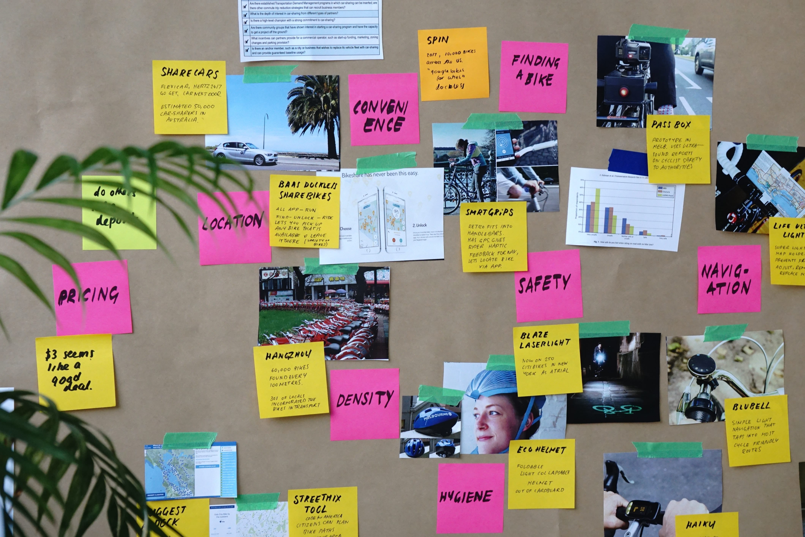
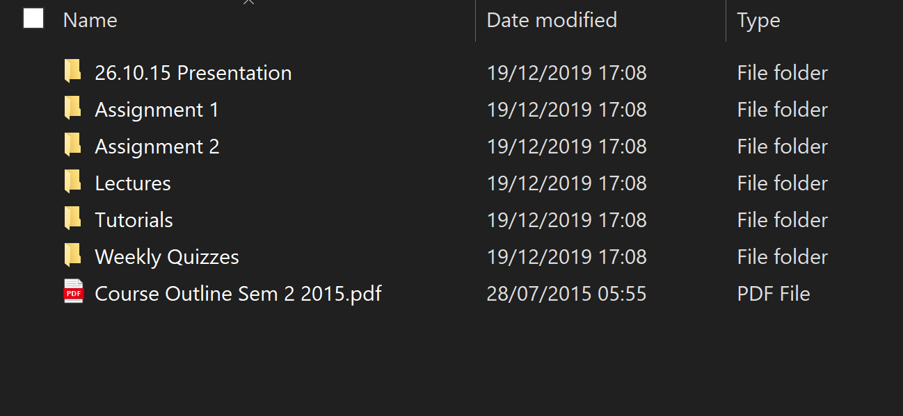
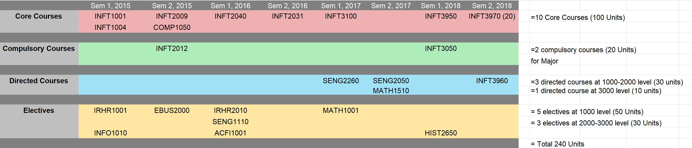

 

## Tips on Making The Most Out Of Your First Year At Uni
___

###### 8 June 2020 by [@Vondreii](https://www.instagram.com/vondreii/?hl=en)
___

There are some things I wish I knew when I first started uni, which would have definitely helped me settle in a lot faster than I did.
I started uni not being very familiar with how the environment would be, how I'd fit in, or what you needed to focus on to make the most out of the experience.
Some of these I didn't realise I needed to do until my final year - so hopefully this will help some of you aspiring uni students out there. 
    
### Take Your Studies And Deadlines Seriously

It is very easy to fall into the trap of procrastinating and underestimating the amount of time you need to do something.
If you are investing time and money into study something, it is safe to assume that you may have future plans for it. 
I recommend watching <a href="https://www.youtube.com/watch?v=bBiRs15JxfE&list=TLPQMDgwNjIwMjBIQmf5o79S4w&index=1">this</a> powerful video of a student who is studying to become a surgeon.
He doesn't study and therefore resorts to paying his lecturers and the board to give him his license and certification. However when faced with real world scenarios, he realises he does not know how to operate on a patient
resulting in her death, and is faced with the realisation that he only cheated himself.

The underlying concept is that more often than not, some students realise they don't have enough time left for an assignment, so they put half the effort in just to get that solid 'Pass'
while failing to understanding the bigger picture of some of the important concepts.

Always focus on the end goal. 
If you find somewhere down the line that you just do not feel motivated because you are not interested, then it is possible the field may not be the one for you.
Most students study full time or part time. Which means they need to spend the appropriate number of hours that match this expectation.

### Prepare Your Study Notes

How are you going to write your notes down? Through writing in notebooks or using a computer? If you choose to use notebooks, buy them before the semester starts.
Colour coding courses can also help. However, don't overdo it or you may overwhelm yourself further down the track if you see you have too many colourful things to do.

<!-- ----------- Image ----------- -->

  
  

Photo by <a href="https://unsplash.com/@joszczepanska">Jo Szczepanska </a>on Unsplash

<!-- ----------------------------- -->

If you are using a computer, make sure you don't have files scattered all over the place. Ideally you should organise each module or course into their own folder.
For instance, if you studied 4 courses/subjects, you would have 4 folders. Each folder can have sub folders related to the content learnt in that course.

<!-- ----------- Image ----------- -->

  

<!-- ----------------------------- -->
	
### Joins Clubs And Do Volunteering

There should be flyers or posters around campus that can direct you on how to join certain groups. 
This might be a bit nerve-racking, especially as a first year student. Uni does have it's share of bad apples but it is a far cry from the 'survival zone' that is high school.
Uni has so many different people, it is very possible to meet friends that have similar interests to you. 

Volunteering is also a great way to enhance communications skills which can help you for when you apply for your next job.
You don't even have to take difficult volunteering shifts. 
When I volunteered at uni, shifts included greeting people for events (and putting tags around their wrists),
gardening, or helping other students with disabilities. I spent a good year or so being a walking guide assistant for another student who was blind, and even though it had nothing to do with my actual software degree,
it exposed me to other interesting life skills and experiences like having a carer's responsibility.

<!-- ----------- Image ----------- -->

  
  

Photo by <a href="https://unsplash.com/@neonbrand">NeONBRAND </a>on Unsplash

<!-- ----------------------------- -->
	
### Try to find secondhand textbooks or use the library

This is the Golden Rule if you do not believe in wasting money (or spending $100 on a textbook that is the exact same as the previous editions except for a page or two).
Try and find a secondhand book or another way to source it online. You can probably find the exact same book on one of the many online ecommerce sites like eBay or Amazon. 
You can even try locally and look at the Facebook Marketplace. The price difference is usually massive. Sometimes you can pay $15-30 or more on something that costs $120 at the uni's bookshop.
If the library has the book available, you could also borrow it for free when you need it and renew it if you need the book for longer.

And while we are on the topic of textbooks, an equally more important tip is to NOT sell your textbooks to the uni's bookstore when you are finished. 
I once sold a book I wasn't using anymore and got around $5 for it, when I could have easily sold it secondhand for much more. The same book I had previously bought for around $60.
I started using the Facebook Marketplace to sell old textbooks and started getting a much better secondhand price for other students
who were willing to buy them.  
	
### Grades Are Not Everything - Focus On The Content And Learn From Your Mistakes

Ask many people who have graduated. Chances are 9/10 will say that no one (or minimal people) have asked them about their grades.
What matters more is experience and attitude. You are much more likely to be chosen for something if you have experience.
Take web development as an example. Student A has focused very hard to get a High Distinction in every course. Student B
has good grades but they are not as good as student A. However, Student B has also invested his own time in doing one or two side projects related to building and hosting websites
as a hobby. Student B has something that student A doesn't - something real that works and shows what they have learnt
in practice. This doesn't mean Student A will struggle to find a job - it just means that Student B likely stands out more.

That being said, you shouldn't be completely careless about grades either. Grades are a good estimate of your understanding, and when you get a grade breakdown from your assignment feedback it gives you a chance to 
know where your weakness is. I struggled with a few programming courses at the beginning and 
got low to mediocre grades for many items. However, I focused on learning the parts of the content I struggled with and eventually got better overtime.
So, you should still care about your grades, but don't kill yourself to be perfect. 

<!-- ----------- Image ----------- -->

  
  

Photo by <a href="https://unsplash.com/@taypaigey">Taylor Wilcox </a>on Unsplash

<!-- ----------------------------- -->
	
### Change Your Expectations

Uni is temporary, and the worst case scenario would be to leave uni going, "What have I actually learnt this whole time?" 
Cue the <a href="https://softwareengineering.stackexchange.com/questions/43528/im-graduating-with-a-computer-science-degree-but-i-dont-feel-like-i-know-how-t/43652">posts</a> all over the internet.  

Uni doesn't teach you everything. A lot of degrees (not all - some degrees can be very streamlined to industry work) teaches you the bare minimum for you to start off with. You acquire the remaining knowledge as you grow in the industry, or by doing self study or side projects.
It is better to enter uni knowing this so you can enter with the right mindset.

Take Computer Science for example. Depending on the uni, some courses are quite outdated. 
When I took a web development course, we spent time learning XSLT (which is pretty much dead as of 2020). We never went into how to host websites, 
what Search Engine Optimisation was, or how to use modern frameworks (like Angular or React, which are used in the real world). 
However, we did learn the basic concepts of HTML/CSS and JavaScript, how they work together and how routing worked.
So when I started learning about other frameworks in my own time, they were just an addition to the basic concepts I had learnt from uni. 

<!-- ----------- Image ----------- -->

  
  

Photo by <a href="https://unsplash.com/@mikael_k">Mikael Kristenson </a>on Unsplash

<!-- ----------------------------- -->

My point is not to expect uni to do all the work for you. Uni gives you the basic concepts and it is up to you to enhance them either through work experience in future years (like when you are in second, third or fourth year) 
or by trying to do your own side projects (if possible) or self study.

### Create a study group with friends

If you start talking to people in your class and find other students with similar interests/goals or plans, you can put forward the idea 
of all of you being part of a study group together. You can meet up every few days or once a week, either at the library or someone's house. You can also make it more fun by:

<ul>
  <li>Making games out of the content</li>
  <li>Making your own questions and quizzing each other</li>
  <li>Watching more entertaining youtube videos related to the content</li>
  <li>Ordering pizza</li>
  <li>Snacks! (Chips, etc)</li>
</ul>

This could make studying more fun and gives you a support network if you don't understand something. Alternatively, sometimes the uni has their own study groups
that you could join. For example, in Australia there is something called PASS (Peer Assisted Study Sessions) that runs at most of the universities, for selected courses.
	
### Organise the units you are taking into a roadmap

You can create a roadmap of the units you are taking so you know which courses to enrol in each semester. 
A lot of degrees give you a set number of courses that you must do in order to meet the requirements for the degree. Then, depending on the major/minor, you might be able to choose what you want to do based on a list of course available.
Some universities already have a 'program plan' such as <a href="https://www.newcastle.edu.au/__data/assets/pdf_file/0003/315228/B_Info_Tech_11497_2014-2016.pdf">this</a> one,
which outlines which types of courses you should take for each semester, and explains the types of courses:

<ul>
  <li>Core Courses</li>
  <li>Directed Courses (for a specific major)</li>
  <li>Electives</li>
</ul> 

This is roughly the standard for a lot of degrees but the types of courses you could choose from change depending on what you are doing. For example, if you are also doing a minor, double degree, or a degree that needs certain placement requirements.

<!-- ----------- Image ----------- -->

  
  

Roadmap that I used

<!-- ----------------------------- -->

However, sometimes it is good to lay out what you plan to do in advance so you don't get lost half way through. 
You want to avoid finishing your 3 or 4 years and realising you ended up doing 5 electives (instead of 4), therefore missing something else.
I was already in my third year when I started losing track of the courses I had done and what I needed to do, and almost went over the limit for the amount of 1000-level courses I was allowed to take.
I created these for myself to help plan my courses, you can download any of them as examples or change them to fit your own:

<ul>
  <li><a href="../../../assets/downloads/courses-needed.docx">List of Courses Needed/Completed</a></li>
  <li><a href="../../../assets/downloads/roadmap.xlsx">Example Roadmap</a></li>
</ul>

All I did was list the name of the courses I planned to take and when. You can start by listing courses that seem interesting, and then changing them later if you change your mind. 

### Ask for help, feedback, advice or improvements from lecturers

If there is anything you are unsure of, ask. Develop a line of communication between yourself and the lecturer/tutors. If there is something you do not understand, and you continuously choose to 'worry about it later' 
it will all add up in the final few weeks of the course. If you get to week 12, and ask a lecturer a question to something that you learnt in week 2, they will likely just answer it with 'Why didn't you ask me this earlier?'  

When you do get feedback for an assignment, don't complain if you were marked down and you don't know why. And don't fight with the lecturer/tutor about the mark because it honestly doesn't matter (as explained earlier).
Ask them why you were marked down. If it was a mistake, they will be sure to correct it. If it wasn't a mistake, they will hopefully explain why and you can take it as an opportunity to learn how to do it better for next time.
Even if you do not agree with the lecturer or tutor, you can still have a healthy discussion with them and accept that you have different viewpoints.

### Contribute to Group Projects

I'm always confused about students who enrol in a course and then disappear just because they find out it needs groupwork (and therefore think they can slack off because other people are doing the work).
The first section explains how you need to take your studies seriously. Leaving other group members to do all the work will cause you to miss out on the concepts you are meant to learn
(it is also likely your group members are going to want to scale the marks to affect your contribution, so you will probably still get a 0).

<!-- ----------- Image ----------- -->

  
  

Photo by <a href="https://unsplash.com/@dylandgillis">Dylan Gillis </a>on Unsplash

<!-- ----------------------------- -->

Even if you do manage to finish uni while always abandoning group members, this is still terrible practice for real world scenarios. 
A lot of workplaces require collaboration with team members, clients or sometimes other businesses, and there will be worse repercussions if you do the same thing there. 
	
### Always keep a backup of your assignments

Regularly back up your files, assignments and class content. When I was in my first year, I had an assignment due in two days (which I had completed, and was just finalising). The day before submission my laptop had the 'Blue Screen of Death' and I could not longer use my laptop to do anything.
Not able to use my computer = not able to retrieve the files and transfer them to another computer. I tried going to computer repair shops to enquire about quick data retrieval but they all said they would not be able to retrieve the data fast enough.
So I resorted to redoing my assignment all over again the night before it was due. Don't learn the hard way - back up your files.
	
### Consider applying for jobs on campus

If you are not currently working, you can probably consider getting a job on campus.
Some universities have portals where you can search or enquire about on campus jobs. Otherwise, you can probably learn more about them through fliers, job postings, word of mouth, or simply by asking around.
In most cases, the jobs are catered towards students so the hours are very flexible. 

If you have a free 4 hour block on Wednesday afternoon, you could have a shift working at the front service center or giving advice to other students.
This is a great way to be proactive as a student and make connections with seniors already in the workforce. It also gives you a chance to improve interpersonal skills such as communication.
Trying to balance studying time, class time and work time is also one of the best ways to practice time management.
	
### Conclusion

Starting uni can be a very exciting, nerve-racking and stressful experience, especially if you don't know what to expect. But being prepared and having an outline of what you can do can help at the beginning. Taking small actions can also help, like establishing a network (either through friends, or lecturers themselves)
or by changing your mindset to look at the bigger picture. Good luck and congratulations on starting a new chapter in life :) 
	
  

