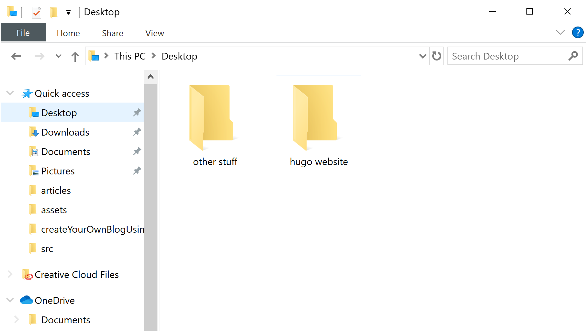
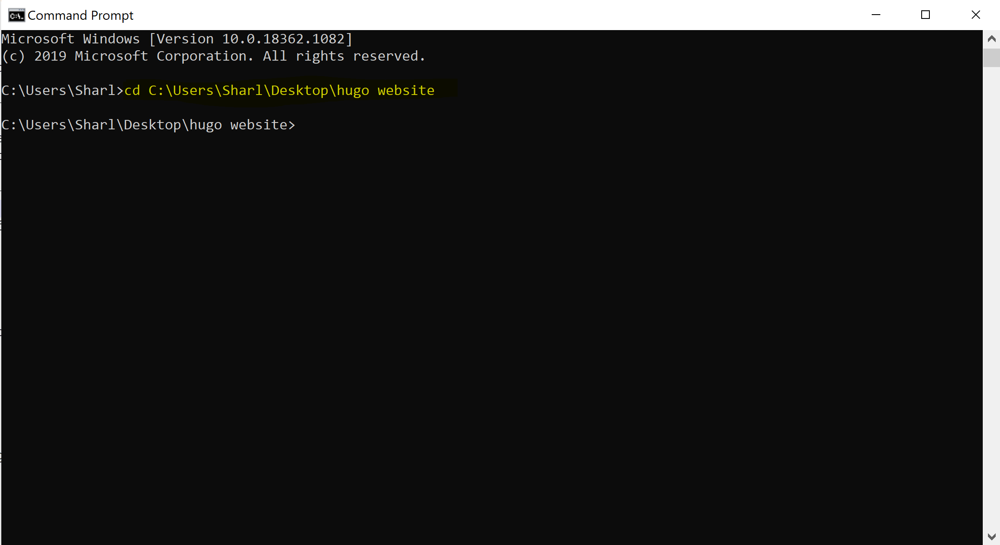

<br>
<div class="writtenContent">

## Creating Your Own Blog Using Hugo
___

###### 16 Sept 2020 by [@Vondreii](https://www.instagram.com/vondreii/?hl=en)
___


Instead of using Squarespace/etc to host your website .. etc... is expensive... etc
You can create your own with not that much effort... etc... without knowinf too much about the internal programming.
You can choose from lots of amazing free themes.

Uses the Go language.

You would be writing all your posts in a language called markdown, which is just writing in english with a few symbols to symbolise what are headings, tables, etc.

This tutorial primary is made for Windows users, however there are equivalent ways of doing some of the steps on a MAC. Most of the steps should be the same.

### Installing Hugo

Create a folder where you want to store your project.

<!-- ----------- Image ----------- -->
<div class="image-container">
	
	<div class="image-description"><p>Create a folder for your project</p></div>
</div>
<!-- ----------------------------- -->

Go into the cmd and navigate to the folder you have created. Run `cd <path to your project folder>`. For example, I created my folder `hugo website` in the Desktop, so I would run:

```bash
cd C:\Users\Sharl\Desktop\hugo website

```

<!-- ----------- Image ----------- -->
<div class="image-container">
	
	<div class="image-description"><p>CMD</p></div>
</div>
<!-- ----------------------------- -->

Now, we will install hugo and create a new project from scratch. In the command prompt, we will run a few commands that will install hugo and create the base of the website.

For windows, if you use chocolatey for package management, run:

```bash
choco install hugo -confirm

```

otherwise if you use Scoop for package management, run:
```bash
scoop install hugo

```

You can check what you are using by going into your `C:\ProgramData` folder and seeing if you either have chocolatey or scoop.

<!-- ----------- Image ----------- -->
<div class="image-container">
	
	<div class="image-description"><p>More options to install hugo: https://gohugo.io/getting-started/installing/</p></div>
</div>
<!-- ----------------------------- -->

To install hugo using MAC:

```bash
brew install hugo

```

To install hugo using Linux:

```bash
brew install hugo

```

### Creating the basic structure of the website

blach  of using Squarespace/etc to host your website .. etc... is expensive... etc
You can c of using Squarespace/etc to host your website .. etc... is expensive... etc
You can c of using Squarespace/etc to host your website .. etc... is expensive... etc
You can c