

#### 25 May 2020
# How To Organise Your Web Browsing
___

<!-- ----------- Intro ----------- -->

    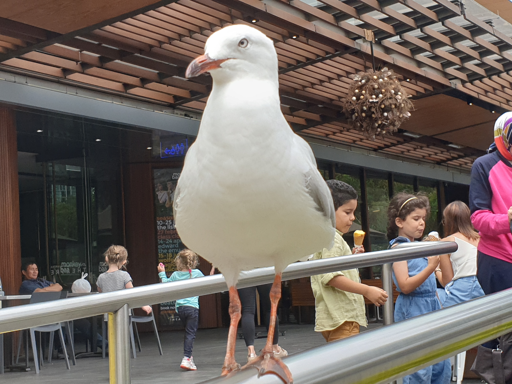
    <h5 class="avatar-text avatar-align"> by Vondreii</h5>

 

    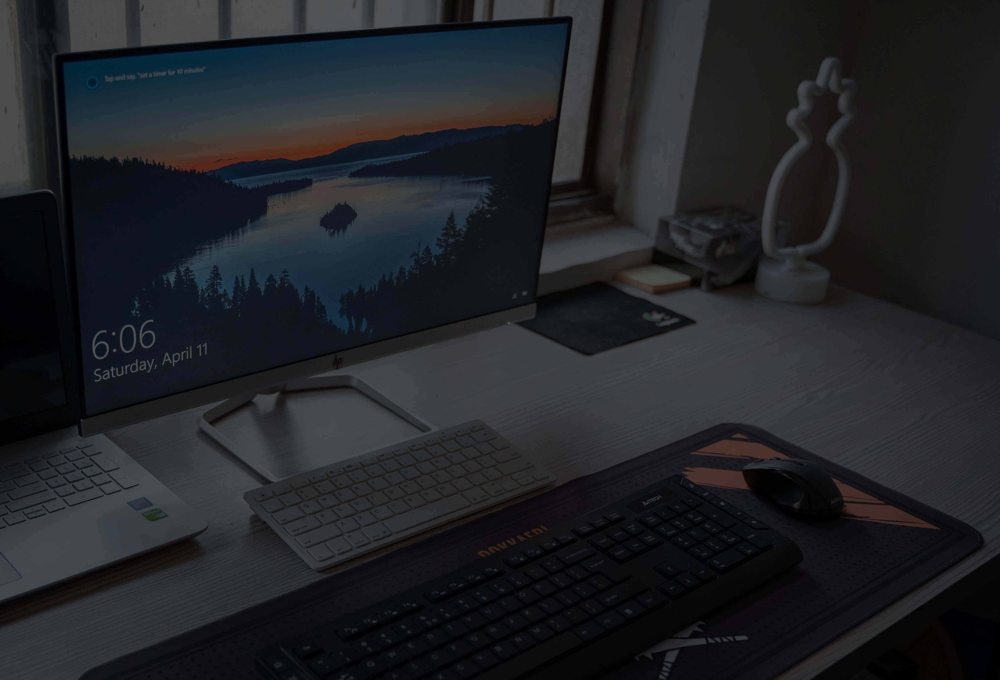
  	

Photo by <a href="https://unsplash.com/@shuttergames">Shuttergames</a> on Unsplash

<!-- ----------------------------- -->

These days, many people spend most of their time surfing the web or conducting important business online. It makes sense to have your accounts, passwords, general online activities and frequently used websites organised in order to make things easier to access. Other online tools can also be utilised to increase productivity by managing social media posts and tracking the time you spend on time wasting websites.

### 1. Declutter Your Emails

Have a look at the cluttered inbox below:

<!-- ----------- Image ----------- -->

    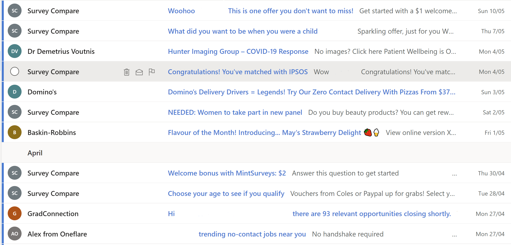
	

A very cluttered inbox

<!-- ----------------------------- -->

This doesn't make me feel like reading anything. I feel very disorganised just by looking at it, and it's clear that backtracking may be difficult.
Luckily, I've decluttered my inbox not too long ago, so here is what it looks like now:

<!-- ----------- Image ----------- -->

	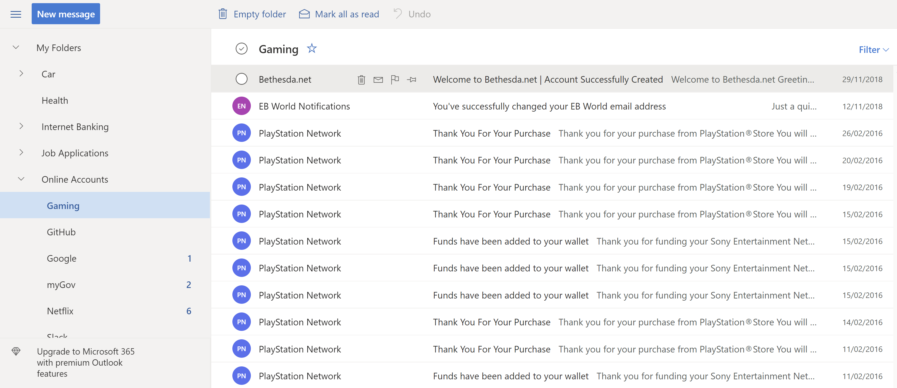
	

Much better

<!-- ----------------------------- -->

I have utilised the sidebar to create folders to categorise all my emails. As you can see, I have a <strong>Gaming</strong> folder where I put everything related to purchases on the PlayStation Store, or my PSN account in general.
Looking at the sidebar, I also have separate folders to store emails related to my Google accounts, and car (such as car insurance or receipts for repairs).
The gaming folder is nested under the 'Online Accounts' folder. This is what all the higher-level folders look like: 

<!-- ----------- Image ----------- -->

	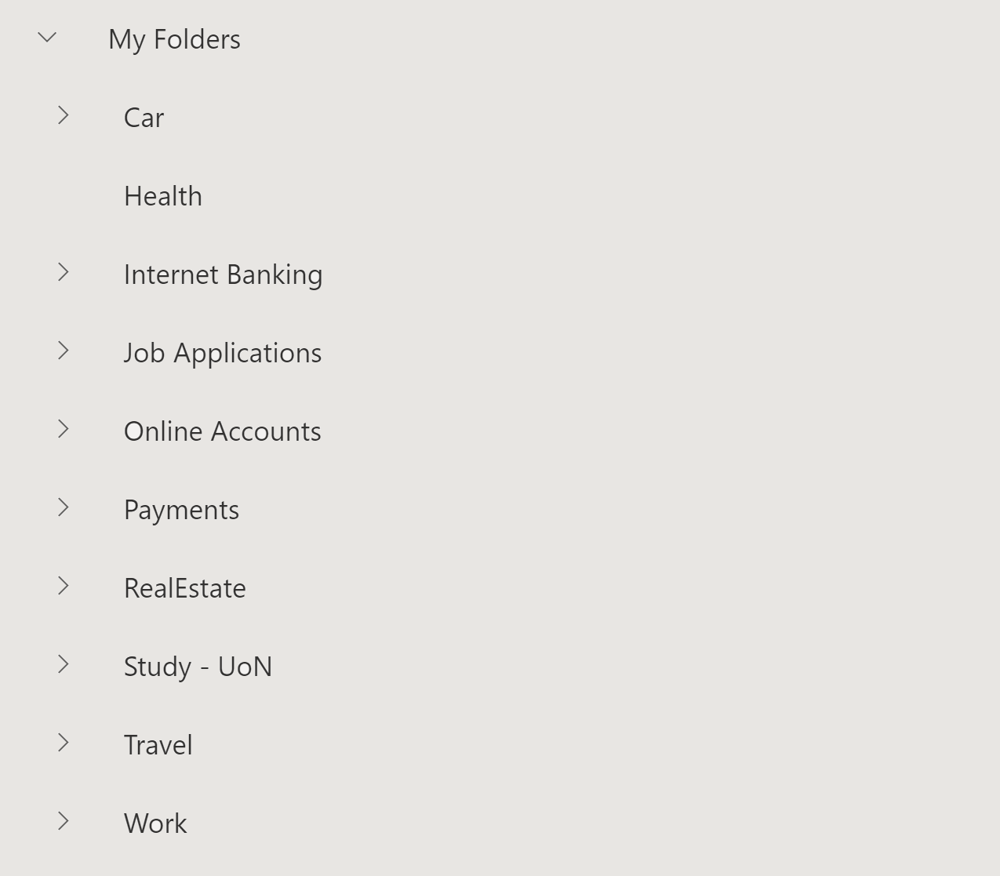
	

Root folder structure

<!-- ----------------------------- -->

I also have **deleted** and **unsubscribed** to a lot of things that I might have 'accidentally' signed up for just by visiting their website. This prevents spam emails from getting into your inbox in the first place.    

### 2. Utilize The Bookmarks Bar to Organise Frequently Used Websites

When you use the web, it can be a lot easier to just click on an icon to open a website. You can use this to save all the websites you use frequently, or even work-related websites that you need to remember (such as links to your work HR timesheets page).

<!-- ----------- Image ----------- -->

  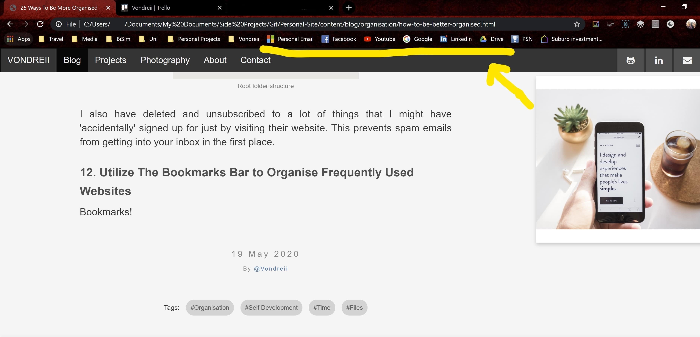
  

Use bookmarks to organise your web browsing

<!-- ----------------------------- -->

First, make sure the bookmarks bar is enabled. Depending on the web browser you use, there should be a setting to show the bookmarks bar.

<!-- ----------- Image ----------- -->

  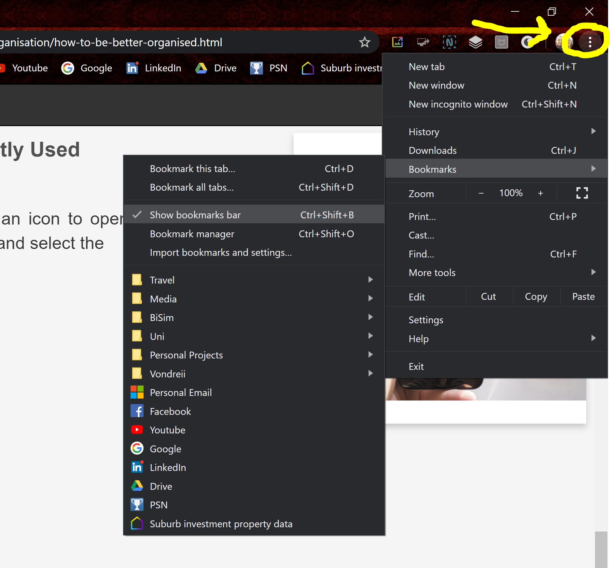
  

Use bookmarks to organise your web browsing

<!-- ----------------------------- -->

All you have to do is visit the website you want to save, and click on the star icon at the top. Here it is in Google Chrome:

<!-- ----------- Image ----------- -->

  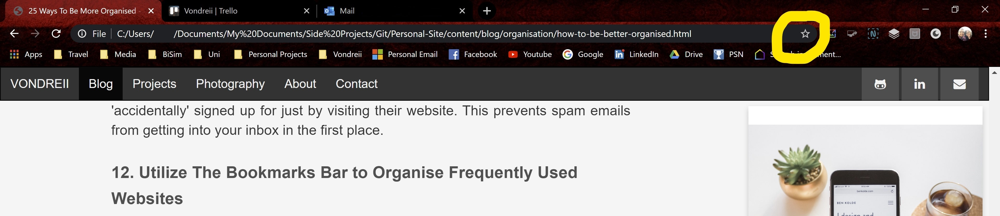
  

Add to bookmarks option in Google Chrome

<!-- ----------------------------- -->

### 3. Utilize a Password/Account Manager

There are a few account password managers you could use such as:

1. <a href="https://www.dashlane.com">Dashlane</a>
2. <a href="https://www.lastpass.com/">LastPass</a>
3. <a href="https://www.myki.com/">Myki Password Manager</a>
4. <a href="https://www.logmeonce.com/">Log Me Once</a>
5. <a href="https://keepass.info/">KeePass</a>

With password managers, all you have to do is remember one master password, and the password manager will do the rest.
You can have secure passwords for all your accounts such as <i>'UDHAKF73FKVE'</i> and never have to remember them.

<!-- ----------- Image ----------- -->

  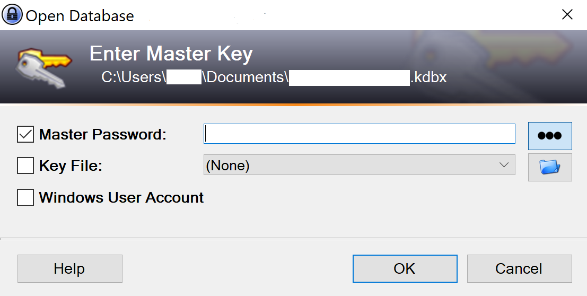
  

<a href="https://keepass.info/">KeePass</a> password manager login

<!-- ----------------------------- -->

### 4. Organise your online finance accounts

If you do online shopping, you want to make sure you organise other online accounts that involve payments, such as <a href="https://www.paypal.com/">PayPal</a>.
This makes your transactions both faster and more secure. Take advantage of online banking apps - you can contact your bank to enquire how they do their online banking.
Many banks offer the choice of logging into your account through their website, or by downloading a secure app on your phone.
If you make or recieve payments online you can easily look at your bank balance without having to leave your computer.

### 5. Use extension or plugins to increase productivity

Utilize extensions to help you keep track of how you spend your time on the computer by blocking your access to certain websites for a limited time. 

<!-- ----------- Image ----------- -->

  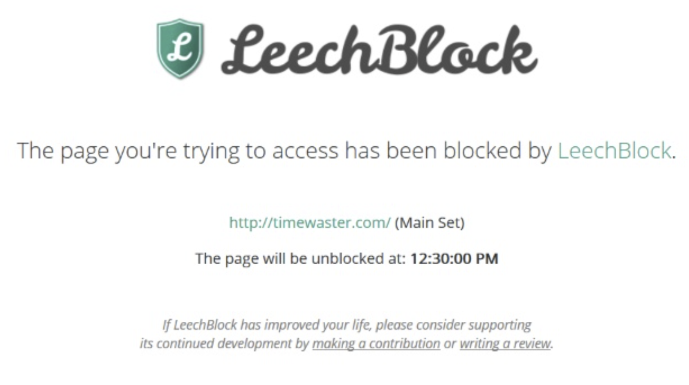
  

<a href="https://chrome.google.com/webstore/detail/leechblock-ng/blaaajhemilngeeffpbfkdjjoefldkok">LeechBlock</a> time manager

<!-- ----------------------------- -->

Examples of this includes:

1. <a href="https://chrome.google.com/webstore/detail/leechblock-ng/blaaajhemilngeeffpbfkdjjoefldkok">LeechBlock</a>
2. <a href="https://chrome.google.com/webstore/detail/stayfocusd/laankejkbhbdhmipfmgcngdelahlfoji?hl=en">StayFocusd</a>
3. <a href="https://chrome.google.com/webstore/detail/toggl-button-productivity/oejgccbfbmkkpaidnkphaiaecficdnfn">Toggl</a>
4. <a href="https://chrome.google.com/webstore/detail/rescuetime-for-chrome-and/bdakmnplckeopfghnlpocafcepegjeap">Rescue Time for Chrome and Chrome OS</a>

These can be used to put time limits on certain sites.
This can help you limit how many minutes or hours you spend a day on sites like Facebook, or other sites that can make time fly without doing anything actually productive.

Do you also sometimes find yourself with 30 bookmarks open? 
<a href="https://chrome.google.com/webstore/detail/todoist-for-chrome/jldhpllghnbhlbpcmnajkpdmadaolakh?hl=en">ToDoist for Chrome</a> 
or <a href="https://chrome.google.com/webstore/detail/save-to-pocket/niloccemoadcdkdjlinkgdfekeahmflj">Save to Pocket</a>
allows you to save webpages as tasks so you can look at them again later.

### 6. Time your Social Media Posts

If you are an influencer or simply have a lot of things to post throughout the day, you can save time by writing all your posts 
and queuing them to automatically post when you want. <a href="https://chrome.google.com/webstore/detail/buffer/noojglkidnpfjbincgijbaiedldjfbhh">Buffer</a>
is an extension that is compatible with many of the popular social media sites such as Facebook, Twitter, LinkedIn.
By using a social media post manager, you can also manage all your posts, activity and discussions all in a single place. 

<!-- ----------- Image ----------- -->

  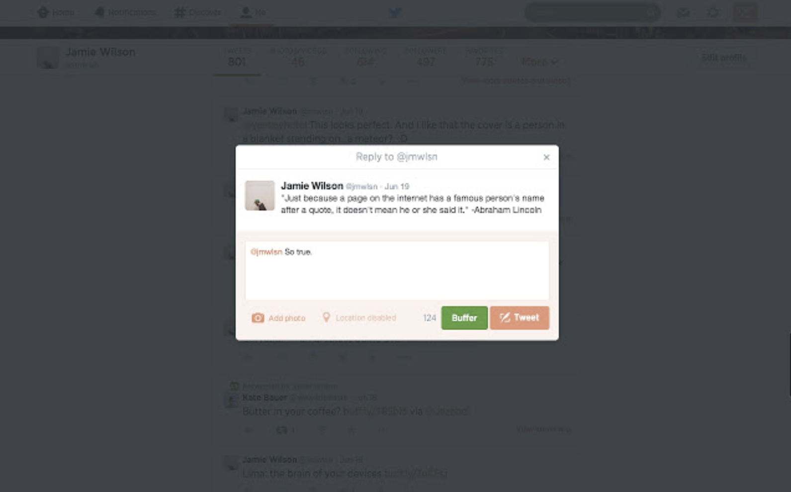
  

<a href="https://chrome.google.com/webstore/detail/buffer/noojglkidnpfjbincgijbaiedldjfbhh">Buffer</a>, social media/time wasting apps blocker

<!-- ----------------------------- -->
	
### Conclusion

Utilising apps or resources such as time trackers or website blockers can help improve organisation and productivity. 
Organising your online accounts, passwords, or other aspects of your life such as  online banking accounts can also make things overal more easy to access. Hopefully some of the resources mentioned in this post are helpful.

  

